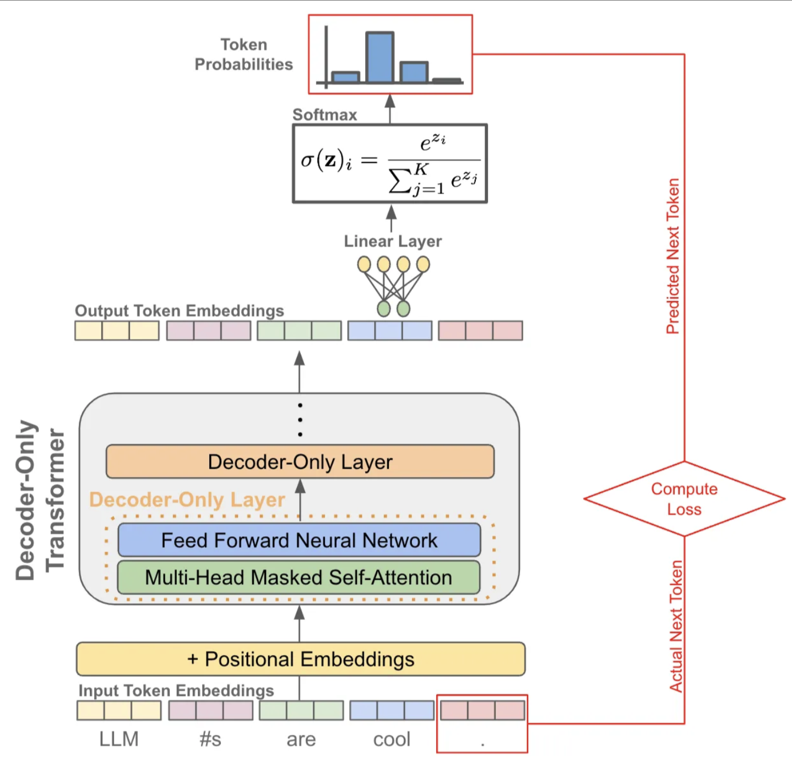
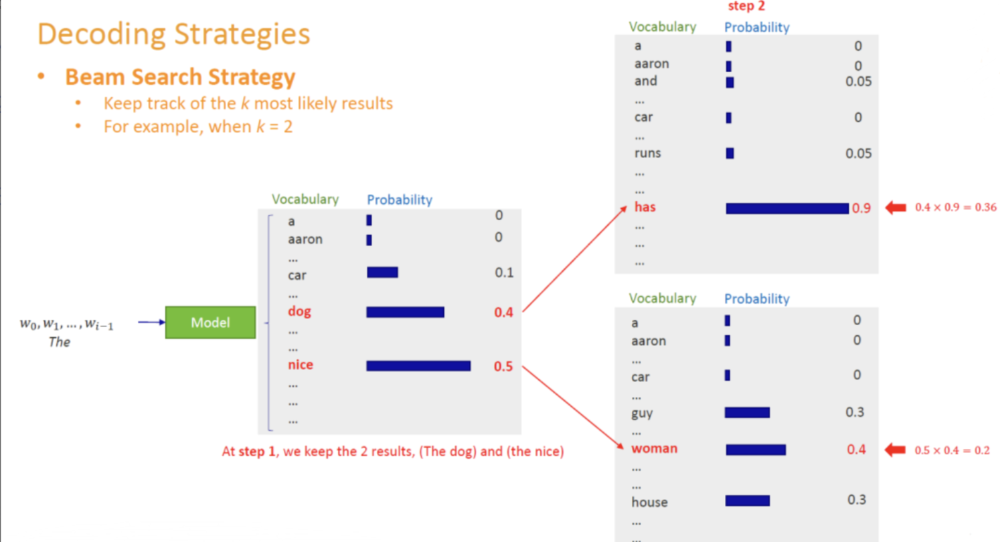

# Encoder和Decoder

Transformer是一种Encoder-Decoder架构，主要有

1. Encoder:负责对输入序列进行特征提取，得到一系列隐藏向量表示

2. Decoder:解码时，逐步生成目标序列的每个token

## Encoder结构

有多个Encoder Block

每个Block分为两个子模块：

- MHA
- FFN

通过 **ADD & Norm**（残差连接与LayerNorm）保持稳定训练并加速收敛

- 核心特征：**全局看待输入序列**，无未来信息屏蔽（无Mask）

## Decoder结构

有多个Decoder Block

每个Block分为三部分：

- MHA(自带mask),只可以看到当前step或step以前的token
- Encoder-Decoder Attention
- FFN

同样有**Add & Norm**机制。例如：

核心特征:**要在生成目标序列时，不能看见为生成的token**，实现next token prediction

## Encoder与Decoder差异

### Encoder：全局编码

在Encoder中，每个位置的token都可与序列中其它所有位置的roken进行自注意力计算，不需要mask。它的目标是**充分理解整个输入序列**，输出一系列隐藏向量

- 无需区分“过去”或"未来"：因为Encoder只需表示输入，不必生成token
- 机器翻译中，对原语言句子进行编码；在文本分类中，对整段文本向量化。

### Decoder:自回归生成

Decoder目标是**自左至右生成目标序列**。为了保证纯粹的自回归属性，它在自注意力阶段要对“未来token”,
进行屏蔽，从而每次只能使用已生成的token信息，**预测下一个词**

- **带有casual mask**:使得位置i的token只能看到i及其以前的位置
- 语言模型（预测下一个单词），堆化系统生成答案。

---

## Decoder的Next Token Prediction




假设目标句子是："LLMs are cool",我们在inference时不在拥有真值标签，只能依赖自己一步步生成的结果：

1.time step=1

输入给Decoder的序列： [SOS] (特殊起始符)

Decoder 预测输出：[LLM]

2.time step=2

输入给Decoder的序列：[SOS, LLM]

Decoder 预测输出：[#s]

3.time step=3

输入给Decoder的序列：[SOS, LLM, #s]

Decoder 预测输出：[are]

4.time step=4

输入给Decoder的序列：[SOS, LLM, #s, are]

Decoder 预测输出：[cool]

5.time step=5

输入给Decoder的序列：[SOS, LLM, #s, are, cool]

Decoder 预测输出：[.]

6.time step=6

输入给Decoder的序列：[SOS, LLM, #s, are, cool, .]

Decoder 预测输出：[EOS] (结束符)

解码结束

**Decoder需要顺序处理，逐步把上一步的预测结果动作输入拼接进来**，和Encoder并行处理不同

## BERT与GPT

### BERT: Encoder-only

BERT只使用**Encoder**不分，用于学习对输入序列的深层双向表示。在其预训练过程中，采用"随机屏蔽部分Token",让模型根据上下文，进行完形填空

- 核心：双向Encoder
- 任务：填空式、理解式（如问答、分类、命名实体识别）
- **不做自回归**：BERT不一次性直接预测整个系列后面的Token，而是看完整个句子，猜测被mask的token
- 优点：能捕捉全局上下文，对下游理解类任务效果显著
- 局限：不适合生成场景（如写文本、翻译），因为缺乏Decoder部分

### GPT:Decoder-only

GPT只使用**Decoder部分**，用于做自回归语言模型。

在预训练的时候，GPT通过给定左侧文本，预测下一个Token，从而学习到强大的文本生成能力。

- 核心：自回归Decoder
- 任务：Next Token Prediction(可扩展到对话生成、翻译、多任务问答等)
- **带有Mask**:只关注已生成的部分，模拟自然语言生成过程
- 优点：适合文本生成类任务
- 缺点：无法向BERT一样直接获取双向上下文信息，只能看左侧历史，对一些需要深度理解的任务可能不如BERT.

## Decoding技术

**解决输出的词表概率如何Decoding成为离散的词**


**如何对训练好的模型进行解码**很关键。

解码策略会直接影响最终生成文本的质量、连贯度和多样性。

### Decoding

自回归语言模型：给定当前已生成的上下文，让模型预测下一个Token的概率分布。模型根据该分布，
从词表中为下一个位置选出一个最优或采样得到的Token。直到输出结束符或达到设定的最大长度。


比如：假设我们有一句话的开头是“I am a .”，当前模型对下一个单词的预测概率大致如下：

- boy: 0.46
- banana: 0.30
- dog: 0.12
- cat: 0.10
- fish: 0.02

**问题**：我们下一步如何从概率分布中“选词”？涉及到**解码策略**

#### 常见的解码方式

- Greedy Decoding:每一步都选取概率最高的词
- Beam Search:保留若干条最有希望的候选序列同步扩展
- Sampling(随机采样)：按概率分布直接采样
- Top-k采样：在概率最高的k个候选中做随机采样
- Top-p采样（核采样，Nucleus Sampling）**
- Temperature调整

---

### Greedy Decoding(贪心策略)

**贪心解码**：在每一步都选取预测概率最高的Token,而不考虑后续的全局最优

- 优点：计算简单，速度快
- 缺点：容易陷入重复循环或生成单调的句子；无法回溯不太优的中间选择，可能错失更优解。


### Beam Search

Beam Search是在机器翻译、摘要生成等任务中非常有用的解码策略。

核心思想：

- 设定一个 Beam Size=K
- 在每个时间步，对当前所有候选序列都进行下一步扩展，并按照其（对数）概率打分，保留top k条
- 继续迭代，直到生成结束符或达到最大长度




- 优点：较贪心更有“全局搜索”性，一次性保留多条路径，防止过早决策
- 缺点：依旧是基于最大似然偏好的搜索，容易生成通顺但缺乏创造性、多样性；对超长文本可能过于保守

### 随机采样

Random Sampling

从整个词表，按softmax后的概率分布直接抽取一个Token


优点：具有随机性和多样性

缺点：如果概率分布“尾部”很长，可能采样到极不合适的Token(特别是概率很低的词)，整体质量难以保证

#### 为什么需要改进？

随机采样虽然带来多样性，但过于随机会让模型出现怪词，这时
就需要**Top-k**或**Top-p**等技术来**截断长尾分布**，只在相对概率较高的词之中进行采样，提高质量又保留一定随机性

### Top-k采样：在概率最高的k个候选中做随机采样

**Top-k采样**在每个时间步里，只保留概率最高的k个Token，让模型只在这k个候选中
进行随机抽取。与贪心解码（k=1）相比，更能避免只选最热门候选导致的重复或过度保守，也减少了怪词。

1. 输入：从模型给出的下一步Token概率分布$\pi \in R^{|V|}$(|V|=词表大小)

2. 保留前k个Token，找到令$\pi_t$最大的k个，让其概率归一化

3. 在这k个Token里按照相对概率进行一次采样

- 优点：在一定范围内（Top-k）随机采样，能兼顾多样性与合理性；k比较小就更保守，大则更有创造力
-缺点：人工指定k不容易；分布较为扁平时，k个候选代表不了所有潜在的好词；分布非常尖锐的时候，k也不一定合适

### Top-p 核采样

Top-p是对Top-k的改进，k固定在所有情况下可能过大或过小，而p采样则根据概率分布的动态特性来确定保留多少token

- 对预测分布进行从大到小排序：$\pi_{(1)}\geq \pi_{(2)}\geq \pi_{(3)}\geq \pi_{(4)\geq ...\geq \pi_{(n)}}$
- 找到**最小的m**,使得$\sum_{i=1}^m \pi_{i}\geq p$，也就是说这m个token的累计概率大于等于p
- 只在这m个Token里进行随机采样，忽略其余token


#### Top-p与Top-k区别

- Top-k:强行控制候选数量为k，不管分布特性
- Top-p:动态确定保留集合的大小，以保证这部分token总概率不低于p
- Top-p往往效果更好

### Temperature 采样

Temperature是最常与Top-k.Top-p一起使用的另一个调控参数。

他通过对logits值进行缩放，改变分布的尖锐度或是平坦度。令模型输出的logits向量为z
则普通softmax概率是：

$$p_i = \frac{e^{z_i}}{\sum_{j=1}^{|V|}e^{z_j}}$$

引入Temperture T后，概率变为：

$$p_i = \frac{e^{z_i/T}}{\sum_{j=1}^{|V|}e^{z_j/T}}$$

- 当T<1:分布变得更尖锐（放大较大的logits，抑制较小的logits），模型更倾向于最可能得词
- 当T>1:分布更平坦，增加随机性
- 当$T \to 0$:接近贪心
- 当$T \to \infty$:接近均匀分布


## 组合策略与实用技巧


### 常见组合

- **Top-k + Temperature**：先截断至k个最可能词，再用温度缩放分布；
- **Top-p + Temperature**：先做核采样选取概率质量≥p的Token集合，再进行温度调整。
- **Beam Search + Temperature**：较少见，但也可尝试给Beam Search的候选在扩展时加些噪声，提升多样性。

### repetition_penalty等

在实践中还会用到一些额外技巧，如：
- **重复惩罚 (repetition_penalty)**：对近期已生成过的Token人为降低其概率，避免陷入重复；
- **长度惩罚 (length_penalty)**：在机器翻译/摘要中鼓励生成更长或更短句子； 
- **bad words ban**：禁止生成某些关键词。

这些方法与top-k / top-p / temperature不冲突，往往配合一起使用，以达成特定的生成目标。 


### 应用示例
下面我们给出一个简化的示例，展示如何在推理时组合使用top-k、top-p和temperature。
假设第t步模型输出logits（仅列举6个单词）：
- “colors”：2.15
- “ideas”：1.80
- “lights”：1.20
- “weather”：0.60
- “bananas”：0.20
- “dogs”：-0.10
（其余单词logits更低。）

#### Temperature调整
若temperature=0.8，我们先把logits除以0.8：
```
1 “colors”：2.15 / 0.8 = 2.69
2 “ideas”： 1.80 / 0.8 = 2.25
3 “lights”：1.20 / 0.8 = 1.50
4 “weather”:0.60 / 0.8 = 0.75
5 “bananas”:0.20 / 0.8 = 0.25
6 “dogs”：-0.10 / 0.8 = -0.125
```

#### 转化为概率分布
对上述做softmax，得到新的分布（大致）：
```
1 colors: 0.40
2 ideas: 0.25
3 lights: 0.18
4 weather:0.10
5 bananas:0.05
6 dogs: 0.02
```

#### (3) top-k
若top_k=3，则只保留{colors, ideas, lights}，概率归一化：
```
1 colors: 0.40 / (0.40+0.25+0.18)= 0.47
2 ideas: 0.25 / 0.83 = 0.30
3 lights: 0.18 / 0.83 = 0.23
```

#### (4) top-p
若top_p=0.8，先从大到小排：colors(0.47), ideas(0.30), lights(0.23)。累计到第2个就达0.77，不够0.8，第3个加上后为1.00 > 0.8。因此最终保留{colors, ideas, lights}全部，也与top_k=3一致。
最后在{colors, ideas, lights}之间随机采样，得出下一个单词。

