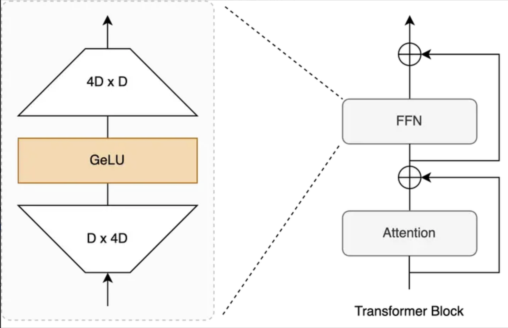
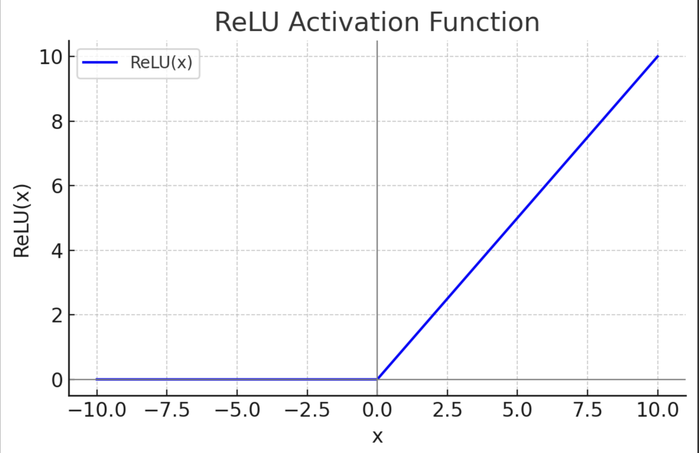

# 前馈网络和激活函数

**FFN计算的本质是通过线性变换和非线性激活函数，逐步学习并映射输入特征到更高维的特征空间，从而增强模型的表达能力**


当然可以，以下是对原图内容的简化与专业化整理，保持核心意思不变：

---

## FFN（Feed-Forward Network）概述

### 什么是 FFN？

**FFN（Feed-Forward Network，前馈神经网络）** 是 Transformer 模型中的关键组成部分，通常紧接在自注意力（Self-Attention）或交叉注意力（Cross-Attention）层之后。

它的主要作用是：

- 对注意力机制输出的特征进行**非线性变换**
- 增强模型的**表达能力**
- 实现对输入表示的**进一步加工和抽象**

###FFN 的结构

典型的 FFN 结构由两个全连接层（线性变换）组成，中间加入激活函数。其结构如下：

$$
FFN(x) = W_2 * ACT(W_1 * x + b_1) + b_2
$$

其中：

- `x` 是输入向量（来自注意力层的输出）
- `W1`, `W2` 是权重矩阵
- `b1`, `b2` 是偏置项
- `ACT` 是激活函数，如 ReLU、GELU 等

通常第一个线性层会将维度提升到更高（例如 4 倍），第二个再压缩回原始维度。

FFN作用：进一步对注意力输出进行非线性变换和特征抽取。

## FFN为什么增加隐藏层维度？

FFN的中间层使用比输入向量更高的维度（输入向量的$d_{model}=512$，而中间层维度往往是2048）.这样可以让
网络学习到**更丰富、更复杂**的特征表示，对模型性能有明显提升。

## 基础FFN和激活函数



### 标准FFN结构

原版transformer中，FFN由两个线性层（全连接层）和一个激活函数（默认为ReLU）组成，结构如下：

1.第一层全连接层（线性变换）：

$$z=x\cdot W_1+b_1$$

其中，$W_1$是权重矩阵，$b_1$是偏置向量，$W_1$的输出维度比输入向量x的维度$d_{model}$大很多。（一般是四倍）

2.激活函数

$$a=ReLU(z)$$

激活函数可换成，GeLU、Swish等

3.第二层全连接层（线性变换）：

$$y=a\cdot W_2+b_2$$

其中,$W_2$的输入维度与z相同，输出维度回归到$d_{model}$,方便后续与其他子层做加法和拼接等操作。

$$FFN(x)=ReLU(xW_1+b_1)W_2+b_2$$

这里，$W_1,W_2,b_1,b_2$都是可学习参数。

> 注意：不同的激活函数对模型表达能力、收敛速度和梯度流等会产生影响

## 常见激活函数

### ReLU

$$ReLU(x)=max(0,x)$$

- 优点：计算简单，速度快
- 缺点：当输入小于0时，输出恒为0，会导致某些神经元在训练过程中一直输出“0”,称之为“神经元死亡问题”。



### Sigmoid

$$\sigma (x)=\frac{1}{1+e^{-x}}$$


- 优点：输出范围在（0,1），可当做开关
- 缺点：易出现梯度饱和，计算贵一点
> 相比于ReLU，Sigmoid涉及到指数运算和除法，计算复杂度更高

### Tanh

$$tanh(x)=\frac{e^x-e^{-x}}{e^x+e^{-x}}$$

- 优点：输出范围（-1,1），比Sigmoid更不易饱和
- 缺点：依然有可能饱和，使得梯度变小，不易训练


下面详细介绍GeLU和Swish这两种使用多的激活函数

### GeLU

GeLU（Gaussian Error Linear Unit）最早在一些预训练语言模型（如 BERT）中开始流行，是一种在性能上往往优于 ReLU 的激活函数。它的形状是一个平滑的 S 型曲线，相比 ReLU，更能平滑地“选择”对负值进行保留还是裁剪。


以下是GeLU近似形式(写代码常用)：

$$GeLU(x)=0.5\times x\times (1+tanh(\sqrt{\frac{2}{\pi}}\times (x+0.044715\times x^3)))$$

```python
import numpy as np

def GELU(x):
    return 0.5 * x * (1 + np.tanh(np.sqrt(2/np.pi) * (x + 0.044715 * x**3)))
```

**GeLU和ReLU的区别**

- **平滑性**：GeLU是平滑曲线，而ReLU在x=0处存在拐点，梯度不连续。
- **负值处理**：ReLU 对所有负值直接输出 0；GeLU 则会给负值以一定概率保留，避免“神经元死亡”问题。
- **计算开销**：ReLU 是极其简单的分段函数，GeLU 则包含了 `tanh` 等函数，计算要更复杂，也更耗时一些。
- **应用场景**：ReLU 更适合使用在卷积神经网络（CNN）中，而 GeLU 更适用于全连接网络（FNN）。

### Swish


Swish 是由 Google 的自动搜索激活函数的方法得到的一种激活函数，当 \( \beta \) 为 1 时的 Swish 激活函数也称作 SiLU（Sigmoid-Linear Unit）。它的公式如下：

\[
\text{Swish}(x) = x \times \sigma(\beta x).
\]

通常 \( \beta \) 可以设置为 1，简化为：

\[
\text{Swish}(x) = x \times \sigma(x).
\]

其中，\( \sigma(\cdot) \) 是 Sigmoid 函数。

**特点**

- **平滑过渡**：与 GeLU 类似，Swish 在负值区域依然有小幅输出，且函数呈平滑曲线。
- **\( \beta \) 的作用**：\( \beta \) 可以调整函数形状。当 \( \beta = 1 \) 时，Swish 的曲线与 GeLU 也相近；\( \beta = 0 \) 时就变回线性函数 \( x \)；\( \beta \to \infty \) 时则趋近 ReLU。
- **计算开销**：Swish 需要一次 Sigmoid 计算，比 ReLU 耗时稍高，但通常仍小于 GeLU 的复杂度。
- **应用**：在图像处理和自然语言处理中都开始逐渐流行，部分 Transformer 变体使用 Swish 来替换 ReLU。

## 基于GLU的FFN块计算公式

GLU是一种门控机制，将全连接输出分为两部分：一部分是负责主干输出
，另一部分通过一个门控函数（通常是Sigmoid或其它激活函数）来选择性地
“保留”或抑制信息。有助于增强模型表示能力，最简单GLU块可表示：

$$GLU(x)=F(xW+b)\odot (xV+c)$$

$\odot$为对应位置上元素两两相乘，F是任意激活函数（原论文是Sigmoid）

**优点**：在不同维度上，对输入的信息选择性保留或屏蔽。相比单纯激活函数，GLU机制更灵活。

**缺点**：增加一些线性映射和门控操作，计算量大

### GeGLU

GLU可以结合GeLU激活函数：

$$GeGLU(x,W,V,b,c)=GeLU(xW+b)\odot (xV+c)$$

不过未能明确激活和门控路径，容易导致参数混乱，激活函数也可用来做门控。

为了维度兼容，实际公式是：

$$GeGLU(x,W_1,W_2,W_3)=GeLU(xW_1)W_2\odot (xW_3)$$

与Sigmoid版本的GLU相比，把门控函数换成GeLU:

- 在负值到正值的过渡更平滑，不像Sigmoid那样硬性的（0,1）输出
- 给网络更多表达能力，计算也复杂一些

在代码中只需要把激活函数从sigmoid()换成GeLU()即可。

### SwiGLU

另外一种常见的组合方式是将GLU与Swish结合(LLaMA系列)：

$$SwiGLU(x,W,b,c)=Swish(xW+b)\odot (xV+c)$$

为了维度兼容，计算公式是：

$$SwiGLU(x,W_1,W_2,W_3)=Swish(xW_1)W_2\odot (xW_3)$$

在这种场景下，“门控向量”来自于Swish(W_1*x),其计算如下：

$$Swish(z)=z\times \sigma (\beta z)$$

如果不强调$\beta$,默认为$\beta =1$

这样可以赋予网络平滑的门控选择能力。

**实现代码（为了保持参数量不变，当前维度变为之前的2/3）**


```python
class FeedForward(nn.Module):

        # 让新的hidden_dim是multiple_of的整数倍
    def __init__(self, dim: int, hidden_dim: int, multiple_of: int, dropout: float):
        super().__init__()

        # 如果 hidden_dim=64, multiple_of=8
        # 计算：2*64//3 = 42 → 42 + 7 = 49 → 49 // 8 = 6 → 6 * 8 = 48
        # 所以新的 hidden_dim = 48
        hidden_dim = multiple_of * ((2 * hidden_dim // 3 + multiple_of - 1) // multiple_of)
        self.w1 = nn.Linear(dim, hidden_dim)
        self.w2 = nn.Linear(hidden_dim, dim)
        self.w3 = nn.Linear(dim, hidden_dim)
        self.dropout = nn.Dropout(dropout)

    def forward(self, x: torch.Tensor) -> torch.Tensor:
        return self.dropout(self.w2(F.silu(self.w1(x))) * self.w3(x))
```

```text
case:

dim = 128       # 输入输出维度
hidden_dim = 256  # 初始设定的隐藏层维度
multiple_of = 16  # 要求隐藏层是16的倍数
dropout = 0.1

hidden_dim = 16 * ((2 * 256 // 3 + 16 - 1) // 16)
           = 16 * ((170 + 15) // 16)
           = 16 * (185 // 16)
           = 16 * 11 = 176


w1: Linear(128 → 176)
w3: Linear(128 → 176)
w2: Linear(176 → 128)

x = torch.randn(4, 128)  # batch_size=4, dim=128
model = FeedForward(dim=128, hidden_dim=256, multiple_of=16, dropout=0.1)
output = model(x)
print(output.shape)  # 输出形状应为 (4, 128)

```

## 不同FFN模块对比

1.经典FFN

$$FFN(x)=ReLU(xW_1+b_1)W_2+b_2$$

2.FFN+GeLU

$$FFN(x)=GeLU(xW_1+b_1)W_2+b_2$$

3.FFN+Swish

$$FFN(x)=Swish(xW_1+b_1)W_2+b_2$$

4.GLU-based FFN

$$GLU=\sigma(xW_1)W_2\odot (xW_3)$$

5.GeGLU

$$GeGLU=GeLU(xW_1)W_2\odot (xW_3)$$

6.SwiGLU

$$SwiGLU=Swish(xW_1)W_2\odot (xW_3)$$

---

### **为什么会出现 GLU 变体？**

- **门控机制的优势**：相比简单的激活函数，GLU 有了对每个通道或维度进行“开”或“关”的能力。
- **不同激活函数的选择**：Sigmoid 可以把输出收敛到 (0, 1) 之间，GeLU 和 Swish 则在负值区间也会平滑地衰减或保留信息。
- **模型容量与计算平衡**：有时候引入更强的激活或门控机制能提升模型表现，但也会带来额外的计算成本，应根据数据规模、任务需求选择合适的激活函数和变体。


### **实际应用与性能对比**

#### **ReLU vs. GeLU vs. Swish**
- **速度**：ReLU 最快，Swish 次之，GeLU 较慢（因为 GeLU 的实现比较复杂）。
- **性能**：在 NLP 任务上，GeLU 与 Swish 往往能在一定程度上优于 ReLU，尤其在大规模预训练模型中。
- **稳定性**：ReLU 有神经元死亡问题，GeLU、Swish 的输出更平滑，但也需要更多计算。

#### **GLU 或者 “激活 + GLU”**
- **优点**：增强表示能力，对信息选择更精细，有时能带来性能收益。
- **缺点**：计算量更大，参数量也可能更多；在数据规模不大时，可能出现过拟合或收益不明显。


### **如何选择？**
1. **小规模任务/资源有限**：可以先用 ReLU 或者 Swish，实现简单、速度快。
2. **大模型/追求极致性能**：可以尝试 GeLU 或者带门控机制的 FFN（比如 GLU + GeLU），在大规模数据上可能会有收益。


### **总结**
- **FFN（Feed-Forward Network）** 是 Transformer 中最重要的模块之一，与注意力机制协同工作。通过增大中间层维度并引入非线性激活，FFN 能大大提升模型的表达能力。
- **激活函数** 在 FFN 中不可或缺，决定了模型的非线性和梯度流动。除了最常见的 ReLU，GeLU 和 Swish 等平滑激活在大型预训练 Transformer 中也很受欢迎。
- **GLU（Gated Linear Unit）** 给 FFN 带来了门控机制，可进一步提升网络选择性保留信息的能力。与不同激活函数结合（Sigmoid/GeLU/Swish）能在不同场景带来性能增益。
