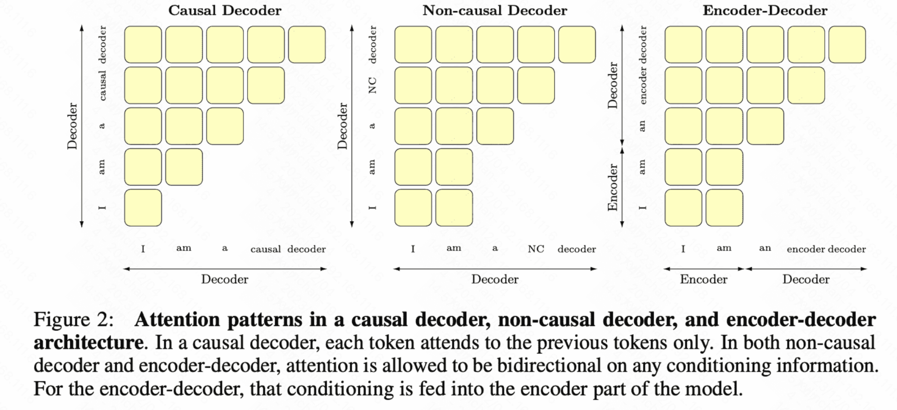

# Mask掩码


**Transformer的Decoder端的Masked MHA中的mask指的是什么技术？区分GPT和Bert区别的关键**

Mask(掩码)用于MHA机制计算中屏蔽掉不可见部分，防止模型能“借鉴”未来的信息，既能在训练时应用，也能在inference时候用。

## Mask的意义

- **限制信息泄露**：如果模型能访问未来的token，会造成信息泄露，使得预测或训练不准确。通过mask，可以屏蔽掉未来时刻的词。
- **避免无关位置**：batch中不同长度序列，常需使用Padding来对齐输入长度。但是Padding位置
实际上并不包含有效信息，为了避免注意力计算中干扰模型，就用到mask将Padding位置屏蔽。
- **训练目标需要**：例如在BERT，引入“遮挡语言模型”的任务，需要将输入序列中部分token用[MASK]或随机token替换
，并让模型进行“完形填空”。需要mask机制

## Mask的作用原理

Transformer核心是MHA，基础单元是**自注意力机制**，对于给定的query,key和value，计算公式如下：

$$Attention(Q,K,V)=softmax(\frac{QK^T}{\sqrt{d_k}}+M)V$$

其中：

- Q,维度（batch_size,seq_len,d_k）
- K,维度（batch_size,seq_len,d_k）
- V,维度（batch_size,seq_len,d_v）
- M是Mask矩阵,形状与$QK^T$的注意力得分矩阵相同(batch_size,num_heads,seq_len)

**M矩阵的作用**

- 对于需要屏蔽的位置，$M_{ij}=-\infty$,经过softmax后，输出的概率趋近于0
- 对于需要保留的位置，$M_{ij}=0$，经过softmax后，输出原概率

## Mask的分类



- Padding Mask
- Casual Mask
- MLM(Masked Language Model) Mask
- 其它自定义Mask(Span Mask,Permutation Mask)

### Padding Mask

在进行批量训练时，为了将序列长度对齐，我们需要进行Padding操作（一般为0或特殊位置），而Mask的作用就是将多余的位置屏蔽，

计算方式：

- 假设有效长度为L,其余位置为Padding，如果下标为j的位置是Padding，那么将$M_{ij}=-\infty$
- 构造QK注意力得分表后，根据序列长度或者是否为Padding值,进行mask

适用位置：

- Encoder self-attention:在处理输入序列时，要屏蔽所有Padding
- Decoder self-attention:处理目标序列，也需要屏蔽Padding
- Cross-Attention:若源序列有Padding，也需要屏蔽

### Casual Mask

Decoder进行解码时，不能访问未来的序列信息，确保预测是自回归、符合因果规律的顺序

计算方式：

- Casual Mask一般是一个上三角矩阵（或下三角）的形式。例如，对长度L的序列而言，有下标（i,j）表示，在位置i处的token是否能看到位置j处的token.

如果j>i,$M_{ij}=-\infty$;如果j$\leq$i,$M_{ij}=0$

\[
M_{ij} =
\begin{cases}
0, & j \leq i \\
-\infty, & j > i
\end{cases}
\]

适用位置：

- 解码器自注意力：在Decoder中使用mask,保证序列第i个位置，无法看到第i+1,i+2个位置

### MLM Mask

- 在 BERT、RoBERTa 等模型的预训练过程中，需要随机遮挡一部分输入 token（例如 15%），并让模型去预测被遮挡的 token。这时就需要一个 Mask 来指示哪些位置是真正被“masked out”的，模型需要在预测时关注它们的上下文，但在计算注意力分数时可做特殊处理。

具体做法：

1. **在输入序列中替换**：将一部分 token 用 `[MASK]` 或随机词替换。
2. **Mask 矩阵**：在注意力机制中，通常并不会完全屏蔽被 `[MASK]` 的位置，因为它需要从其他位置获取信息。但有时为了避免模型“看到自己”，可能需要一定的自注意力屏蔽策略。
3. **损失计算**：只对被 `[MASK]` 的位置计算预测损失，其余位置不会贡献损失。

变体：

- **整段 Mask（Span Mask）**：如在 BART 中，对连续若干 token 做 span masking，并用一个特殊 token 来替代整个 span，模型需要学习如何完整恢复 span 内容。
- **Permuted Language Modeling（XLNet）**：引入了一种不同的 Mask 顺序，通过随机排列的方式来学习依赖关系。


### 其他自定义 Mask

Transformer 模型在各个领域衍生出许多变体，也带来了不同的 Mask 机制。例如：

1. **Span Mask**：在序列中抽取一个连续的片段全部 mask，用在生成模型中使其学会填充缺失片段。

2. **Permutation Mask**：在 XLNet 中，通过重新排列序列并对某些位置进行屏蔽，引导模型学习双向上下文。

3. **Cross-Modal Mask**：在多模态学习中（图像+文本、语音+文本等），需要屏蔽不同模态之间无效的对齐或额外的空白帧等。

4. **Segment Mask**：在句子对（或段落对）任务中，引入 segment embedding 并可结合 Mask 控制跨段落的注意力范围。

5. **可学习的 Mask**：在少数前沿研究中，引入可学习的 Mask 参数，以便模型自行学习何时屏蔽哪些位置。

## Mask实现细节

1.**Shape对齐**：将Mask矩阵的形状与注意力分数矩阵一样，或者将Mask进行广播后，形状对齐

2.**数值填充**：在需要屏蔽的位置设置设置一个非常大的负数，使得进行softmax操作后，注意力权重接近于0.

3.**何时添加Mask**:在计算注意力分数（$\frac{QK^T}{\sqrt{d_k}}$）后，进行Mask,最后做Softmax。

4.**高效实现**：

#### 有些时候会构造通用的Padding Mask，再与Casual Mask做逻辑或的操作，合并到同一个Mask矩阵，减少重复计算。

合并 Padding Mask 和 Casual Mask：

```python
"""
    自动构造 casual mask + padding mask

    torch.ones(seq_len, seq_len)：构造一个 seq_len × seq_len 的全为 1 的张量。
    torch.triu(..., diagonal=1)：提取这个矩阵的上三角部分（不包括对角线）
    输出:
    tensor([[0., 1., 1., 1.],
            [0., 0., 1., 1.],
            [0., 0., 0., 1.],
            [0., 0., 0., 0.]])这里1是未来的信息，需要屏蔽

    .bool()：将值为 0 的地方变为 False，非零的地方变为 True。
    输出:
    tensor([[False,  True,  True,  True],
            [False, False,  True,  True],
            [False, False, False,  True],
            [False, False, False, False]])
    .to(device)：把这个 mask 张量放到 GPU 或 CPU 上（根据 device 设置）。

"""
attn_mask = torch.triu(torch.ones(seq_len, seq_len), diagonal=1).bool().to(device)

# 如果有 padding，则合并 padding mask
if padding_mask is not None:
    attn_mask = attn_mask | padding_mask.unsqueeze(1)
    """
    如果这两个 mask 分别处理：要写两套逻辑，要 apply 两次 mask，效率低。
    所以我们会把它们合并成一个 mask ，一次性应用到 attention score 上。

    padding_mask.unsqueeze(1)：给 padding mask 添加一个维度，从 (batch_size, seq_len) 变成 (batch_size, 1, seq_len)
    这是为了让它能和 attention mask（通常是 (seq_len, seq_len) 或 (batch_size, 1, seq_len, seq_len)）广播兼容。

    attn_mask | padding_mask.unsqueeze(1)：对两个 mask 做 逻辑或（OR）操作 。
    True 表示该位置要被屏蔽（mask 掉）
    所以只要其中一个 mask 标记了某个位置为 True，它就会被屏蔽。
    """
```

然后这个 `attn_mask` 就会被应用到 attention score 上：

```python
attn_weights = torch.matmul(query, key.transpose(-1, -2))
attn_weights = attn_weights.masked_fill(attn_mask, -inf)
```


我们把两个 mask 做 逻辑或操作 ，合并成一个 mask 矩阵，这样在 attention 计算时只需应用一次。

这样做的好处：

避免分别应用多个 mask，提高效率。更容易在 GPU 上并行处理。

####为了提高计算速度：会在GPU上一次性构造好Mask矩阵，并于分数矩阵并行计算


为什么要在 GPU 上构造 Mask？

- 构造 mask 是个规则性操作（比如上三角、padding 标记），非常适合 GPU 并行计算。
- 如果先在 CPU 上构造好再传到 GPU，会有额外的数据传输开销。
- 所以很多框架（如 PyTorch Transformers）直接在 GPU 上构造 mask。

什么叫“和分数矩阵并行计算”？

在 Transformer 的 Attention 层中，一般流程如下：

```text
Q (Query) →        \
                   → QK^T → softmax → V
K (Key)   →        /
                        ↑
                     Attention Score Matrix
                        ↑
                    Mask 加入其中（屏蔽掉 padding 或 future tokens）
```

如果我们在 GPU 上预先准备好 mask，并直接应用在 score 矩阵上，就可以：

- 减少数据搬运  
- 利用 GPU 并行加速 mask 应用过程  
- 避免多次 mask 操作（如分开 apply padding 和 causal）


| 步骤 | 描述 | 是否推荐 |
|------|------|----------|
| 分别构造 padding mask 和 casual mask | 可读性强 | ❌ 不高效 |
| 合并 mask 成一个矩阵 | 提高计算效率 | ✅ 推荐 |
| 在 CPU 上构造 mask 再传给 GPU | 易实现 | ❌ 有性能损耗 |
| 在 GPU 上构造 mask | 更高效 | ✅ 推荐 |
| 分步 apply 多个 mask | 容易理解 | ❌ 多次运算 |
| 一次 apply 合并后的 mask | 高效 | ✅ 推荐 |


## 代码示例：Casual Mask + Padding Mask

```python
import torch

def create_padding_mask(seq, pad_token=0):
    """
    seq: 维度为(batch_size, seq_len)的输入序列
    返回：(batch_size,1,1,seq_len)的mask张量
    """
    # 等于 pad_token 的位置标记为 True
    mask = (seq == pad_token).unsqueeze(1).unsqueeze(2)
    # mask形状为(batch_size,1,1,seq_len)
    # 在广播时会扩展到（batch_size,1,seq_len_q, seq_len_k）
    return mask     #True表示需要屏蔽

def create_look_ahead_mask(size):
    """
    size: seq_len
    返回：（size, size）的上三角矩阵，上三角（不含对角线）为True，表示需要mask

    """

    mask = torch.triu(torch.ones((size, size)), diagonal=1).bool()
    return mask     # True 表示需要屏蔽

def apply_mask(scores, mask):
    """
    scores: (batch_size, heads, seq_len, seq_len)的注意力分数
    mask: 形状可广播到 scores 的bool张量
    """

    # 将需要mask的地方置为一个很大的负数
    scores = scores.masked_fill(mask, float('-1e9'))
    return scores

# 假设我们有一个输入序列(batch_size=2, seq_len=5)
seq = torch.tensor([
    [5,6,7,8,0],
    [1,2,0,0,0]
])

pad_mask = create_padding_mask(seq, pad_token=0) #(2,1,1,5)
look_ahead_mask = create_look_ahead_mask(size=5) #(5,5)

# 最终mask可合并在一起
combines_mask = pad_mask | look_ahead_mask  # 注意形状的broadcast
```

## 不同变体中的Mask示例：

### 1. BERT
以 15% 概率随机遮挡输入 token，并用 `[MASK]` 或其他词替换，训练“被遮挡的语言模型”。这是在输入层面“替换”，注意力机制中则不一定强行屏蔽该位置，但会在损失函数只计算被 mask 的 token。

### 2. GPT 系列
使用经典的 Look-Ahead Mask（也叫 causal mask），保证解码时只能看到已生成的词。训练时也保持该特性，以便于自回归预测。

### 3. BART
对输入序列做随机 span masking，用特殊 token `[MASK]` 替换整段 span；同时输出依然是自回归方式解码，也需要结合 Look-Ahead Mask 进行生成。

### 4. XLNet
使用 Permutation Language Modeling，在预训练阶段打乱 tokens 的顺序，并引入一个自定义的 Mask 机制保证模型不会看到目标 token 的内容，达成类似双向学习的效果。

