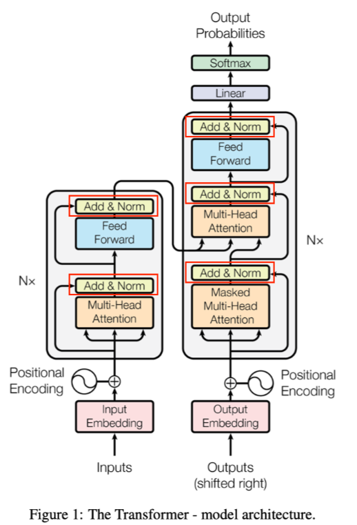

# 标准化Normalization

**Normalization作用是通过标准化隐藏层的输出，稳定训练过程，缓解梯度消失或爆炸问题，同时加速收敛并提高模型泛化能力**

**这里的“Add”就是残差操作，缓解深层网络梯度消失问题**



Normalization（归一化）：目的是通过对激活值或特征张量进行规范化处理，使得**缓解梯度消失、加速模型收敛、增强模型泛化能力**.

又有其它多种归一化技术，如Batch Normalization(BN)、Layer Normalization(LN)、Instance Normalization(IN)、Group Normalization(GN)、RMS Norm以及
超深层模型有效的Deep Norm等。

## BN

### 为什么进行BN?

- 深度神经网络训练过程中，采用mini-batch进行梯度下降时，每个batch数据分布不同，使得网络各层的输入分布在训练过程中不断发生漂移（ICS），使得模型训练变得困难，收敛速度变慢。

ICS是指前面batch训练时会影响到后续batch的训练，让模型在这条道路一直训练，起了形象的名字——漂移。

- BN核心思想是在**激活函数前，对每个通道在batch维度上计算均值与方差，并将激活值约束到均值为0、方差为1的分布**
（再加上可学习的缩放与偏置系数），可减小ICS问题

### BN的计算过程

如果某层输出维度为[N,C,H,W]，其中N表示batch_size,C为通道数，H和W分别为表示特征图的高和宽。

**沿着通道方向**计算每个batch的均值和方差，即对**同一通道**内的所有样本像素进行统计：

1.**计算均值$\mu_c$**：$\mu_c = \frac{1}{N\times H\times W}\sum_{n=1}^N \sum_{h=1}^H\sum_{w=1}^W x_{n,c,w,h}$

2.**计算方差$\sigma_c^2$**:$\sigma_c^2=\frac{1}{N\times H\times W\times}\sum_{n=1}^N \sum_{h=1}^H \sum_{w=1}^W (x_{n,c,h,w}-\mu_c)^2$

3.**归一化$\hat{x}_{n,c,h,w}$**: $\hat{x}_{n,c,h,w}=\frac{x_{n,c,h,w}-\mu_c}{\sqrt{\sigma^2+\epsilon}}$

$\epsilon$ 是一个非常小的正数，它的作用是防止分母为零或接近零的情况，从而避免计算时出现数值不稳定或错误。

4.**缩放和平移**：$y_{h,c,w,h}=\gamma_c \hat{x}_{n,c,w,h}+\beta_c$,其中$\gamma_c和\beta_c$为可学习参数，初始时$\gamma_c=1,\beta_c=0$


### BN的作用

- 减少ICS,避免梯度消失、爆炸
- 允许使用较大的学习率
- 降低对权重初始化的敏感度
- 对隐藏层输出有轻微的正则化效果（类似在隐藏层加入噪声）

### BN存在的问题

- 当**batch_size太小**：统计的均值、方差估计不准确，不足以代表整体数据分布
- 当**batch_size太大**：消耗显存且训练慢
- 不适用于对序列长度较不固定或batch_size=1的场景，BN效果不佳

## Layer Normalization(LN)

在很多任务里，batch_size很小，甚至为1；在RNN里，每一步输入大小各异，
BN难以奏效。LN则解决这一问题，**不依赖batch维度**，在单个样本内对特征进行归一化。

### LN计算公式

#### 统计量计算维度：
- 对于每个样本 $n$，在其 **所有通道 + 所有空间位置** 上计算均值和方差。
- 即：每个样本自己内部做归一化。

#### 数学公式：
对于第 $n$ 个样本：

$$
\mu_n = \frac{1}{C \cdot H \cdot W} \sum_{c,h,w} x_{n,c,h,w}
$$

$$
\sigma_n^2 = \frac{1}{C \cdot H \cdot W} \sum_{c,h,w} (x_{n,c,h,w} - \mu_n)^2
$$

然后进行归一化：

$$
\hat{x}_{n,c,h,w} = \frac{x_{n,c,h,w} - \mu_n}{\sqrt{\sigma_n^2 + \epsilon}}
$$

最后缩放和平移（对每个样本可以独立设置参数，也可以共享）：

$$
y_{n,c,h,w} = \gamma \hat{x}_{n,c,h,w} + \beta
$$

（注意：这里 $\gamma, \beta$ 可以是每个通道一个，也可以是整个层共享）

```python
nn.LayerNorm(normalized_shape, eps=1e-05, elementwise_affine=True)
```

- normalized_shape 指出在特征张量的哪些维度上做LN;
- eps 为防止分母的方差估计趋近于0
- elementwise_affine 指是否使用可学习的$\gamma和\beta$

### 特点

- **不依赖batch**: 适用与batch_size很小的情况，以及在序列建模（RNN、Transformer）的场景
- **对序列建模效果明显**：由于不依赖batch_size大小和时间序列长度，在循环网络中能稳定激活分布，加快收敛。
- **在CNN上效果比BN差**： LN统计范围相当于每个通道都被参与计算，会损失某些图像特征的局部性。


### 总结

> - **BN（BatchNorm）：对一个 batch 内的每个通道（channel）单独计算均值和方差。**
> - **LN（LayerNorm）：对单个样本的所有通道、空间位置一起计算均值和方差。**


BN vs LN 的关键对比

| 特性 | BatchNorm (BN) | LayerNorm (LN) |
|------|----------------|----------------|
| 统计维度 | 同一通道下，跨 batch 和空间 | 同一批次下，跨通道和空间 |
| 是否依赖 batch 大小 | 是 | 否 |
| 是否适合 RNN / Transformer | 否 | 是 ✅ |
| 对 batch size 敏感 | 是（小 batch 影响效果） | 否 |
| 是否保留样本差异性 | 否（batch 内共享统计） | 是 ✅ |
| 应用场景 | CNN 图像任务 | NLP、Transformer、小 batch 场景 |


举个例子说明差异

假设你有一个 batch 中有 2 张图片，每张图片有 3 个通道（RGB），尺寸是 $64 \times 64$：

- **BN**：对每个通道（如 R 通道）把这 2 张图的所有像素（共 $2 \times 64 \times 64$）拿来算均值和方差。
- **LN**：对每一张图，把它所有的像素（共 $3 \times 64 \times 64$）拿来算均值和方差。


实际应用中的选择建议

| 模型类型 | 推荐使用 |
|----------|-----------|
| CNN 图像分类 | BatchNorm ✅ |
| RNN / LSTM / GRU | LayerNorm ✅ |
| Transformer | LayerNorm ✅ |
| 小 batch size | LayerNorm 更稳定 |
| 分布变化大或 batch 不稳定 | LayerNorm 更鲁棒 |


总结

| 层面 | BatchNorm | LayerNorm |
|------|------------|-------------|
| 统计对象 | 每个通道（C） | 每个样本（N） |
| 统计范围 | batch + 空间 | 通道 + 空间 |
| 是否依赖 batch | 是 | 否 |
| 适用网络 | CNN | RNN、Transformer |
| 数学表达 | 均值 $\mu_c$、方差 $\sigma_c^2$ | 均值 $\mu_n$、方差 $\sigma_n^2$ |


## Transformer中的LayerNorm解释


对这张图可能会做出这样的转化：$N \sim Batch_size, C \sim seq_len, H、W\sim hidden_sim$

不过这样转化对BatchNorm是可以的，但对于LayerNorm就不对了。

```python
Examples:

# NLP Example
>>> batch, sentence_length, embedding_dim = 20, 5, 10
>>> embedding = torch.randn(batch, sentence_length, embedding_dim)
>>> layer_norm = nn.LayerNorm(embedding_dim)
>>> # Activate module
>>> layer_norm(embedding)

# Image Example
>>> N, C, H, W = 20, 5, 10, 10
>>> input = torch.randn(N, C, H, W)
>>> # Normalize over the last three dimensions (i.e. the channel and spatial dimensions)
>>> layer_norm = nn.LayerNorm([C, H, W])
>>> output = layer_norm(input)

```

可以看到对于NLP model(Bert之后的)LayerNorm有着不同的用法，可以用下面这张图描述，
LayerNorm是对每一个token的hidden_dim做归一化：


```python
torch.nn.LayerNorm( normalized_shape, eps=1e-05, elementwise_affine=True, bias=True,device=None,dtype=None)
```

LN的归一化需要两个trainable参数，以及分母上的eps

- 手撕LayerNorm (deepseek面试题)
```python
import torch
import torch.nn as nn

class LayerNorm(nn.Module):
    
    def __init__(self, featurea, eps=1e-6):
        super().__init__()
        self.gamma = nn.Parameter(torch.ones(features))
        self.beta = nn.Parameter(torch.zero(features))
        self.eps = eps


    def forward(self, x):
        mean = x.mean(-1, keepdim = True)
        std = x.std(-1, keepdim = True, unbiased = False)
        return self.gamma * (x - mean) / (std + self.eps) + self.beta

fearures = 768
layer_norm = LayerNorm(features)

x = torch.randn(10, 20, features)
normalized_x = layer_norm(x)
print(normalized_x)

```

## Instance Normalization(IN)

IN最初用于图像风格迁移任务。原因在于：在风格化生成网络中，每张图像风格往往只受单张图像本身的特征分布影响。

BN这种“跨样本”的归一化无法保留单张图像的风格差异，因此需要在**每张图像的特征图上分别做归一化**，即在$H\times W$维度上进行操作，而保留batch和通道维度。

### IN计算公式

对输入$x\in R^{N\times C\times W\times H}$ ,IN在每个样本n、每个通道c的特征图上计算均值和方差：

$$\mu_{n,c}=\frac{1}{HW}\sum_{h=1}^H\sum_{w=1}^W x_{n,c,h,w}, \sigma_{n,c}^2=\frac{1}{HW}\sum_{h=1}^H\sum_{w=1}^W(x_{n,c,h,w}-\mu_{n,c})^2$$

$$y_{n,c,h,w}=\frac{x_{n,c,w,h}-\mu_{n,c}}{\sigma_{n,c}^2+\epsilon}$$

可以加上可学习的$\gamma, \beta$

### IN的特点

- **对每个样本、每个通道分别进行归一化**：不考虑batch内其它样本，与BN不同
- **风格化迁移**：可保证不同样本之间的风格差异
- **特征图上归一化**： 去掉了$H\times W$中的统计差异，但保留了跨样本、跨通道的变化

---

**IN和LN有什么区别**

可训练参数上是有区别的，layer_norm为hidden_dim上的每一个数字维护$\gamma和\beta$,
instance_norm为seq_len上的每一个数字维护$\gamma和\beta$

## Group Normalization(GN)

GN是解决BN对batch size依赖较大的问题：当batch size非常小（如图像分割、超大模型训练时），BN估计均值和方差出现偏差，效果变差。

GN提出将通道分组后，各分组内部做LN类似的归一化

### GN的计算方式

假设有C个通道，将其分成G组（每组有C/G个通道），在单样本特征图中，对同一组中的所有通道和其对应的空间位置$H\times W$做均值和方差计算：

$$\mu_{n,g}=\frac{1}{(C/G)HW}\sum_{c=g\frac{C}{G}}^{(g+1)\frac{C}{G}-1}\sum_{h=1}^H\sum_{w=1}^W x_{n,cmh,w}$$

$$\sigma_{n,g}=\sqrt{\frac{1}{(\frac{C/G}HW)}\sum_{c=g\frac{C}{G}}^{(g+1)\frac{C}{G}-1}\sum_{h=1}^H\sum_{w=1}^W(x_{n,c,h,w}-\mu_{n,g})^2+\epsilon}$$

再进行标准化与可学习的缩放和平移。GN是BN与LN的一种折中，既比LN更关注通道结构，有不依赖batch_size，适合小batch_size场景。

---

### BN、LN、IN、GN区别

假设输入特征的形状为 [N, C, H, W] ，它们的区别：

1. **BN**：在batch维度上做归一化（对N × H × W做均值和方差），保留通道维度C。适用于CNN，中等或大batch size；不适合极小batch或RNN场景。

2. **LN**：在单个样本中对C×H×W的所有元素做归一化。适合RNN、Transformer等序列场景，对batch size不敏感；在CNN上效果不如BN。 

3. **IN**：在单张图片、单个通道上，对H×W进行归一化。常用于风格迁移，保留跨图片、跨通道的风格差异。 

4. **GN**：将通道C分成G组，在同一组内进行LN式归一化；既不依赖batch size，又兼顾通道间统计特性，适合小batch size场景。 

---

## RMS Norm

### 原理

- **计算均方根（RMS）**：给定输入向量 $\mathbf{x} \in \mathbb{R}^d$ （$d$ 为特征维度） ，RMS Norm通过计算输入特征的均方根进行归一化，公式为 $\text{RMS}(\mathbf{x}) = \sqrt{\frac{1}{d} \sum_{i = 1}^{d} x_{i}^{2}}$  ，不进行均值计算与减法操作。
- **归一化与缩放**：归一化输入向量 $\hat{\mathbf{x}} = \frac{\mathbf{x}}{\text{RMS}(\mathbf{x})}$ ，并通过可学习的缩放系数 $g_{i}$ （或表示为 $\gamma$ ）对其缩放 ，得到最终归一化输出 $\text{RMSNorm}(\mathbf{x}) = \gamma \odot \hat{\mathbf{x}}$  （$\odot$ 表示元素级乘法） 。

### 与LayerNorm的区别
LayerNorm计算输入特征的均值 $\mu$ 和标准差 $\sigma$ ，公式为 $\text{LN}(h_i) = \frac{h_i - \mu_{h_i}}{\sqrt{\sigma_{h_i}^2 + \epsilon}} * \gamma + \beta$ ，需进行均值减法和标准差除法操作，且有可学习的缩放参数 $\gamma$ 与偏移参数 $\beta$ ；RMS Norm不计算均值，仅依赖均方根归一化，没有额外可学习的偏移参数，简化了计算流程。

### 优点
- **计算高效**：省去均值计算步骤，减少约10% - 30%计算开销，尤其在大模型或处理长序列数据时，能显著提升计算效率。
- **数值稳定**：避免了均值接近零时可能出现的数值不稳定问题，在某些应用中，LayerNorm因均值计算不稳定导致训练波动，RMS Norm去除该步骤使训练更平滑。 
- **适用性广**：作为简单高效的归一化方法，无需依赖批量大小或输入分布，能处理变长输入序列，在Transformer和自注意力机制等序列模型中表现良好，被广泛应用于现代架构（如LLaMA、GPT - Neo等） 。
- **训练加速**：在部分任务上，使用RMS Norm的模型收敛速度更快，训练效率更高，处理大型数据集时优势明显。

### 缺点
- **无均值归一化限制**：在某些对输入数据均值敏感的任务中（如图像数据处理） ，表现可能不如LayerNorm，因为去除均值计算可能影响模型对关键特征的捕捉。
- **缺乏批量统计依赖**：虽适合处理变长序列，但在有足够大批量数据的任务中，BatchNorm利用批量统计量可能取得更好效果。 


### pRMS Norm

在深度学习中，当处理超大向量或者特征数极多的情况时，RMS Norm（Root Mean Square Layer Normalization）需要对整个向量计算均方根，计算量会变得很大。为了在不显著影响模型性能的前提下减小计算量，pRMS Norm（Partial Root Mean Square Layer Normalization）应运而生。它通过只使用部分元素来计算RMS值，从而降低计算成本，尤其适用于大规模模型的训练与推理。

### 原理
pRMS Norm的核心在于只选取向量中前 $p\%$ 的元素来计算RMS值。假设向量 $\mathbf{a} = [a_1, a_2, \cdots, a_n]$ ，其中 $n$ 是向量的长度。首先确定用于计算的元素个数 $k$ ，$k = n\times p$ （这里 $p$ 是一个比例值，比如 $p = 0.1$ 表示选取前10%的元素 ）。

然后按照以下公式计算均方根值：
$\overline{RMS}(\mathbf{a})=\sqrt{\frac{1}{k}\sum_{i = 1}^{k}a_{i}^{2}}$

也就是说，它不是对整个向量的所有元素进行均方根计算，而是仅基于选定的部分元素来计算。这样在大规模向量计算时，就可以大幅减少计算量。

### 优势
- **计算量降低**：在超大向量或者特征维度极高的场景下，通过只使用部分元素计算RMS，能显著减少计算量。例如在一些大语言模型中，处理长文本序列时，特征向量维度很大，pRMS Norm可以有效降低计算成本，加速训练和推理过程。
- **性能保留**：在实际测试中发现，pRMS Norm在减少计算量的同时，还能较好地保留模型的收敛性能。这意味着它不会因为减少了计算量而使模型的训练效果大打折扣，依然能够让模型在合理的时间内达到较好的训练结果。

### 应用场景
主要适用于大规模深度学习模型，尤其是那些处理长序列数据的模型，比如大语言模型（LLMs）。在这些模型中，输入序列可能很长，对应的特征向量维度很高，传统的RMS Norm计算开销大，而pRMS Norm可以平衡计算效率和模型性能，使得模型在有限的计算资源下也能高效运行。同时，在一些处理高维图像特征等场景中，如果存在类似的计算量过大问题，也可以考虑应用pRMS Norm来优化计算过程。  

---

## Post-LN与Pre-LN


Transformer中，残差连接与LN的先后顺序分为：

1.**Post-LN**： 在自注意力/FFN + 残差连接之后再做LN

2.**Pre-LN**:在自注意力/FFN之前先做LN ，再加上残差连接

#### Post-LN 结构：

- 将LN放在残差之后，有更强的正则化效果；
- 但在深层网络中，有时出现训练不稳定（梯度不易传递或爆炸）。

**更强正则化效果**：将 LN 放在残差之后，对残差块输出的所有参数进行归一化，使得参数分布更加规整，相当于对模型施加了更强的约束，限制了参数的取值范围，增强了正则化效果，有助于防止模型过拟合 。

**训练不稳定**：在深层网络中，梯度要经过较多的计算层回传。由于 Post - LN 对所有参数归一化，当网络层数加深，每层的输出经过归一化后，可能会使梯度在反向传播时出现异常变化，比如梯度值变得过大或过小，导致梯度爆炸或消失，使得训练不稳定，难以有效更新参数 。

#### Pre-LN 结构：

- 在残差前先做LN，以保证梯度能够更顺畅地传递；
- 更易训练且更稳定，但有时模型的最终性能不如Post-LN高。 

**梯度传递顺畅**：在残差前先做 LN，对输入到残差块的信号进行归一化，使得输入数据分布更稳定，能让梯度在反向传播过程中更顺畅地通过各层，避免因数据分布变化过大导致梯度异常，所以训练过程更加稳定 。

**最终性能受限**：Pre - LN 将部分参数进行归一化，部分参数直接加在后面（没有正则化） ，从某种程度上降低了网络的等效深度，近似于使网络变 “宽”，但深度神经网络中深度往往对性能很关键。这种结构无形之中降低深度，可能影响模型对复杂特征的学习和表示能力，导致有时最终性能不如 Post - LN 高 。


Deep Norm 则实在Post-LN的基础上加上缩放系数$\alpha,\beta$,在深层网络中既能维持训练稳定性，也能保持Post-LN的优势。

---

## Deep Norm

### Deep Norm的提出

Deep Norm主要用于超深层Transformer的稳定训练。它是在原有Post-LN（LayerNorm放在残差连接后）结构的基础上做了两点改进：

1. 在残差连接前乘以一个系数 $\alpha$，以缩放输入特征；

2. 在Xavier初始化时，对部分参数乘以 $\beta$，以减小初始化范围。

参数参考：

| Architectures | Encoder |  | Decoder |  |
| ---- | ---- | ---- | ---- | ---- |
|  | $\alpha$ | $\beta$ | $\alpha$ | $\beta$ |
| Encoder-only (e.g., BERT) | $(2N)^{\frac{1}{4}}$ | $(8N)^{-\frac{1}{4}}$ | - | - |
| Decoder-only (e.g., GPT) | - | - | $(2M)^{\frac{1}{4}}$ | $(8M)^{-\frac{1}{4}}$ |
| Encoder-decoder (e.g., NMT, T5) | $0.81(N^{4}M)^{\frac{1}{10}}$ | $0.87(N^{4}M)^{-\frac{1}{10}}$ | $(3M)^{\frac{1}{4}}$ | $(12M)^{-\frac{1}{4}}$ |

### Deep Norm的原理

论文提出，如果仅使用后归一化（Post-LN）时，在极深层网络中，梯度容易累积放大，导致训练不稳定。Deep Norm的做法是在每个残差连接前都用 $\alpha$ 把输入放大或缩小，并在初始化时用 $\beta$ 调整部分参数的分布。作者通过理论和实验证明：

- 这种缩放可以让模型的“预期更新”维持在一个恒定水平，不会导致梯度爆炸或梯度消失；
- Deep Norm在保持Post-LN良好收敛性的同时，也像Pre-LN那样使得超深层训练变得稳定。

Deep Norm的实现在microsoft/torchscale中可见。对比Pre-LN的方案，Deep Norm保留了更强的正则化效果，且能将Transformer堆叠到上千层深度。 

