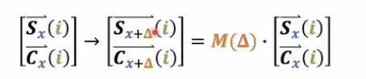

# Positional Embedding
**Transformer中使用的自注意力机制没有顺序概念，需要添加一个含有位置信息的embedding**


## 为什么需要位置编码？

额外引入位置编码的原因很简单：如果没有位置信息，Transformer会将所有词并行处理，无法捕捉词语顺序带来的语义差异。比如“我打你”和“你打我”，字相同但语义相反，顺序至关重要。

为了在并行计算中保留顺序信息，有两种方式可以将位置信息融入词向量：

1. **乘法方式（阿达玛积）**：通过权重调整词向量，相当于给模型增加一层结构；

针对两个维度相同的矩阵\(A\)和\(B\)（行列数分别相等 ），它们的阿达玛乘积记作\(A \circ B\) ，得到的结果是一个新矩阵\(C\) 。
新矩阵\(C\)中每个元素\(C_{ij}\) ，是矩阵\(A\)和\(B\)对应位置元素\(A_{ij}\)与\(B_{ij}\)的乘积，

即\(C_{ij} = A_{ij} \cdot B_{ij}\) 。

例如：

若\(A=\begin{pmatrix}1&2\\3&4\end{pmatrix}\) ，\(B=\begin{pmatrix}5&6\\7&8\end{pmatrix}\) ，
那么\(A \circ B=\begin{pmatrix}1\times5&2\times6\\3\times7&4\times8\end{pmatrix}=\begin{pmatrix}5&12\\21&32\end{pmatrix}\) 。 

几何意义

普通矩阵乘法能实现旋转、缩放等全局线性变换 

阿达玛乘积更多是局部元素级别操作，可看作在每个维度上独立缩放对应位置元素 ，反映的是两个矩阵在每个元素上的局部交互 。


2.**加法方式**：将位置信息作为偏置加到词向量上，相当于对不同位置的向量进行不同的平移操作。

原版Transformer采用的是加法方式。这可能是因为乘法对词向量的影响更强、更复杂，而加法更像是神经网络中常见的偏置项，改动更温和。

当然，并非所有模型都用加法。例如LLaMA使用的旋转位置编码（RoPE），就是通过乘法实现的。这部分我们会在讲相对位置编码时再详细展开。

我们现在来看原版Transformer中用加法实现的位置编码。既然要用加法，那就要解决一个问题：**P矩阵中的值应该怎么设定？**

这个不能随意决定，必须保证这些值能体现出词语的顺序信息。具体做法是：

将位置编号（自然数）映射到一个与词向量维度相同的连续空间中，这样就可以和词向量直接相加。

论文中给出的绝对位置编码公式看起来很复杂，但我们可以借助“傅里叶级数”来理解它的设计思路。

---

### 一、位置编码的本质

绝对位置编码的本质是对每个位置编号 $0,1,2,...,N$ 进行升维，变成一个 D 维向量（D 是词向量维度），使得模型可以区分不同位置的词。

这个向量是怎么构造的呢？

- 每两个维度为一组；
- 一组内分别使用 sin 和 cos 函数；
- 函数的参数按一定规律变化；
- 同一组内的括号内容相同。

写出来就是这样的形式：

$$
PE_{(pos, 2i)} = \sin\left(\frac{pos}{10000^{\frac{2i}{d}}}\right), \quad PE_{(pos, 2i+1)} = \cos\left(\frac{pos}{10000^{\frac{2i}{d}}}\right)
$$

---


我们现在来看原版Transformer中用加法实现的位置编码。既然要用加法，那就要解决一个问题：**P矩阵中的值应该怎么设定？**

这个不能随意决定，必须保证这些值能体现出词语的顺序信息。具体做法是：将位置编号（自然数）映射到一个与词向量维度相同的连续空间中，这样就可以和词向量直接相加。

论文中给出的绝对位置编码公式看起来很复杂，但我们可以借助“傅里叶级数”来理解它的设计思路。

---

### 二、为什么这么设计？从傅里叶级数出发理解

虽然论文没有明确说明设计动机，但我们可以通过类比傅里叶级数来理解它的特性。

在傅里叶级数中，周期函数可以表示为一系列正弦和余弦函数的叠加，频率依次递增：

$$
f(x) = a_0 + \sum_{n=1}^\infty \left(a_n \cos\left(\frac{2\pi n x}{T}\right) + b_n \sin\left(\frac{2\pi n x}{T}\right)\right)
$$

这和位置编码的结构有些相似：

- 都是 sin 和 cos 的组合；
- 都有频率的变化；
- 都是用来表示某种“信号”或“模式”。

区别在于：

| 特性 | 傅里叶级数 | 位置编码 |
|------|-------------|----------|
| 频率 | 线性增长（1, 2, 3...） | 指数衰减（分母中有指数项） |
| 项数 | 可以无限多 | 有限 |
| 系数 | 可学习或计算得到 | 固定值 |

---

### 三、关键设计点：频率的指数衰减

位置编码中，频率因子出现在分母的指数上，意味着随着维度增加，频率逐渐变小，也就是说：

- 低频部分捕捉长距离依赖；
- 高频部分捕捉局部细节；
- 整体频率分布不均匀，呈指数递减趋势。

这种设计可以让位置信息在多个尺度上被表达，增强模型对相对位置的感知能力。

---
 
- 绝对位置编码通过 sin 和 cos 函数，将位置编号映射为高维向量；
- 其设计灵感可能来自傅里叶级数；
- 使用指数衰减的频率分布，使位置信息在不同维度上体现不同尺度的特征；
- 这种方式不仅保留了位置顺序信息，还能让模型更好地处理长序列。


我们可以从图中定性地看出函数 $ F(t) $ 的周期。根据傅里叶级数的原理，最小频率决定了整个函数的周期：即用 $ 2\pi $ 除以这个最小频率单位，就能得到周期 $ T $。

在位置编码的设计中，我们也试图找出这样一个“最小刻度”$ \delta $，使得所有频率都是这个刻度的整数倍。这样，才能满足傅里叶级数的基本形式——只有当频率是基本频率的整数倍时，叠加后才是一个标准的周期函数。

因此：

- 所有非零系数对应的位置信息，可以看作是对某个周期函数的有限项展开；
- 这个函数是关于位置 $ t $ 的函数，并且是周期性的；
- 每一行（每个词向量对应的位置编码）都可以看作是这个周期函数在某一维度上的投影；
- 把所有这些维度加起来，就构成了完整的位置编码矩阵 $ P $。


> 位置编码本质上是一个周期函数的离散展开，每一维对应傅里叶级数中的一个频率分量。通过这种方式，模型可以在不同尺度上感知位置信息，同时保持结构的规律性和可扩展性。

我们可以从图中定性地看出函数 $ F(t) $ 的周期。周期由最小的频率单位决定：用 $ 2\pi $ 除以这个最小频率，就能得到整个函数的周期。

在位置编码中，我们也希望找到一个“最小刻度”$ \delta $，使得所有其他频率都是它的整数倍。这样才能符合傅里叶级数的基本形式。

也就是说：

- 所有非零项的频率都应是某个基本频率的整数倍；
- 只有满足这个条件，叠加后的结果才是标准的周期函数；
- 即使某些频率看起来更大，它们的本质仍可归结为更小基本频率的组合；
- 因此，虽然位置编码按维度排列，但只要把这些项加起来，就可以看作是一个关于位置 $ t $ 的周期函数。


进一步地，我们可以把每个 sin 和 cos 看成一个向量（S 向量和 C 向量），它们拼接在一起就构成了一个更高维的向量。每一行代表一个位置的信息，把这些行合起来就是完整的位置编码矩阵 $ P $。

所以：

> **位置编码矩阵 $ P $ 的每一行对应一个位置，每一列对应一个特定频率的 sin 或 cos 函数值。将这些值加起来，就相当于对一个周期函数进行离散采样。**

这也解释了为什么我们能借助傅里叶级数来分析位置编码的结构与特性。

### 四、Transformer中的位置编码机制解析


我们可以从频域的角度来看位置编码的作用：

这个函数本质上是对位置信息做了一种**频域变换**，就像傅里叶级数把一个时域函数分解成多个频率分量一样。

在Transformer的位置编码中：

- **每一列代表一个特定频率的 sin 或 cos 值；**
- 不同列之间是**正交的**，就像图像中的 RGB 通道互不干扰；
- 这保证了不同维度上的信息不会互相干扰，是模型有效学习的基础。

---

### 频率选择：为什么用指数方式？

- 如果我们简单地将频率均匀划分（等比增长），最小频率会很大，导致整体周期很小；
- 这样一来，稍长一点的序列就会出现重复的位置编码；
- 所以原版 Transformer 使用了**指数递减的方式**来设置频率：
  
  $$
  \frac{pos}{10000^{\frac{2i}{d}}}
  $$

- 这样可以让**最小频率尽可能小**，从而让整个函数的周期非常大；
- 结果就是：**支持更长的输入序列（如上万个 token）而不重复。**

---


第三个关键特性：相对位置关系变为了“旋转角度”

- 在原始的位置表示中，两个词之间的距离是数值上的差（比如位置 $ x $ 和 $ x+\delta $）；
- 经过 sin/cos 编码后，它们之间的差异变成了**向量空间中的旋转角度**；
- 换句话说，模型不再直接看“相隔几个位置”，而是看到“这两个词向量在某个维度上旋转了多少角度”。

这种设计有助于模型更好地理解**相对位置关系**，也更容易泛化到未见过的长度。

---

> Transformer 的位置编码通过 sine/cosine 函数将位置信息映射到频域，每一列代表一个频率分量，列间保持正交性；使用指数方式控制频率分布，使得最小频率足够小、周期足够大，从而支持更长序列；同时，位置差异被转化为向量空间中的旋转角度，使模型能更好地捕捉相对位置信息。


我们可以从一组 sin 和 cos 的维度入手来看位置编码的结构。这一组确定之后，其他组的变化其实只是频率不同而已。

我们来看这两个向量之间的关系：一个是位置 $ x $ 的编码，一个是位置 $ x + \delta $ 的编码。


直接说结论：

> 这两个向量之间差了一个**旋转矩阵**的作用。也就是说，原本在数值上相差 $ \delta $ 的两个位置，在经过 sine/cosine 编码后，变成了在向量空间中“旋转”了某个角度。

---

- 如果你对线性代数熟悉一点就会发现，这个变换其实就是二维平面上的一个标准旋转；
- 每一对 sin 和 cos 组成一个二维向量；
- 当位置增加 $ \delta $ 时，这个向量就绕原点旋转了一个固定角度；
- 所有维度合在一起，就是多个这样的二维旋转组合起来的大变换。



数学形式如下：

$$
\begin{bmatrix}
\sin(\omega x) \\
\cos(\omega x)
\end{bmatrix}
\quad \xrightarrow{\text{+}\delta} \quad
\begin{bmatrix}
\sin(\omega(x+\delta)) \\
\cos(\omega(x+\delta))
\end{bmatrix}
= R(\omega\delta)
\begin{bmatrix}
\sin(\omega x) \\
\cos(\omega x)
\end{bmatrix}
$$

其中 $ R(\omega\delta) $ 就是一个二维旋转矩阵。

---

- 把每一组 sin/cos 看作一个小的二维旋转模块；
- 整个大矩阵就是一个由这些小模块组成的“块对角矩阵”；
- 每个模块对应不同的频率 $ \omega_i $；
- 不同频率之间互不干扰（因为非对角线元素都是0）；

所以：

> 两个位置相差 $ \delta $ 的词向量，它们之间的差异被编码为一组不同频率下的“旋转操作”。

---
1. **相对位置 → 向量旋转**  
   原本是数值上的距离差，现在变成了向量空间中的角度差；
2. **频率分布设计巧妙**  
   使用指数方式控制频率，使得最小频率足够小、周期足够长，支持更长序列；
3. **各维度正交**  
   不同频率之间相互独立，信息不混杂，便于模型学习；
4. **与旋转位置编码的区别**  
   虽然都涉及“旋转”，但这里说的是绝对位置编码的内在结构，而旋转位置编码（如 RoPE）是一种显式的相对位置编码方法。

## 相对位置编码


我们前面讲的是**绝对位置编码**，它是直接给输入词向量加上一个位置信息，让每个词自己携带它的位置信息。

而后来提出的**相对位置编码**，思路完全不同：它不是修饰数据本身，而是修饰**注意力得分矩阵 A**。因为在注意力机制中，Q 和 K 的点积就是用来衡量两个词之间的关系的，所以相对位置信息应该在这里体现。

---

### 一、绝对位置编码 vs 相对位置编码

| 类型 | 作用方式 | 实现位置 | 特点 |
|------|----------|-----------|------|
| 绝对位置编码 | 给词向量加位置信息 | 输入层前 | 每个词有固定“编号” |
| 相对位置编码 | 修饰注意力得分 | 注意力计算过程中 | 强调两个词之间的相对距离 |

---

### 二、为什么相对位置要放在注意力里？

- 因为注意力机制是唯一真正比较两个词（Q 和 K）的地方；
- 所以如果我们想表达“这个词在那个词之前/之后多少位”，就必须在这个点积结果上做文章；
- 绝对位置可以在输入阶段处理，但相对位置必须等到 Q 和 K 被拿出来以后才能计算。

---

### 三、原始注意力机制回顾

在标准的 Transformer 中，注意力得分是这样计算的：

$$
A_{q,k} = Q_q \cdot K_k^T
$$

其中：

- $ Q_q $ 是第 $ q $ 行的 query 向量；
- $ K_k $ 是第 $ k $ 列的 key 向量；
- 得分矩阵 $ A $ 中的每个元素表示第 $ q $ 个词对第 $ k $ 个词的关注程度。(这里不是输入矩阵)

这个得分只考虑了语义信息（由模型学习而来），没有包含任何位置信息。

---

### 四、引入绝对位置编码后的影响

如果我们给输入加上绝对位置编码（比如 sin/cos 编码）：

$$
Q_q = W_Q (X_q + P_q), \quad K_k = W_K (X_k + P_k)
$$

那么注意力得分就变成了：

$$
A_{q,k} = (W_Q X_q + W_Q P_q) \cdot (W_K X_k + W_K P_k)^T
$$

展开后得到四项：

$$
A_{q,k} = \underbrace{W_Q X_q \cdot W_K X_k^T}_{\text{纯数据项}} + 
\underbrace{W_Q X_q \cdot W_K P_k^T}_{\text{X-P项}} +
\underbrace{W_Q P_q \cdot W_K X_k^T}_{\text{P-X项}} +
\underbrace{W_Q P_q \cdot W_K P_k^T}_{\text{P-P项}}
$$

可以看到，除了第一项完全来自数据本身外，其余三项都与位置有关，分别依赖于：

- 第二项：$ X_q $ 和 $ P_k $
- 第三项：$ P_q $ 和 $ X_k $
- 第四项：$ P_q $ 和 $ P_k $

也就是说，这些项既和 $ q $ 有关，也和 $ k $ 有关，它们并不是纯粹的“相对位置”。

---

### 五、目标：让注意力得分只依赖于相对位置 $ q - k $

为了实现**相对位置编码**，我们要让注意力得分中涉及位置的部分只依赖于两个位置的差值 $ r = q - k $，而不是单独的 $ q $ 或 $ k $。

这就要求我们把注意力得分中的位置相关项改写为如下形式：

$$
f(q, k) = g_1(q) + g_2(q - k)
$$

或者更进一步地：

$$
f(q, k) = U_q + R_{q-k}
$$

其中：

- $ U_q $：只与当前 query 的位置 $ q $ 有关；
- $ R_{q-k} $：只与相对位置 $ r = q - k $ 有关；

这样做的好处是：

- 模型可以学到某种“平移不变性”：无论你从哪一行开始看，相对位置的关系保持一致；
- 更符合语言的本质：“我打你”和“你打我”的区别在于“我”和“你”的相对位置，而不是它们的绝对编号。

---

### 六、如何构造 $ R_{q-k} $？

#### 方法一：人为设计（手工定义）

我们可以直接设计一个向量 $ R_r $，它的每一维对应一个关于相对位置 $ r $ 的函数。例如：

- 第0维：常数 1；
- 第1维：$ r $
- 第2维：$ r^2 $
- 第3维：$ r^3 $
- ……

这种做法类似于多项式拟合，可以表达复杂的非线性关系。

也可以使用其他函数，比如：

- 正弦/余弦函数（类似绝对位置编码）
- 指数函数、高斯函数等

#### 方法二：可学习嵌入（Learnable Embedding）

这是最常用的方法，就是预先定义一个位置偏移范围（如 $-L$ 到 $+L$），然后为每一个可能的相对位置 $ r $ 学习一个向量 $ R_r $。

举个例子：

- 如果最大序列长度是 512，那最多有 $ \pm 512 $ 的相对位置；
- 那么我们就准备一个大小为 $ 1024 \times d $ 的可学习矩阵；
- 每次查表取出对应的 $ R_{q-k} $ 即可。

这种方法简单有效，在很多模型中都有应用。

#### 方法三：结合卷积思想

也可以将 $ R_r $ 设计成类似 CNN 中的卷积核，让它在局部区域内共享参数或具有某种空间结构，从而捕捉局部依赖。

---

### 七、如何整合进注意力机制？

我们希望最终的注意力得分是这样的形式：

$$
A_{q,k} = Q_q \cdot K_k^T + U_q + R_{q-k}
$$

或者更一般的形式：

$$
A_{q,k} = Q_q \cdot K_k^T + b_q + c_{q-k}
$$

这里的 $ b_q $ 和 $ c_{q-k} $ 就是我们要加进去的位置偏置项：

- $ b_q $：与当前 query 有关的偏置；
- $ c_{q-k} $：与相对位置有关的偏置；

具体实现时，可以在计算完原始注意力得分后，再加上这两个偏置项即可。

---

### 八、举例说明

假设我们有以下内容：

- 位置编码 $ R_r $ 是一个可学习嵌入；
- 当前 query 在第 3 行，key 在第 1 列，那么相对位置是 $ r = 3 - 1 = 2 $；
- 查找 $ R_2 $，然后把这个向量加到注意力得分中。

如果是加法实现，那最终得分就是：

$$
A_{3,1} = Q_3 \cdot K_1^T + U_3 + R_2
$$

如果是乘法实现（如 RoPE），那就是：

$$
A_{3,1} = Q_3 \cdot K_1^T \cdot \phi(2)
$$

其中 $ \phi(2) $ 是一个旋转因子，和相对位置有关。


> 相对位置编码的核心思想是：通过修改注意力得分，使其不仅依赖于词的内容，还依赖于它们之间的相对距离 $ q - k $。这可以通过设计一个只与相对位置有关的向量 $ R_{q-k} $ 来实现，它可以是手动设计的函数、可学习的嵌入，甚至结合卷积的思想。


它不同于绝对位置编码（修饰输入），而是直接作用于注意力机制内部，强调的是词与词之间的关系，更贴近自然语言的本质。

---

### 九、旋转位置编码（RoPE）也是一种相对位置编码

- 它不通过加法，而是通过乘法来引入相对位置信息； 
- 具体做法是让 Q 和 K 在内积时乘上一个与相对位置相关的旋转因子；
- 数学形式如下：

$$
A_{q,k} = Q_q \cdot K_k^T \cdot \phi(q - k)
$$

- 其中 $ \phi $ 是一个关于相对位置的函数，通常用复数或旋转矩阵表示；
- RoPE 的优点在于它天然支持长序列，并且可以很好地保留相对位置信息。


> **绝对位置编码是对输入数据进行修饰，让每个词自己带位置；相对位置编码是在注意力机制中进行修饰，强调两个词之间的相对关系。两者各有优劣，也常常结合使用。**

虽然相对位置编码看起来更复杂，但它更符合语言的本质：我们理解句子时，往往不是靠“这是第几个词”，而是靠“这个词在另一个词的前后多远”。

## 主流位置编码方法

### 固定的正余弦位置编码（绝对位置编码）

传统transformer使用的位置编码，上文已经讲过。

$$

PE(position,2i)=sin(\frac{position}{10000^{\frac{2i}{d}}})
$$

$$
PE(position,2i+1)=cos(\frac{position}{10000^{\frac{2i}{d}}})

$$

特性：

- 可插值性：当输入序列位置超过训练时最大长度，模型仍然可以通过正弦和余弦函数的周期性，将位置编码自然地扩展到更长的位置。
- 平滑性：随着position的逐渐增加，编码向量的变化是平滑连续的
- 无额外参数：所有参数均是按照固定公式生成，不会额外增加可学习的权重

**生成的正余弦位置编码和token的词向量相加**

### 可学习的位置编码（绝对位置编码）

主要思想：允许位置编码在训练的时候学习，模型可以通过训练数据来决定如何在不同的维度上表示位置信息。

比正余弦位置编码方式要灵活一些，但是训练时需要更多数据才可以覆盖到更长的序列范围们，还有如果序列位置超过训练时的最大长度，模型对超长序列的位置索引就没办法扩展。

#### 具体实现

- 初始化矩阵$P\in R^{L_{max}\times d_{model}}$,$L_{max}$表示预先设定的最大序列长度
- 对序列中第$position$个token，它的位置编码是$P[position]$这一行向量
- 训练过程中，这个矩阵P会像词向量一样，随着反向传播更新，逐渐学习如何编码不同的位置

在大多数深度学习框架可直接用训练嵌入层（nn.Embeddind）做，但是泛化性不如正余弦，增加参数量

### 传统相对位置编码
最早出现在[Self-Attention with Relative Position Representations](https://arxiv.org/pdf/1803.02155)这篇论文里，思路是：

- 不为每个token绝对位置编码向量，而是为每一种两个token之间相对位置编码向量

### Transformer-XL的相对位置编码

详情可见这篇论文[Transformer-XL](https://arxiv.org/pdf/1901.02860)提出了分割上下文
和当前片段，并通过相对位置信息实现跨片段捕捉，实现更复杂，需要在注意力分数阶段额外添加一套机制处理相对距离。

慢而且不能用kv cache

### ROPE

RoPE的核心思想是通过在查询向量（Query）和键向量（Key）进行点乘之前，用一个二维旋转变换将它们映射到带有位置信息的空间中。

如果我们将向量拆分成二维坐标对\((x_1, x_2)\)，那么在二维平面做一个旋转：

\(\begin{pmatrix}
x_1 \\
x_2
\end{pmatrix} \to 
\begin{pmatrix}
x_1 \cos \theta - x_2 \sin \theta \\
x_1 \sin \theta + x_2 \cos \theta
\end{pmatrix}\)

而在RoPE中，不同维度对应不同的旋转角度，通常通过类似正余弦周期的方式来定义旋转角。


- **二维表示**：

\(f_{\{q, k\}}(\boldsymbol{x}_m, m) = 
\begin{pmatrix}
\cos m \theta & -\sin m \theta \\
\sin m \theta & \cos m \theta
\end{pmatrix}
\begin{pmatrix}
W_{\{q, k\}}^{(11)} & W_{\{q, k\}}^{(12)} \\
W_{\{q, k\}}^{(21)} & W_{\{q, k\}}^{(22)}
\end{pmatrix}
\begin{pmatrix}
x_m^{(1)} \\
x_m^{(2)}
\end{pmatrix}\)

- **拓展到n维表示**：

\(f_{\{q, k\}}(\boldsymbol{x}_m, m) = \boldsymbol{R}^d_{\boldsymbol{\theta}, m} \boldsymbol{W}_{\{q, k\}} \boldsymbol{x}_m\)

\(\boldsymbol{R}^d_{\boldsymbol{\theta}, m} = 
\begin{pmatrix}
\cos m \theta_1 & -\sin m \theta_1 & 0 & 0 & \cdots & 0 & 0 \\
\sin m \theta_1 & \cos m \theta_1 & 0 & 0 & \cdots & 0 & 0 \\
0 & 0 & \cos m \theta_2 & -\sin m \theta_2 & \cdots & 0 & 0 \\
0 & 0 & \sin m \theta_2 & \cos m \theta_2 & \cdots & 0 & 0 \\
\vdots & \vdots & \vdots & \vdots & \ddots & \vdots & \vdots \\
0 & 0 & 0 & 0 & \cdots & \cos m \theta_{d/2} & -\sin m \theta_{d/2} \\
0 & 0 & 0 & 0 & \cdots & \sin m \theta_{d/2} & \cos m \theta_{d/2}
\end{pmatrix}\)

- **实际上更简洁的n维表示**：

\(\boldsymbol{R}^d_{\boldsymbol{\theta}, m} \boldsymbol{x} = 
\begin{pmatrix}
x_1 \\
x_2 \\
x_3 \\
x_4 \\
\vdots \\
x_{d - 1} \\
x_d
\end{pmatrix}
\otimes
\begin{pmatrix}
\cos m \theta_1 \\
\cos m \theta_1 \\
\cos m \theta_2 \\
\cos m \theta_2 \\
\vdots \\
\cos m \theta_{d/2} \\
\cos m \theta_{d/2}
\end{pmatrix}
+
\begin{pmatrix}
-x_2 \\
x_1 \\
-x_4 \\
x_3 \\
\vdots \\
-x_{d - 1} \\
x_d
\end{pmatrix}
\otimes
\begin{pmatrix}
\sin m \theta_1 \\
\sin m \theta_1 \\
\sin m \theta_2 \\
\sin m \theta_2 \\
\vdots \\
\sin m \theta_{d/2} \\
\sin m \theta_{d/2}
\end{pmatrix}\)

优点：

- 结合绝对位置和相对位置的优点：它可以在注意力分数层面上体现相对位置的位移特征，同时又保留了类似正余弦编码可以“外推”的特性。
- 易于跨序列泛化：在更长序列或跨段情况下，RoPE依然可以很好地保持有效性。
- 计算简单高效：只需要在向量乘法前做一次旋转变换。

应用：

- 在一些开源的大模型（如Llama）以及多模态大模型中，RoPE是非常常用的默认位置编码方式。
- 相较于原生的正余弦编码，RoPE在对齐长文本、处理较长上下文时往往展现出更好的性能。 

1. **`rotate_half(x)` 函数**
   ```python
   def rotate_half(x):
       """"Rotates half the hidden dims of the input."""
       x1 = x[..., : x.shape[-1] // 2]
       x2 = x[..., x.shape[-1] // 2 :]
       return torch.cat((-x2, x1), dim=-1)
   ```

   - **功能**：该函数将输入张量 `x` 的最后一个维度（假设为隐藏维度 `hdim`）分成两半，并对这两半进行旋转操作。
   - **具体步骤**：
     1. `x1 = x[..., : x.shape[-1] // 2]`：提取 `x` 的最后一个维度的前一半。
     2. `x2 = x[..., x.shape[-1] // 2 :]`：提取 `x` 的最后一个维度的后一半。
     3. `torch.cat((-x2, x1), dim=-1)`：将 `-x2` 和 `x1` 沿着最后一个维度拼接起来，形成新的张量。

   - **关键点**：
     - `-x2` 表示对 `x2` 的每个元素取反（乘以 -1）。
     - `torch.cat(..., dim=-1)` 表示沿着最后一个维度进行拼接。

2. **`apply_rotary_pos_emb(q, k, cos, sin, position_ids)` 函数**
   ```python
   def apply_rotary_pos_emb(q, k, cos, sin, position_ids):
       # The first two dimensions of cos and sin are always 1, so we can `squeeze` them.
       cos = cos.squeeze(1).squeeze(0)  # [seq_len, dim]
       sin = sin.squeeze(1).squeeze(0)  # [seq_len, dim]
       cos = cos[position_ids].unsqueeze(1)  # [bs, 1, seq_len, dim]
       sin = sin[position_ids].unsqueeze(1)  # [bs, 1, seq_len, dim]
       q_embed = (q * cos) + (rotate_half(q) * sin)
       k_embed = (k * cos) + (rotate_half(k) * sin)
       return q_embed, k_embed
   ```

   - **功能**：该函数实现旋转位置编码（Rotary Position Embedding），对查询向量 `q` 和键向量 `k` 应用旋转位置编码。
   - **具体步骤**：
     1. **处理 `cos` 和 `sin`**：
        - `cos = cos.squeeze(1).squeeze(0)`：去掉 `cos` 的前两个维度（通常是批量维度和序列长度维度），得到形状为 `[seq_len, dim]` 的余弦值。
        - `sin = sin.squeeze(1).squeeze(0)`：同理，得到形状为 `[seq_len, dim]` 的正弦值。
        - `cos = cos[position_ids].unsqueeze(1)`：根据 `position_ids` 索引出对应的余弦值，并增加一个维度（批量维度），得到形状为 `[bs, 1, seq_len, dim]`。
        - `sin = sin[position_ids].unsqueeze(1)`：同理，得到形状为 `[bs, 1, seq_len, dim]` 的正弦值。
     2. **应用旋转位置编码**：
        - 对于查询向量 `q`：
          - `(q * cos)`：将 `q` 与 `cos` 相乘。
          - `(rotate_half(q) * sin)`：先对 `q` 调用 `rotate_half` 函数，然后与 `sin` 相乘。
          - 最终结果是：`q_embed = (q * cos) + (rotate_half(q) * sin)`。
        - 对于键向量 `k`：
          - 同理，`k_embed = (k * cos) + (rotate_half(k) * sin)`。
     3. **返回结果**：
        - 返回经过旋转位置编码后的查询向量 `q_embed` 和键向量 `k_embed`。

---

1. **`rotate_half(x)` 的作用**
   - 该函数的核心是对输入张量的最后一个维度（隐藏维度 `hdim`）进行分割，并对两部分进行旋转操作：
     - 前一半 `x1` 不变；
     - 后一半 `x2` 取反（乘以 -1），并将其放在前面。
   - 这种操作相当于对向量进行了一种特殊的“旋转”，在旋转位置编码中起到关键作用。

2. **旋转位置编码的数学原理**
   - 旋转位置编码的公式可以表示为：
     $$
     \text{rotated\_vec} = (\text{vec} \cdot \cos(\theta)) + (\text{rotate\_half(vec)} \cdot \sin(\theta))
     $$
     其中：
     - $\text{vec}$ 是原始向量（如查询向量 `q` 或键向量 `k`）；
     - $\cos(\theta)$ 和 $\sin(\theta)$ 是根据位置计算出的余弦和正弦值；
     - $\text{rotate\_half(vec)}$ 是对向量的特殊旋转操作。

   - 这种设计的目的是让模型能够更好地捕捉相对位置信息，同时保持位置信息的连续性和可插值性。

3. **为什么使用 `rotate_half` 而不是逐对旋转？**
   - 在传统的旋转位置编码中，通常会对向量的每一对相邻维度进行旋转。例如，对于向量 $(x_1, x_2, x_3, x_4)$，会分别对 $(x_1, x_2)$ 和 $(x_3, x_4)$ 进行旋转。
   - 然而，在实际实现中，为了提高效率，通常会选择将整个向量分成两半，然后对两半进行整体旋转。这种做法等价于逐对旋转，但计算更高效。

   - 这种方法的合理性在于：
     - 向量的维度是可交换的，不会影响向量的加法和乘法运算。
     - 将向量分成两半并旋转，从实现角度来看更高效，且与原始公式等价。

---

- **`rotate_half(x)`**：将输入张量的最后一个维度分成两半，对后一半取反并调整顺序，实现一种特殊的旋转操作。
- **`apply_rotary_pos_emb(q, k, cos, sin, position_ids)`**：对查询向量 `q` 和键向量 `k` 应用旋转位置编码，通过 `cos` 和 `sin` 描述位置信息，并结合 `rotate_half` 实现旋转效果。
- **为什么选择分半旋转？**：虽然传统方法是对每对相邻维度进行旋转，但分半旋转在实现上更高效，且不影响最终效果，因为向量维度是可交换的。

---

```plaintext
rotate_half(x) 函数的作用是对输入张量的最后一个维度分成两半，对后一半取反并调整顺序，实现一种特殊的旋转操作。
apply_rotary_pos_emb 函数则利用 cos 和 sin 描述位置信息，并结合 rotate_half 对查询向量 q 和键向量 k 应用旋转位置编码。
分半旋转的方法在实现上更高效，且与逐对旋转等价，因为向量维度是可交换的。
```

### ALiBi (Attention with Linear Biases)
#### 背景

ALiBi是近一年多来又一个备受关注的位置编码方案，来自论文《Train Short, Test Long: Attention with Linear Biases Enables Input Length Extrapolation》(Press et al., 2022)。它不再显式地提供一个向量去与词向量相加或拼接，而是通过一种线性偏置(linear bias)的形式直接作用在自注意力的打分上。

#### 原理
在自注意力中，常见的打分函数是：

\[
\text{score}(Q, K) = \frac{QK^T}{\sqrt{d_k}}
\]


ALiBi在计算score时，加入一个与query和key的距离（或者说key的位置与query的位置之差）相关的线性项：


\[
\text{score}(Q, K) += \alpha \times (\text{distance})
\]


其中 \(\alpha\) 可以是可训练的常数或固定常数，\(\text{distance}\) 表示当前Key相对于Query的相对位置。
- 对距离更大的token，可以给注意力打分增加惩罚或不同程度的偏置。

#### 优点

- 无需显式保存位置编码向量：节省了存储，也不需要像RoPE那样做旋转操作。
- 良好的外推能力：在训练时只用较短序列，但是测试时可以处理更长序列，并能保持较好的性能。
- 实现简洁：只需要在注意力打分时加一个基于距离的简单线性偏置即可。

#### 与其他位置编码的对比

- ALiBi相对于固定正余弦、可学习位置或RoPE的区别在于，它把位置信息内置到了注意力打分过程，不再额外显式生成位置编码向量。
- 在一些长文本测试（zero-shot extrapolation）中，ALiBi有时优于经典的绝对位置编码和相对位置编码。

### 各位置编码方法的对比与总结

| 方法 | 实现方式 | 是否可外推 | 参数数量 | 特点 |
| --- | --- | --- | --- | --- |
| Sinusoidal | 固定正余弦公式 | 可以 | 无额外参数 | 原版Transformer中最经典的做法，易实现，可处理超长序列（插值方式） |
| Learnable Positional | 训练一个可学习嵌入表 | 不可以 | 成比例增加 | 灵活，易实现，但无法泛化到超出训练时长度的序列 |
| Relative Positional | 基于token之间距离的可学习向量 | 视实现 | 需要额外参数 | 强调相对距离信息，在NLP任务尤其是语言模型中表现较好 |
| RoPE (旋转位置编码) | 对Q/K做旋转变换引入位置信息 | 可以 | 无额外参数 | 大模型常用，可提升长序列处理能力，具有较好的连续外推能力 |
| ALiBi (线性偏置) | 在注意力打分时添加线性距离偏置 | 可以 | 少量可训练 | 近期流行的新方法，拥有良好外推能力且实现简单，不需要显式位置向量 |

选择哪种位置编码往往取决于：

- 任务要求：是否需要更强的长序列处理能力？是否更依赖局部相对关系？
- 模型规模：大模型通常更倾向于RoPE或ALiBi，以方便长序列处理。
- 实现难度：Sinusoidal或可学习位置编码最简单，但不一定适合所有情况。

### 考点解析

1. 位置编码与词向量的加法/拼接方式有区别吗？

    a. 大多数实现直接选择相加，因为这样不会改变维度，也最简单。

    b. 少数情况下也会选择拼接，但需要把下游网络的维度调大，较麻烦。
    
2. 序列长度非常大时怎么办?

    a. 固定正余弦可以外推，但可能存在数值不稳定或分辨率不足的问题；

    b. 如果采用可学习embedding，超长长度会带来巨大参数开销。

    c. RoPE或ALiBi在大多数大模型中被证明效果更佳。

3. 为什么正弦和余弦有助于插值和外推?

    a. 正弦和余弦是周期函数，模型可以学习到它们的周期模式，并在未见过的位置上也能维持规律性。

4. 多头注意力下，每个头的位置信息是如何处理的?

    a. 位置编码一般与输入向量在词向量维度同一空间，因此对多头注意力并没有额外影响。多头注意力关注通道拆分后，位置编码已经注入到这些向量中。

### 总结

- 位置编码是Transformer模型中解决“自注意力不自带顺序信息”的关键模块，保证模型能够理解序列的位置信息。

- 主流方法包括：
    - 固定正余弦位置编码 (经典、无额外参数、可外推)，
    - 可学习位置编码 (灵活但不易外推)，
    - 相对位置编码 (突出相对距离对注意力的影响)，
    - RoPE (通过旋转引入位置)，
    - ALiBi (在注意力打分上做线性偏置)。 

