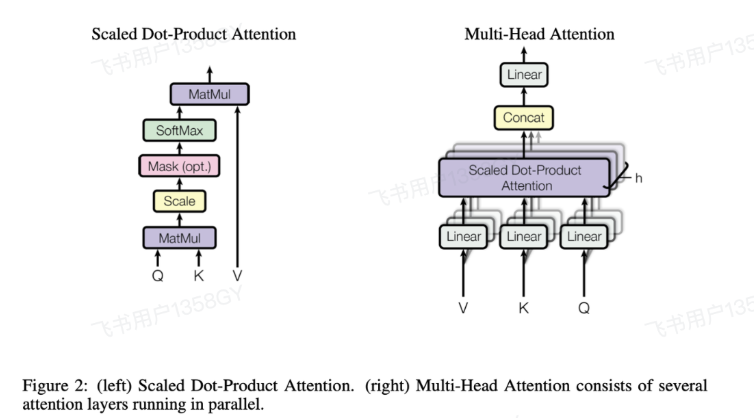
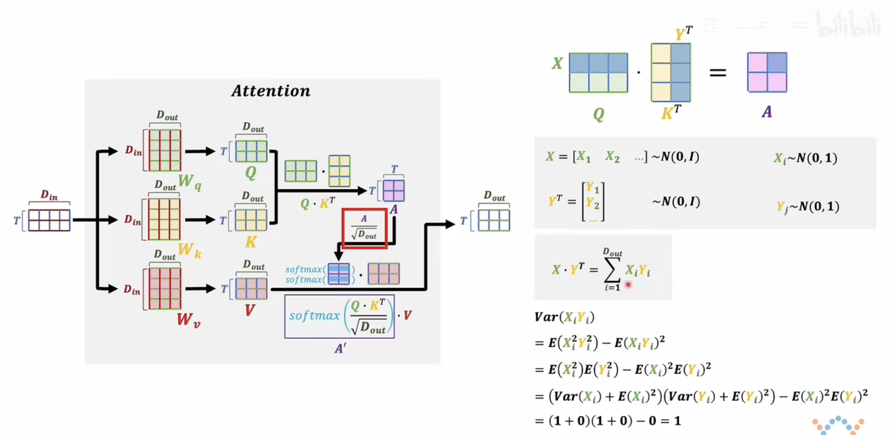
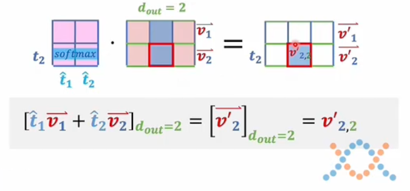
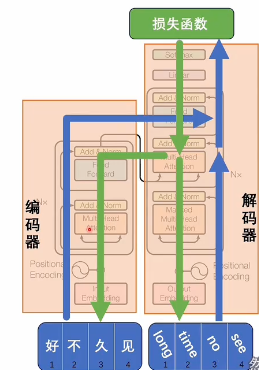
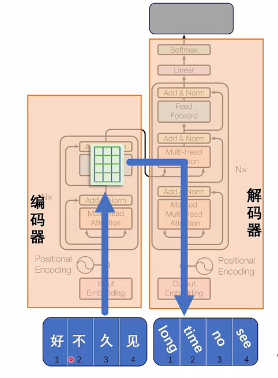
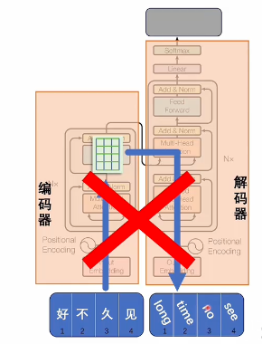

# Attention（1）

**Attention的本质是通过点积来衡量q和k之间相关性并进行加权求和，由于输入的不同，可分为自注意力和交叉注意力机制**

## 为什么需要Attention

在nlp领域，输入的序列较长，如文本、音频和视频等等，传统的RNN方法在处理较长序列时会出现**梯度消失**或**梯度爆炸**，一种专门用于训练推理专用模型以实现。

Attention就是在模型处理当前时间步时候，可以自适应地关注序列中更重要的部分，通过显式地计算每个位置的相关性，并加权求和来获取上下文信息。

Attention机制可以让模型动态分配注意力权重，使得生成某个词的时候，可以侧重参考输入序列的相应语义部分，
捕捉长距离依赖方面更出色。

注意力机制的核心目标是：**识别上下文对词义的调整和影响**。

- 输入是一组词向量，这些词向量已经包含基础语义（来自词典），但这种语义是**客观、静态**的。
- 真正赋予文本**主观语义**的是词序和上下文组织方式。
- 比如“美女”在不同语境中可能表达完全不同的含义。

所以，注意力机制的关键在于：**捕捉上下文如何修改原本的客观词义**。

## 注意力机制计算

以transformer经典的Scaled Dot-Product Attention计算为例，我们需要先了解Q,K,V

- Q(Query):是当前需要关注的信息，用于寻找相关信息。
- K（Key）:是每个元素的标识或特征，用于与Query比较。
- V（Value）:是每个元素的实际内容，用于生成最终输出。

词嵌入已经解决了单个词单个token语义的问题了，注意力机制要解决的就是许多词组合在一起之后，整体体现出来的那个语义。

你只有把一句话里多个词同时输入到模型里面，前面说的那一点才能体现出来，所以接下来讲解输入部分，就不考虑只输入一个词的情况了，而是考虑输入一组值的情况。
这个时候这组值向量就组成了一个数据矩阵。假如说输入的是一个T行的矩阵，输出它也是一个T行矩阵。
至于输出的列数，也就是一个词向量它的维度的个数，我们把token变成词向量。

---

## 为什么 Q 和 K 的内积能体现上下文关系？

- 把 Q 和 K 看作一组向量。
- 它们的乘法本质是**两两之间的内积计算**。
- 内积表示一个向量在另一个上的投影，反映的是**相关性**。
- 所以，QK^T 就是在衡量：**每个词与其他词在语义上的相关程度**。

---

矩阵运算可以从多个角度理解：

- 一种是看作空间变换（线性代数视角）；
- 另一种是看作向量集合之间的关系（语义交互视角）；

在注意力机制中，我们选择后者，因为它更符合语言理解和模型设计的初衷。

---

---

在注意力机制中，输入的词向量矩阵首先会分别与三个可学习参数矩阵 **W_Q、W_K、W_V** 相乘，得到对应的 **Q、K、V** 矩阵。这一步本质上是完成了从原始词向量空间到新空间的线性变换。

真正体现注意力机制核心的是后续操作：

1. **计算注意力得分矩阵 A：**  
   将 Q 与 K 的转置相乘（也可以理解为 K 与 Q 的转置相乘，本质相同），得到一个 $T\times T$ 的矩阵 A，其中每个元素表示两个位置之间的相关性或注意力强度。

2. **缩放操作：**  
   对 A 中的每一个元素除以 $\sqrt{d_k}$（$d_k$是 K 的维度），这个步骤称为“缩放（scaling）”，目的是防止点积结果过大导致 softmax 进入饱和区，影响梯度传播。

为什么要这样做？我们可以从概率的角度来解释：

- 假设 Q 和 K 的每一行都服从标准正态分布（均值为0，方差为1），并且各分量之间相互独立。
- 那么 Q 的一行与 K 的一列做点积后，其结果是一个期望为0、方差为 dₖ 的高斯分布。
- 因此，为了使该分布重新变为标准正态分布（方差为1），我们对结果除以 √dₖ。

这样处理后，softmax 的输入数据更稳定，训练过程也更加平稳有效。

---

**Q 与 K 相乘后再除以 $\sqrt{d_k}$，是为了控制点积结果的数值范围，使其更适合后续 softmax 操作，提升模型稳定性。**

---

### 注意力机制中缩放操作的概率解释

我们重点分析注意力得分矩阵 $ A $ 中的一个元素。该元素由 Q 的一行与 K 的一列相乘得到，即：

$$
A_{ij} = Q_i \cdot K_j^T
$$

假设 Q 和 K 的每个元素都服从标准正态分布（均值为 0，方差为 1），并且相互独立。

### 分析单个乘积项的方差

对于每一项 $ X_i \cdot Y_i $：

- 期望：$\mathbb{E}[X_i Y_i] = 0$
- 方差：

  $$
  \text{Var}(X_i Y_i) = \mathbb{E}[(X_i Y_i)^2] - (\mathbb{E}[X_i Y_i])^2 = \mathbb{E}[X_i^2]\mathbb{E}[Y_i^2] = 1
  $$

当我们将所有 $ d_k $ 项累加后，整体的方差变为：

$$
\text{Var}(A_{ij}) = d_k
$$

### 缩放操作的意义

为了使 $ A_{ij} $ 重新恢复为标准正态分布，我们需要对其除以标准差 $ \sqrt{d_k} $：

$$
A'_{ij} = \frac{A_{ij}}{\sqrt{d_k}}
$$

这样处理后，$ A'_{ij} $ 的期望仍为 0，方差为 1，更适合后续的 softmax 操作。

---
- **Q、K、V 是输入词向量经过线性变换后的表示**
- **Q 与 K 相乘得到注意力得分矩阵 A**
- **对 A 缩放是为了控制其方差，使其更适配 softmax**
- **Softmax 从概率角度对注意力得分进行归一化**
- **最终输出是对 V 的加权求和，权重由注意力得分决定**
---

### 注意力机制中为什么要除以 $\sqrt{d_k}$？

在 Transformer 的注意力机制中，计算注意力得分时会执行如下操作：

$$
\text{Attention}(Q, K, V) = \text{softmax}\left( \frac{QK^T}{\sqrt{d_k}} \right)V
$$

其中 $ Q, K, V $ 是输入词向量分别与三个可学习矩阵相乘得到的查询（Query）、键（Key）和值（Value）向量。

我们重点分析为什么要对 $ QK^T $ 除以 $ \sqrt{d_k} $，即所谓的“缩放”操作。

---

#### 一、点积的统计特性分析

##### 1. 假设条件（标准正态分布）

设：
- $ Q_i = (x_1, x_2, \dots, x_{d_k}) $
- $ K_j = (y_1, y_2, \dots, y_{d_k}) $

其中：
- 每个 $ x_i \sim \mathcal{N}(0, 1) $
- 每个 $ y_i \sim \mathcal{N}(0, 1) $
- 所有 $ x_i $ 和 $ y_i $ 彼此独立

那么注意力得分定义为：

$$
A_{ij} = Q_i \cdot K_j^T = \sum_{k=1}^{d_k} x_k y_k
$$

---

##### 2. 单项乘积的期望与方差

对于每一项 $ x_k y_k $：

- 期望：
  $$
  \mathbb{E}[x_k y_k] = \mathbb{E}[x_k] \cdot \mathbb{E}[y_k] = 0 \cdot 0 = 0
  $$

- 方差：
  $$
  \text{Var}(x_k y_k) = \mathbb{E}[(x_k y_k)^2] - (\mathbb{E}[x_k y_k])^2 = \mathbb{E}[x_k^2] \cdot \mathbb{E}[y_k^2]
  $$

由于 $ x_k \sim \mathcal{N}(0,1) $，有：
- $ \mathbb{E}[x_k^2] = \text{Var}(x_k) + (\mathbb{E}[x_k])^2 = 1 + 0 = 1 $
- 同理 $ \mathbb{E}[y_k^2] = 1 $

所以：
$$
\text{Var}(x_k y_k) = 1 \cdot 1 = 1
$$

---

##### 3. 整体点积的期望与方差

现在来看整体的 $ A_{ij} = \sum_{k=1}^{d_k} x_k y_k $：

- 期望：
  $$
  \mathbb{E}[A_{ij}] = \sum_{k=1}^{d_k} \mathbb{E}[x_k y_k] = 0
  $$

- 方差：
  $$
  \text{Var}(A_{ij}) = \sum_{k=1}^{d_k} \text{Var}(x_k y_k) = d_k \cdot 1 = d_k
  $$

因此，注意力得分服从以下分布：

$$
A_{ij} \sim \mathcal{N}(0, d_k)
$$

---

#### 二、标准化：除以 $ \sqrt{d_k} $ 的数学意义

我们现在对注意力得分进行标准化：

$$
A'_{ij} = \frac{A_{ij}}{\sqrt{d_k}}
$$

根据方差的线性变换性质：

$$
\text{Var}\left( \frac{A_{ij}}{\sqrt{d_k}} \right) = \frac{1}{d_k} \cdot \text{Var}(A_{ij}) = \frac{1}{d_k} \cdot d_k = 1
$$

同时期望仍为零：

$$
\mathbb{E}[A'_{ij}] = \frac{\mathbb{E}[A_{ij}]}{\sqrt{d_k}} = 0
$$

因此，标准化后：

$$
A'_{ij} \sim \mathcal{N}(0, 1)
$$

---

#### 三、Softmax 的影响与数值稳定性

Softmax 函数定义如下：

$$
\text{softmax}(z_i) = \frac{e^{z_i}}{\sum_j e^{z_j}}
$$

当 $ z_i $ 数值过大时，指数函数会导致数值溢出或梯度消失。例如：

- 若 $ z_i \gg 0 $，则 softmax 输出集中在接近 1 或 0 的位置，形成“尖峰”
- 若 $ z_i \sim \mathcal{N}(0,1) $，softmax 输出更平滑，有助于模型学习合理的权重分配

因此，通过除以 $ \sqrt{d_k} $，我们可以让 softmax 输入处于一个“良好”的区间内，提升训练稳定性。

---

> **在注意力机制中，将 QKᵀ 除以 $ \sqrt{d_k} $ 的本质是对点积结果进行标准化，使其从高方差正态分布 $ \mathcal{N}(0, d_k) $ 转换为标准正态分布 $ \mathcal{N}(0, 1) $，从而适配 softmax 操作，提升模型稳定性和表达能力。**

---

### 计算流程

1. **输入**
输入为一个形状为 $T \times D_{in}$ 的矩阵（$T$ 表示序列长度，$D_{in}$ 表示输入维度 ）。

2. **线性变换**
    - 通过权重矩阵 $W_q$（形状为 $D_{in} \times D_{out}$ ）对输入进行线性变换，得到 $Q$（Query），形状为 $T \times D_{out}$。
    - 通过权重矩阵 $W_k$（形状为 $D_{in} \times D_{out}$ ）对输入进行线性变换，得到 $K$（Key），形状为 $T \times D_{out}$。 
    - 通过权重矩阵 $W_v$（形状为 $D_{in} \times D_{out}$ ）对输入进行线性变换，得到 $V$（Value），形状为 $T \times D_{out}$。 

3. **计算注意力分数**
    - 计算 $Q$ 与 $K^T$ 的矩阵乘积，得到注意力分数矩阵 $A$，形状为 $T \times T$。
    - 对 $A$ 进行缩放，除以 $\sqrt{D_{out}}$ ，得到缩放后的注意力分数。

4. **归一化**
使用 softmax 函数对缩放后的注意力分数进行归一化，得到概率分布矩阵 $A'$ 。

5. **计算输出**
将归一化后的矩阵 $A'$ 与 $V$ 进行矩阵乘法，得到最终的输出，形状为 $T \times D_{out}$。 

$$
A = Q \cdot K^T
$$

$$
A' = \text{softmax}\left(\frac{Q \cdot K^T}{\sqrt{D_{out}}}\right)
$$

$$
\text{输出} = A' \cdot V
$$

## 注意力机制中的 Q、K、V 理解（续）

虽然也可以从空间变换的角度理解注意力机制，但那样过于复杂。我们更倾向于将 Q 和 K 看作一组向量进行处理。

- **Q 的每一行**是一个词向量；
- **K 的每一列**也是一个词向量；
- Q 与 K 的转置相乘，本质是：**每个词向量与其他所有词向量之间的内积计算**；
- 这个结果保存在矩阵 A 中，表示的是：**词与词之间的相关性强度**。

### 内积的意义

两个向量的内积可以看作是它们之间投影的关系：

$$
\text{内积} = \|K_1\| \cdot \|K_2\| \cdot \cos(\theta)
$$

- 若夹角 θ 为 0°，说明两个向量方向一致，内积最大；
- 若夹角为 90°，两个向量正交，内积为 0；
- 若夹角大于 90°，内积为负，代表负相关。

因此：

- **正值** → 正相关；
- **负值** → 负相关；
- **接近 0** → 几乎无关。

---

### 自注意力机制的本质

在自注意力中，输入数据来自同一组词向量：

- 每个词都要和包括自己在内的所有词做内积；
- 得到的 A 矩阵是一个“关系表”；
  - 行：当前词；
  - 列：被关注的词；
  - 值：两者之间的语义相关程度。

---

- Q、K 相乘得到的 A 矩阵反映了：**上下文中词语之间的相互影响与关联**；
- 这种机制让模型能够动态识别哪些词对当前词的理解更重要；
- 是注意力机制捕捉**主观语义变化**的关键所在。

---

---

注意力机制中的上下文修正过程

在注意力机制中：

- **A 矩阵**（即 Q 与 K 的乘积）表示的是：词与词之间的相关性；
- 每一项 A_ij 表示第 i 个词对第 j 个词的关注程度；
- 经过 **softmax** 处理后，这些值被归一化为 0 到 1 之间的权重。

---

如何利用 A 去修正原始语义？

- 使用 A 与 V 相乘，得到新的词向量矩阵；
- 新的每一行仍然是一个词向量，但它已经被上下文所“修正”了；
- 修正规则是：
  - 每个维度的更新，只受其他词向量中**相同维度**的影响；
  - 影响的大小由 A 中对应行的权重决定。

---

以 $t_2$ 这个词为例：

- 它的新词向量由所有词向量的对应维度加权求和而来；
- 权重来自 A 中 $t_2$ 对应的那一行；
- 如果某个词和 $t_2$ 高度相关（比如内积大），那它对 $t_2$ 的影响就大；
- 若两者正交（内积为 0），则没有影响。

---

- **Q 和 K 的相乘**：获取上下文关系；
- **Softmax 后的 A**：转化为关注权重；
- **A 与 V 相乘**：用上下文去修正原始词义；
- 最终输出的词向量不仅包含原始语义，还融合了上下文信息；
- 这种动态调整使得语言表达具有**主观性和多样性**。

---

### 注意力机制中的 Q 和 K：为什么需要两个矩阵？

讲到这里，希望大家对注意力机制已经有了初步理解。但在学习初期，我有两个关键疑问：

---

#### 一、为什么不能只用一个矩阵 A 来表示注意力权重？

- 如果直接训练出一个矩阵 A，相当于从输入 X 到输出 A 是一个**线性变换**；
- 线性变换只能表达词之间的一一对应关系，无法捕捉复杂的语义交互；
- 而使用 Q 和 K 分别进行计算（即 $Q\cdot K^T$），本质上是构造了一个**二次型**；
- 这种形式增强了模型的表达能力，能更好地捕捉非线性关系，比如上下文之间的复杂关联。

$$A = X \cdot W_A $$

$$ A = X\cdot W_q \cdot [X\cdot W_k]^T= X\cdot [W_q\cdot W_k^T]\cdot X^T=X\cdot W_A\cdot X^T$$
> **结论：Q 和 K 的分离设计为模型引入了更强的表达能力。**

---

#### 二、那为什么不只用一个 W 矩阵，让它自己和自己相乘呢？

- 单纯从数学上看，W 和 Wᵀ 相乘确实也可以得到一个矩阵；
- 但它会生成一个**对称矩阵**，限制了模型灵活性；
- 而 Q 和 K 使用不同的参数矩阵（$W_Q$ 和 $W_K$）则不会出现这种限制；
- 虽然数学上两者等价，但**在实际建模中它们承担了不同功能**。

**引入“设定语义”与“表达语义”的视角**

为了帮助理解 Q 和 K 的分工，我们可以将语义分为三类：

| 类型 | 含义 |
|------|------|
| 客观语义 | 来自词典的静态语义 |
| 主观语义 | 在上下文中动态调整的语义 |
| 设定语义 | 上下文为后续表达提供的语境 |
| 表达语义 | 在设定语境下表达的具体观点 |

> 注意：这些术语是我个人定义，用于辅助理解。

---

### Q 和 K 的角色划分（逻辑层面）

- **Q** 更倾向于表达当前词的**表达语义**（观点）；
- **K** 更倾向于提供上下文的**设定语义**（语境）；
- 二者通过内积建立联系：**当前观点是否与该语境匹配？**

> 换句话说：
>
> - Q 是“我在说什么”
> - K 是“我说这句话时的背景”

---

### 从训练角度看 Q 和 K 的必要性

- 在训练过程中，如果 Q 和 K 的匹配度低（A 中数值小），说明当前参数有问题；
- 反向传播会调整 WQ 和 WK，使 Q 和 K 的相关性增强；
- 最终模型学到的是所有训练数据中“表达语义”的**交集**；
- 如果没有 Q 和 K 的区分，就相当于把所有语境统一处理；
  - 对物理规律这类统一世界观有效；
  - 但对人类语言这种多语境、多价值观的情况就不够用了。

---

### 类比理解：注意力机制 = NLP 中的条件语句

- 就像程序中根据条件分支执行不同操作一样；
- 注意力机制允许模型根据不同的设定语义，选择性地激活对应的表达语义；
- 这也是为什么注意力机制能支持“在不同语境下表达相反观点”这一人类思维特点。

---

### 实际应用中的启示

- “洗地”文章就是通过操控设定语义来引导读者得出特定结论；
- 如果一篇文章在同一设定下表达矛盾观点，说明逻辑混乱；
- 注意力机制的设计，正是为了避免这种情况的发生。

---

### 总结

| 视角 | 内容 |
|------|------|
| 数学角度 | $Q\cdot K^T$ 提升模型表达能力，优于单一线性或对称矩阵 |
| 语义角度 | Q 表达观点，K 提供语境，共同构建主观语义 |
| 训练角度 | 通过反向传播优化设定与表达之间的匹配程度 |
| 应用角度 | 支持多语境、多观点表达，模拟人类复杂思维 |

---

如果你能接受这个理解方式，再去看待**自注意力机制**和**交叉注意力机制**，就会更加清晰易懂。这只是我的一种解释思路，不一定完全准确，但希望能为你打开一扇理解的大门。

---

## 自注意力与交叉注意力机制解析

---

## 自注意力 vs 交叉注意力：从语义设定与表达角度理解

自注意力和交叉注意力的核心都离不开 **Q、K、V 三个矩阵**，但它们的数据来源不同：

| 类型 | Q 来源 | K/V 来源 | 特点 |
|------|--------|----------|------|
| 自注意力 | 来自相同输入 | 来自相同输入 | 模型自主理解设定与表达语义 |
| 交叉注意力 | 来自目标输入 | 来自参考输入（如编码器输出） | 模型依赖外部设定，只学习表达语义 |

---

### 类比理解

- **自注意力**：像是“闷头自学”
  - 所有理解都来自原始材料；
  - 需要先理解上下文设定，再推理表达；
  - 学得深，能举一反三。

- **交叉注意力**：像是“对照参考资料学习”
  - 设定语义由外部提供；
  - 只需关注表达语义；
  - 学得浅，记忆性强，泛化能力弱；
  - 容易“坚信自己没错”，只是题变了。

---

### 应用场景举例

- **翻译任务中**：交叉注意力是一种优势；
  - 编码器提供源语言的设定语义；
  - 解码器在此基础上生成目标语言的表达；
  - 是一种“语义校准”过程。

---

### Transformer 中的结构差异

在 Transformer 中：

- **编码器**：仅使用自注意力；
- **解码器**：
  - 第一层是自注意力（理解当前已生成内容）；
  - 第二层是交叉注意力（与编码器输出对齐，进行语义校准）；

> 图中通常只画一层结构，但实际上这些模块是可以堆叠多层的（Nx 层），每一层都会重新校准一次。

---

### 总结对比

| 维度 | 自注意力 | 交叉注意力 |
|------|-----------|--------------|
| 数据来源 | 相同 | 不同 |
| 理解深度 | 深（设定 + 表达） | 浅（仅表达） |
| 泛化能力 | 强 | 弱 |
| 适用场景 | 理解、生成 | 翻译、校准 |

## Transformer在训练与推理中的流程差异

---

## Transformer 的训练与推理流程解析

### 一、训练阶段：编码器与解码器协同工作

- **输入形式**：
  - 编码器输入中文：“好久不见”
  - 解码器输入英文：“long time no see”

- **运行流程**：
  - 编码器将“好久不见”转换为潜空间词向量；
  - 解码器从“开始符号”开始逐步生成目标序列；
  - 使用交叉注意力机制，让解码器理解源语言语义；
  - 最终通过 softmax 输出下一个 token 概率分布；
  - 损失函数计算预测结果与真实标签之间的差异；
  - 反向传播优化模型参数，使编码器和解码器在潜空间中语义对齐。

---

### 二、推理阶段：自回归生成机制

- **问题背景**：
  - 中英文 token 数量不一致（sequence to sequence）；
  - 无法简单地一对一映射；

- **解决方法**：
  - Transformer 在解码时借鉴了 RNN 的**自回归思想**；
  - 解码过程是**串行的**，一个 token 接一个生成；

- **具体流程**：
  1. 编码器处理原始输入，生成固定长度的词向量；
  2. 解码器从“开始符号”出发，进行第一次预测；
  3. 将预测结果与历史输出拼接后再次输入；
  4. 重复该过程，直到输出“结束符号”为止；

> 这种方式可以支持任意长度的目标序列，灵活应对 seq2seq 场景。

---

### 三、Transformer 结构变体的理解

| 模型类型 | 组成 | 功能说明 |
|----------|------|-----------|
| 完整 Transformer | 编码器 + 解码器 | 支持翻译、摘要等跨模态任务 |
| GPT 类模型 | 仅解码器 | 实际具备编码能力，可进行上下文理解和生成 |

- **GPT 模型如何工作？**
  - 输入一段文本，模型将其视为已生成内容；
  - 然后继续生成后续内容；
  - 并非凭空生成，而是基于已有上下文；
  - 至于执行哪种任务（续写、摘要、翻译），取决于训练目标；

- **多语言支持方案**：
  - 将所有语言统一到一个大 token 表中；
  - 模型通过大量数据学习不同语言之间的对应关系；
  - 不需要单独的编码器也能实现翻译功能。

---

### 四、总结对比

| 阶段 | 特点 | 是否并行 | 依赖外部信息 |
|------|------|------------|----------------|
| 训练 | 编码器 & 解码器同时参与 | ✅ 是 | ✅ 是 |
| 推理 | 解码器自回归生成 | ❌ 否 | ✅ 是（输入上下文） |

| 架构 | 是否需编码器 | 应用场景 |
|------|----------------|------------|
| 完整 Transformer | ✅ 是 | 多任务、翻译 |
| GPT 类模型 | ❌ 否 | 生成、对话、续写 |

### 五、类比理解

- **编码器**：理解当前语境；
- **解码器**：根据语境表达观点；
- **交叉注意力**：校准两个语义空间是否一致；
- **自注意力**：内部逻辑推理，构建完整语义表示；
- **自回归生成**：像人一样逐句思考、表达。

