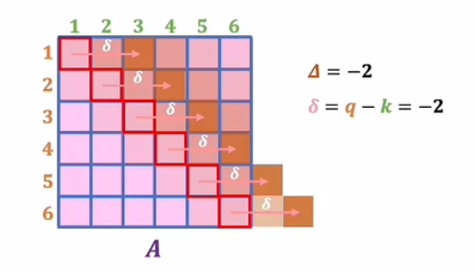

# Attention（2）

## 多头注意力机制


## 多头注意力机制的理解：从 CNN 视角出发


### 一、为什么引入多头注意力？

- 单头注意力只能捕捉一种语义关系；
- 多头注意力通过并行计算多个不同语义空间中的注意力结果，提升模型表达能力；
- 最终将这些“多视角”的结果拼接后，再通过一个线性变换输出。


### 二、多头注意力的基本流程

1. 输入数据（如词向量矩阵）；
2. 使用不同的参数矩阵分别生成三组 Q、K、V；
3. 并行计算三次注意力，得到三个不同语义空间下的输出；
4. 将三组输出**按维度拼接**，形成更高维的表示；
5. 再乘以一个统一的权重矩阵 W，输出最终结果。

### 三、为什么要分头计算？而不是直接用一个大矩阵？

- 如果直接使用一个大的注意力矩阵：
  - 模型难以学习到多种语义特征；
  - 缺乏对不同语义通道的独立建模；
- 分头计算相当于在不同子空间中提取信息；
- 类似于 CNN 中的多个卷积核，各自提取不同特征。


## 多头注意力机制流程

### 基本思想

将输入映射到多个不同的语义子空间中，分别进行注意力计算，再将结果融合输出，增强模型表达能力。


### 输入

- 一个词向量矩阵 $ X \in \mathbb{R}^{n \times d_{\text{model}}} $
  - $ n $：序列长度（token 数量）
  - $ d_{\text{model}} $：词向量维度


### 多头注意力机制计算流程

#### 线性变换生成 Q、K、V（每个 head 独立）

对于每一个 attention head：

$$
Q_i = X W_Q^i,\quad K_i = X W_K^i,\quad V_i = X W_V^i
$$

其中：

- $ W_Q^i, W_K^i, W_V^i \in \mathbb{R}^{d_{\text{model}} \times d_k} $ 是可学习参数；
- $ i = 1,2,...,h $，表示第 $ i $ 个 head；
- $ h $：head 的数量；
- $ d_k $：每个 head 的维度（通常 $ d_k = d_{\text{model}} / h $）

---

#### 2. 每个 head 单独计算注意力

使用缩放点积注意力公式：

$$
\text{Attention}(Q_i, K_i, V_i) = \text{softmax}\left( \frac{Q_i K_i^T}{\sqrt{d_k}} \right) V_i
$$

得到每个 head 的输出 $ \text{Head}_i $


#### 3. 拼接所有 head 的输出

$$
\text{Concat}(\text{Head}_1, \text{Head}_2, ..., \text{Head}_h)
$$

拼接后维度为：$ n \times d_{\text{model}} $


#### 4. 最终线性变换

乘以权重矩阵 $ W_O \in \mathbb{R}^{d_{\text{model}} \times d_{\text{model}}} $：

$$
\text{MultiHead}(Q,K,V) = \text{Concat}(...) W_O
$$


### 输出

- 一个新的词向量矩阵，形状与输入相同：$ \mathbb{R}^{n \times d_{\text{model}}} $
- 包含了从多个语义子空间聚合而来的上下文信息


### 总结图示（文字版）

```
Input X
   ↓
Linear: W_Q, W_K, W_V → 得到 Q, K, V
   ↓
Split into h heads → 每个 head 计算自注意力
   ↓
Concat all heads
   ↓
Linear: W_O → Output
```

---

### 类比理解（图像 CNN）

| 注意力机制 | CNN |
|------------|-----|
| 每个 head | 一个卷积核 |
| 多头注意力 | 多通道特征提取 |
| Concat + Linear | 1×1 卷积整合通道信息 |


### 四、相对位置编码的作用（补充说明）

- 引入相对位置编码是为了让注意力机制更好地捕捉序列的局部依赖；
- 它使得模型能像 CNN 一样关注相邻元素的关系；
- 在一些论文中，作者通过实验设定（如输入全为0、W设为单位矩阵等），验证了这种 CNN 特征提取能力的存在；
- 相关设定如下：
  - 所有输入设为 0；
  - W 设为单位矩阵；
  - R 向量所有 head 共享，V 各自不同；

这样可以简化问题，便于分析注意力机制是否具有类似 CNN 的局部归纳偏置。

## 多头注意力机制与CNN关系的数学解析


## 多头注意力与 CNN 的关系（论文核心思路）

为了体现多头注意力与卷积神经网络（CNN）的联系，作者设计了特殊的 **R 向量** 和 **V 向量**。


### 向量定义

#### V 向量（Value）

- 第一维：1  
- 第二维：$ -2\delta $  
- 整体乘上一个可学习参数 $ -\alpha $

形式为：
$$
V = -\alpha \cdot [1,\ -2\delta]
$$

#### R 向量（Relative Position）

- 第一项：$ \delta^2 $
- 第二项：$ \delta $

形式为：
$$
R = [\delta^2,\ \delta]
$$

其中 $ \delta = q - k $，表示 query 与 key 的相对位置。

---

### 注意力得分计算

通过内积得到注意力得分：

$$
A = V \cdot R = -\alpha (1 \cdot \delta^2 + (-2\delta) \cdot \delta) = -\alpha \delta^2
$$

进一步变形为：
$$
A = -\alpha (\delta - \Delta)^2 + C
$$

这是一个关于 $ \delta $ 的**二次函数**，最大值出现在 $ \delta = \Delta $。

---

### 注意力分布特性

- 当 $ \delta = \Delta $，注意力得分最高；
>$\Delta$是一个可学习的位置偏移参数，用于控制注意力机制中“最大关注点的位置”

- 随着距离增大，得分下降；
- 形成“窗口效应”：当前 token 更关注其附近 token；
- 类似于 **一维卷积操作中的滑动窗口机制**。

---

### 参数 α 的作用

- 控制影响范围的“宽度”；
- $ \alpha \to \infty $：只关注最中心的那个 token；
- $ \alpha $ 较小：周围 token 对当前 token 的影响更大；
- 相当于控制 CNN 中的**感受野大小**。





## 多头注意力机制如何扩展到二维？和 CNN 的类比

### 一、从一维到二维的扩展

- 在一维中，Q、K 是标量，$\delta = q - k$ 是一个数；
- 在二维中，Q 和 K 变成向量（如位置坐标）；
- $\delta = q - k$ 也变成一个向量，表示两个位置之间的相对偏移；

例如：
- Q = (1, 4)，K = (3, 2) → $\delta = (-2, 2)$

---

### 二、V 和 R 向量的二维扩展

为了适应二维空间，对 V 和 R 进行如下设计：

#### V 向量（Value）：
$$
V = -\alpha \cdot [1,\ -2\delta_1,\ -2\delta_2]
$$

#### R 向量（Relative Position）：
$$
R = [\|\delta\|^2,\ \delta_1,\ \delta_2]
$$

其中 $\delta = (\delta_1, \delta_2)$ 是相对偏移向量。

---

### 三、注意力得分计算


通过内积得到注意力得分：

$$
A = V \cdot R = -\alpha(\|\delta\|^2 - 2\delta_1^2 - 2\delta_2^2) = \alpha\|\delta\|^2
$$

进一步变形为：
$$
A = -\alpha \|\delta - \Delta\|^2 + C
$$

这个函数在 $\delta = \Delta$ 时取得最大值，模拟了类似卷积核的局部响应区域。

---

### 四、多头机制模拟卷积核

- 每个 head 学习不同的 $\Delta$，即关注不同方向或位置；
- 如设计 9 个 head，分别对应 3×3 卷积核中的每个位置；
- 最终拼接所有 head 的输出，形成“多通道”特征图；
- 再通过线性变换（W 矩阵），相当于进行 1×1 卷积整合通道信息；

> 这就构成了一个与 CNN 非常相似的结构。

---

### 五、与 CNN 的对比分析

| 特性 | CNN | Transformer（多头注意力） |
|------|-----|----------------------------|
| 局部建模 | 固定感受野 | 动态学习关注区域 |
| 参数设定 | 固定卷积核 | 每个 head 自主学习 $\Delta$ |
| 感受野控制 | 卷积核大小决定 | $\alpha$ 控制影响范围 |
| 远距离依赖 | 无法直接建模 | 支持任意距离的注意力 |

---

### 六、Transformer 层数叠加的意义

- 类似于 CNN 中的层叠卷积层：
  - 浅层：捕捉局部词义关系；
  - 中间层：理解短语级语义；
  - 深层：掌握段落、篇章级语义；
- 多层叠加使模型具备逐层抽象的能力。

---

### 七、总结类比

| 注意力机制 | 类比 CNN |
|------------|----------|
| 每个 attention head | 一个卷积核 |
| 多 head 输出拼接 | 多通道特征图 |
| 最终线性层 | 1×1 卷积整合 |
| 相对位置编码 | 模拟局部归纳偏置 |
| 多层叠加 | 提升语义抽象能力 |

---

### 结论

通过合理设计 V 和 R 向量，我们可以让多头注意力机制在二维空间中呈现出与 CNN 极其相似的建模能力。  
但它更加灵活，不仅限于局部邻域，还能建模远距离依赖关系。  
这种类比为我们理解视觉 Transformer（ViT）、图像处理任务等提供了非常直观的视角。

### **2. Multi-Head Attention 中每个 head 为什么要降维？**

#### **原因：**
1. **并行关注多种子空间信息**：
   - 每个 head 学习不同方面的特征，从而捕捉更丰富的语义信息。

2. **减少计算量**：
   - 如果每个 head 使用原始维度 $ d_{\text{model}} $ 进行计算，复杂度会很高。
   - 将输入向量维度 $ d_{\text{model}} $ 均分到 $ h $ 个 head 上，每个 head 的维度变为 $ d_{\text{model}} / h $，降低了单个 head 的计算复杂度，整体效率更高。

---

### **3. Transformer 的权重共享**

#### **目的：**
- 减少参数量，提高模型效率。

#### **实现方式：**
- 在某些变体或特定实现中，允许 Encoder 或 Decoder 的不同层之间共享参数。
- 权重共享可行的原因：
  1. Transformer 的各层结构相同（自注意力 + 前馈网络）的堆叠设计；
  2. 实验表明，权重共享不会显著削弱模型性能，同时大幅减少参数量。

#### **注意事项：**
- Transformer 原始论文（Vaswani et al.）并未明确要求所有层都共享参数。
- 实际项目中可根据需求灵活选择是否进行权重共享。

### **1. 不同类型的多头注意力：MHA、MQA、GQA**


#### **Grouped-query**
**Multi-head Attention (MHA)**：

  - 每个 head 都有独立的 Query、Key 和 Value 矩阵。
  - 标准的多头注意力机制，每个 head 的参数是独立的。

**Multi-query Attention (MQA)**：

  - 所有的 head 共享同一个 Key 和 Value 矩阵。
  - 每个 head 只保留独立的 Query 参数，大大减少了 Key 和 Value 矩阵的参数量。

**Grouped-query Attention (GQA)**：

  - 将 Query 分为若干组（Group），每组共享一个 Key 和 Value 矩阵。
  - GQA 是 MHA 和 MQA 的折中方案：
    - GQA-1：只有一个组，等价于 MQA；
    - GQA-H：每组与头数相等，等价于 MHA；
    - GQA-N：介于 MHA 和 MQA 之间，分组一定数量的 Query 共享一组 Key 和 Value 矩阵。

---


### **MHA（Multi-Head Attention）**

- **标准做法**：假设有 $ h $ 个头，每个头都有**单独**的线性映射 $ W_i^Q, W_i^K, W_i^V $：
  $$
  \text{head}_i = \text{Attention}(QW_i^Q, KW_i^K, VW_i^V)
  $$
  然后将这些头的输出拼接：
  $$
  \text{MultiHead}(Q, K, V) = \text{Concat}(\text{head}_1, ..., \text{head}_h) W^O
  $$

- **含义**：让模型可并行学习到不同子空间的注意力，“一个头”关注词性信息，“另一个头”关注句法结构信息，等等。

- **优点**：表达力强，兼容自注意力和跨注意力等多场景；

- **缺点**：参数量大，尤其在 Key / Value 维度上重复了多组。

```python
import torch
from torch import nn

class MultiHeadAttention(torch.nn.Module):
    def __init__(self, hidden_size, num_heads):
        super(MultiHeadAttention, self).__init__()
        self.num_heads = num_heads
        # 将隐藏层维度（hidden_size）平均分配给每个注意力头（head）
        self.head_dim = hidden_size // num_heads  

        # 初始化Q、K、V投影矩阵
        self.q_linear = nn.Linear(hidden_size, hidden_size)
        self.k_linear = nn.Linear(hidden_size, hidden_size)
        self.v_linear = nn.Linear(hidden_size, hidden_size)

        # 输出线性层
        self.o_linear = nn.Linear(hidden_size, hidden_size)

    # hidden_state: 输入张量，形状为 [batch_size, seq_len, hidden_size]，表示一批句子或文本的嵌入向量
    def forward(self, hidden_state, attention_mask=None):
        batch_size = hidden_state.size()[0]

        query = self.q_linear(hidden_state)
        key = self.k_linear(hidden_state)
        value = self.v_linear(hidden_state)

        query = self.split_head(query)
        key = self.split_head(key)
        value = self.split_head(value)

        # 计算注意力分数
        attention_scores = torch.matmul(query, key.transpose(-1, -2)) / torch.sqrt(torch.tensor(self.head_dim))

        if attention_mask is not None:
            attention_scores += (1 - attention_mask) * -1e9

        # 对注意力分数进行归一化
        attention_probs = torch.softmax(attention_scores, dim=-1)

        output = torch.matmul(attention_probs, value)

        # 对注意力输出进行拼接
        # transpose(1, 2)：将 head 维度和序列长度调换回来；
        # contiguous()：确保内存连续；
        # view(...)：将多个 head 的结果拼接成一个大的向量，恢复到 [batch_size, seq_len, hidden_size]。
        output = output.transpose(1, 2).contiguous().view(batch_size, -1, self.head_dim * self.num_heads)

        output = self.o_linear(output)

        return output

    def split_head(self, x):
        batch_size = x.size()[0]
        return x.view(batch_size, -1, self.num_heads, self.head_dim).transpose(1, 2)
```


### **MQA（Multi-Query Attention）**

- **出处**：Google 在 2019 年论文《Fast Transformer Decoding: One Write-Head is All You Need》。
- **核心思想**：在多头解码场景下，所有头共享同一份 Key 和 Value，只有 Query 不同。
  - 这样 Key、Value 的参数就只需要 1 组，大幅减少参数量、提高解码速度；
  - 但也会带来一定性能损失，因为多头不再在 Key/Value 维度各自独立建模。

#### **公式示意**：
$$
\text{head}_i = \text{Attention}(QW_i^Q, K^*, V^*)
$$
其中 $ K^*, V^* $ 是共享的 Key、Value。


```python
import torch
from torch import nn

class MultiQueryAttention(torch.nn.Module):
    def __init__(self, hidden_size, num_heads):
        super(MultiQueryAttention, self).__init__()
        self.num_heads = num_heads
        self.head_dim = hidden_size // num_heads

        # 初始化Q、K、V投影矩阵
        self.q_linear = nn.Linear(hidden_size, hidden_size)
        self.k_linear = nn.Linear(hidden_size, self.head_dim)  ###
        self.v_linear = nn.Linear(hidden_size, self.head_dim)  ###

        # 输出线性层
        self.o_linear = nn.Linear(hidden_size, hidden_size)

    def forward(self, hidden_state, attention_mask=None):
        batch_size = hidden_state.size()[0]

        query = self.q_linear(hidden_state)
        key = self.k_linear(hidden_state)
        value = self.v_linear(hidden_state)

        query = self.split_head(query)
        key = self.split_head(key, 1)
        value = self.split_head(value, 1)

        # 计算注意力分数
        attention_scores = torch.matmul(query, key.transpose(-1, -2)) / torch.sqrt(torch.tensor(self.head_dim))

        if attention_mask is not None:
            attention_scores += (1 - attention_mask) * -1e9

        # 对注意力分数进行归一化
        attention_probs = torch.softmax(attention_scores, dim=-1)

        output = torch.matmul(attention_probs, value)
        output = output.transpose(1, 2).contiguous().view(batch_size, -1, self.head_dim * self.num_heads)
        output = self.o_linear(output)

        return output

    def split_head(self, x, head_num=None):
        batch_size = x.size()[0]

        if head_num == None:
            return x.view(batch_size, -1, self.num_heads, self.head_dim).transpose(1, 2)
        else:
            return x.view(batch_size, -1, head_num, self.head_dim).transpose(1, 2)
```


### **GQA（Grouped-Query Attention）**

- **出处**：Google 2023 年论文《GQA: Training Generalized Multi-Query Transformer Models from Multi-Head Checkpoints》。
- **目的**：折中 MHA 与 MQA 在性能与速度上的矛盾。
- **做法**：将 $ h $ 个 Query 头分为 $ G $ 组 ($ 1 \leq G \leq h $)。每组使用独立的 $ K, V $；所以分组越少越接近 MQA，共享程度越高，速度快但表达力受限；分组越多越接近 MHA，速度较慢但表达力更强。
- **当 $ G = 1 $ 时**：只有一个 Key/Value 表示，等同于 MQA；当 $ G = h $ 时，每个头都有独立 Key/Value，等同于 MHA。

```python
import torch
from torch import nn

class GroupQueryAttention(torch.nn.Module):
    def __init__(self, hidden_size, num_heads, group_num):
        super(GroupQueryAttention, self).__init__()
        self.num_heads = num_heads
        self.head_dim = hidden_size // num_heads
        self.group_num = group_num

        # 初始化Q、K、V投影矩阵
        self.q_linear = nn.Linear(hidden_size, hidden_size)
        self.k_linear = nn.Linear(hidden_size, self.group_num * self.head_dim)
        self.v_linear = nn.Linear(hidden_size, self.group_num * self.head_dim)

        # 输出线性层
        self.o_linear = nn.Linear(hidden_size, hidden_size)

    def forward(self, hidden_state, attention_mask=None):
        batch_size = hidden_state.size()[0]

        query = self.q_linear(hidden_state)
        key = self.k_linear(hidden_state)
        value = self.v_linear(hidden_state)

        query = self.split_head(query)
        key = self.split_head(key, self.group_num)
        value = self.split_head(value, self.group_num)

        # 计算注意力分数
        attention_scores = torch.matmul(query, key.transpose(-1, -2)) / torch.sqrt(torch.tensor(self.head_dim))

        if attention_mask is not None:
            attention_scores += (1 - attention_mask) * -1e9

        # 对注意力分数进行归一化
        attention_probs = torch.softmax(attention_scores, dim=-1)

        output = torch.matmul(attention_probs, value)
        output = output.transpose(1, 2).contiguous().view(batch_size, -1, self.head_dim * self.num_heads)
        output = self.o_linear(output)

        return output

    def split_head(self, x, group_num=None):
        batch_size, seq_len = x.size()[:2]

        if group_num == None:
            return x.view(batch_size, -1, self.num_heads, self.head_dim).transpose(1, 2)
        else:
            x = x[:, :, None, :, :].expand(batch_size, group_num, self.num_heads, seq_len, self.head_dim).reshape(batch_size, self.num_heads // group_num, group_num, seq_len, self.head_dim)
            return x
```

##区别

### **1. MHA（Multi-Head Attention）**

#### **特点：**
- **每个头独立**：每个注意力头都有独立的 $ Q, K, V $ 投影矩阵。
- **参数量大**：每个头都有一组独立的 $ W_Q, W_K, W_V $ 矩阵，因此参数量较大。
- **灵活性强**：每个头可以学习不同的特征，表达能力更强。

#### **关键代码：**
```python
self.q_linear = nn.Linear(hidden_size, hidden_size)
self.k_linear = nn.Linear(hidden_size, hidden_size)
self.v_linear = nn.Linear(hidden_size, hidden_size)
```

- 每个线性层的输出维度都是 `hidden_size`，表示每个头都有独立的 $ Q, K, V $ 向量。

#### **分头操作：**
```python
def split_head(self, x):
    batch_size = x.size()[0]
    return x.view(batch_size, -1, self.num_heads, self.head_dim).transpose(1, 2)
```

- 将输入张量按 `num_heads` 分成多个 head，每个 head 处理一部分维度。

---

### **2. MQA（Multi-Query Attention）**

#### **特点：**
- **共享 Key 和 Value**：所有头共享同一份 $ K $ 和 $ V $，只有 $ Q $ 是独立的。
- **参数量小**：减少了 $ K $ 和 $ V $ 的参数量，提高了解码速度。
- **性能损失**：由于共享 $ K $ 和 $ V $，多头无法在 $ K/V $ 维度上独立建模，可能影响性能。

#### **关键代码：**
```python
self.q_linear = nn.Linear(hidden_size, hidden_size)
self.k_linear = nn.Linear(hidden_size, self.head_dim)  ###
self.v_linear = nn.Linear(hidden_size, self.head_dim)  ###
```

- $ Q $ 的投影矩阵输出维度是 `hidden_size`，而 $ K $ 和 $ V $ 的投影矩阵输出维度是 `head_dim`（即 `hidden_size // num_heads`），因为它们是共享的。

#### **分头操作：**
```python
def split_head(self, x, head_num=None):
    batch_size = x.size()[0]

    if head_num == None:
        return x.view(batch_size, -1, self.num_heads, self.head_dim).transpose(1, 2)
    else:
        return x.view(batch_size, -1, head_num, self.head_dim).transpose(1, 2)
```

- 对于 $ Q $，按 `num_heads` 分头；对于 $ K $ 和 $ V $，只分成一组（`head_num=1`）。

---

### **3. GQA（Grouped-Query Attention）**

#### **特点：**
- **折中设计**：介于 MHA 和 MQA 之间，将 Query 头分为若干组，每组共享 $ K $ 和 $ V $。
- **灵活调整**：通过调整组数 $ G $，可以在 MHA 和 MQA 之间平衡性能与效率：
  - $ G = 1 $：等同于 MQA；
  - $ G = h $：等同于 MHA；
  - 中间值：兼顾速度和表达力。

#### **关键代码：**
```python
self.q_linear = nn.Linear(hidden_size, hidden_size)
self.k_linear = nn.Linear(hidden_size, self.group_num * self.head_dim)
self.v_linear = nn.Linear(hidden_size, self.group_num * self.head_dim)
```

- $ Q $ 的投影矩阵输出维度是 `hidden_size`，而 $ K $ 和 $ V $ 的投影矩阵输出维度是 `group_num * head_dim`，表示每组共享一个 $ K $ 和 $ V $。

#### **分头操作：**
```python
def split_head(self, x, group_num=None):
    batch_size, seq_len = x.size()[:2]

    if group_num == None:
        return x.view(batch_size, -1, self.num_heads, self.head_dim).transpose(1, 2)
    else:
        x = x[:, :, None, :, :].expand(batch_size, group_num, self.num_heads, seq_len, self.head_dim).reshape(batch_size, self.num_heads // group_num, group_num, seq_len, self.head_dim)
        return x
```

- 对于 $ Q $，按 `num_heads` 分头；对于 $ K $ 和 $ V $，按 `group_num` 分组，并扩展到每个组。

---

### **总结对比**

| 特性 | MHA | MQA | GQA |
|------|-----|-----|-----|
| **$ Q $ 的处理** | 每个头独立 | 每个头独立 | 每个头独立 |
| **$ K $ 的处理** | 每个头独立 | 所有头共享 | 每组共享 |
| **$ V $ 的处理** | 每个头独立 | 所有头共享 | 每组共享 |
| **参数量** | 最大 | 最小 | 可调 |
| **灵活性** | 最强 | 最弱 | 可调 |
| **适用场景** | 表达能力强，但参数量大 | 参数量小，适合解码加速 | 平衡性能与效率，适用于多种场景 |

---

#### **核心区别：**

1. **MHA vs. MQA：**

   - MHA：每个头完全独立，参数量大，表达能力强。
   - MQA：所有头共享 $ K $ 和 $ V $，参数量小，解码速度快，但性能可能下降。

2. **MQA vs. GQA：**

   - MQA：极端情况，所有头共享 $ K $ 和 $ V $。
   - GQA：折中方案，将头分为多组，每组共享 $ K $ 和 $ V $，灵活性更高。

3. **MHA vs. GQA：**

   - MHA：每个头独立，表达能力强。
   - GQA：通过分组共享 $ K $ 和 $ V $，在 MHA 和 MQA 之间找到平衡。

