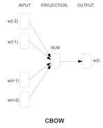
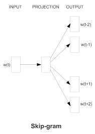

# Word Embedding

**要让transformer模型理解每一个token，需要把词语转化为具有语义的向量（embedding）**

**词嵌入(Word Embedding)用于将离散的token映射到连续的向量空间，使语义相近的词在向量空间中接近**


## 编码

### 基础语义单元的数字化方法及其问题

首先要搞明白一件事儿，所谓的编码和解码这个码到底是个什么码？

人工智能最典型的应用是图像识别和自然语言处理（NLP）。卷积神经网络（CNN）最早应用于图像识别，因为图像中的像素是并行结构。而语言则具有时序性，词与词之间有强先后关系，语义也与此相关。

为了解决这种序列到序列（sequence-to-sequence）的问题，比如机器翻译中输入输出长度不一致的情况，人们引入了编码器-解码器结构，并使用了循环神经网络（RNN）。RNN通过其循环结构，能够捕捉语言的时序信息。

Transformer模型虽然最初解决的是同样的问题，但它并没有延续RNN的技术路线，而是另起炉灶。不过它同样保留了编码器-解码器结构。尽管如此，已有研究表明，从数学角度看，Transformer与RNN甚至CNN在本质上是一致的。这个话题我们后续还会深入探讨。

那么，为什么无论是RNN还是Transformer，在做机器翻译时都采用编码-解码结构呢？我们可以从语言学习的本质出发来理解。

以学语言为例，我们在不懂英文的情况下学习英文，是通过实物（如“苹果”）将两种语言符号联系起来，建立语义对应。但机器无法直接接触现实世界实体，只能通过大量文本上下文来推断词语之间的语义关系。

因此，机器翻译的关键在于：如何从纯文本中提取出一种通用的语义表示，使得不同语言的词可以通过这一表示实现对齐。这就引出了“编码”的概念——即剥离语言形式差异，提取出纯粹的语义关系。

这种语义关系应满足两个条件：

1. 数字化表示；

2. 数值之间能体现语义相似性或关联性。

一个直观的想法是用高维空间中的向量来表示语义。例如，“香蕉”可能是一个向量 [1000]，而“猴子”接近于它，原子能则离得较远。这种向量空间能够体现出语义之间的距离关系。

在实际操作中，我们常使用 **tokenizer（分词器）** 和 **one-hot 编码** 来对语言进行数字化处理。它们分别代表了两种极端方式：

- Tokenizer 将每个 token 映射为一个整数 ID，相当于投射到一维空间。这种方式信息密度高，但难以表达复杂的语义关系。
- One-hot 编码则为每个 token 分配一个独立维度，形成一个高维稀疏向量。虽然组合语义容易表示，但所有 token 彼此正交，缺乏语义相似性的表达。

两者各有优劣：一个是“高密度低维”，一个是“低密度高维”。它们都不能很好地满足我们对语义编码的两个基本要求。

所以，我们需要一种更合理的语义表示方法，既能数字化，又能反映语义之间的相对关系。这也是后来词嵌入（word embedding）等技术出现的原因。

既然如此，我们就可以考虑找一个维度适中的“中间空间”来完成语义编码与解码。这个空间通常被称为“嵌入空间”（embedding space），它既不是一维也不是极高维，而是一个折中方案。

实现这个目标有两个方向：

1. 从低维升维（如基于 token ID 扩展）；

2. 从高维降维（如对 one-hot 编码进行压缩）。

通常选择后者，因为压缩比还原更容易控制。

### 空间变换与线性变换的理解及矩阵的应用

提到降维，自然想到线性代数中的矩阵乘法：一个向量与矩阵相乘，本质上就是一种空间变换。（建议去看MIT的线性代数公开课和3blue1brown视频辅助理解）

我们可以把这种运算理解为坐标系之间的转换。例如，原向量在旧坐标系下的表示，通过矩阵变换后，变成了新坐标系下的表示。

矩阵的每一列代表了新坐标系的一个基向量，而矩阵乘法就是将原向量在这个新基下的投影重新计算出来。

更进一步地，矩阵乘法不仅可用于坐标系变换，也可以看作是对向量本身的变换——比如旋转、缩放等。这种变换是线性的，意味着直线仍保持为直线，不会变成曲线。只有引入二次型（如 $x^T A x$）时，才可能得到非线性的几何结构（如椭圆、抛物线等）。

在机器学习中，尤其是 Transformer 等模型中，这种空间变换非常关键。它可以理解为数据从原始输入空间到语义空间的一种映射过程。多个向量组成的矩阵与变换矩阵相乘，就相当于一批数据同时经历一次统一的空间转换。

需要注意的是，矩阵乘法是不可交换的，顺序不同意义也不同。这类似于函数式编程中的数据流处理：前一个矩阵是数据集合，中间矩阵是变换规则，整个过程体现了数据在一系列空间中的流动与重构。


我对“空间变换”的理解是：某个空间中的对象通过一个或一组函数映射到另一个空间中。如果这些函数都是一次函数，这种变换就是**线性变换**。

从几何角度看，线性变换会保持一些关键特性不变：
- 原空间中不同的点，在新空间中仍是不同的点；
- 共线的点仍然共线；
- 平行向量仍然平行；
- 向量长度可能变化，但它们的比例关系保持不变。

为了方便描述这些变换，我们引入了**矩阵**。矩阵本质上就是一组线性变换的系数。它不仅是一种数学形式上的简化，更重要的是它让空间变换变得直观易懂。比如通过矩阵的行列数，我们可以立刻知道变换前后空间的维度是否发生了变化。

在矩阵乘法中，前一个矩阵通常表示数据（如一组向量），后一个矩阵则表示变换规则。两者相互独立，说明变换规则不依赖于具体的数据，而是决定整个空间如何被改变。

进一步地，我们可以引入**行列式**来衡量方阵所代表的空间变换对面积（二维）或体积（三维）的影响。行列式的值就表示变换后相对于原空间的拉伸或压缩比例。

此外，矩阵的其他性质（如对称性、秩等）也对应着空间变换的不同特征：
- 对称矩阵意味着变换前后向量的内积保持不变；
- 矩阵的“秩”表示该变换实际占用的空间维度，即用最少多少个线性无关向量就能完整描述所有输出。

总的来说，矩阵是一种工具，而“空间变换”只是其中一种理解方式。换个角度，也可以把它看作是一组向量之间的关系。不同理解方式适用于不同场景，比如注意力机制中就会有第三种理解方式。

回到AI模型本身，神经网络中的隐藏层其实就是在进行空间变换。隐藏层神经元的数量决定了变换后的空间维度——比输入多是升维，少则是降维。

有了这些基础认知，再去理解词嵌入、Transformer 中的注意力机制等内容，就会顺畅很多。

### 神经网络与矩阵运算的关系及非线性变换的重要性


$$sigmoid(X^TM+b)$$


神经网络的数学表达本质上是一系列矩阵运算，这也解释了为什么显卡（GPU）在训练神经网络时如此重要。因为显卡原本就是为处理3D图形中的空间计算设计的，而这些计算和神经网络中的矩阵操作非常相似。

不过，神经网络与纯矩阵运算还是有两个关键区别：

1. **加入了偏置项（Bias）**：除了权重矩阵乘法（$W_x$），还加上了一个偏置项 b。从几何角度看，矩阵乘法相当于对空间进行旋转或拉伸，而加偏置则相当于对整个空间进行了平移。

2. **引入了非线性激活函数**：线性变换只能实现一一映射，而神经网络通过激活函数实现了非线性变换，从而能将复杂的数据结构压缩到更小的空间中。例如，在分类任务中，输入空间中大量代表“猫”的图像最终都会被映射到输出空间中的同一个点。

从这个角度看，神经网络不仅是在做空间变换，更是在学习如何通过非线性方式把数据“折叠”成更容易区分的形式。

关于神经网络的**升维与降维**，可以从隐藏层的角度理解：
- 隐藏层中神经元的数量决定了变换后的空间维度；
- 增加神经元数量，相当于将数据映射到更高维空间，使得原本线性不可分的数据变得可分；
- 只要维度足够高，总能找到一个超平面来完成分类任务。

一个典型的神经网络结构包括输入层、隐藏层和输出层：
- 输入层接收原始数据；
- 隐藏层负责对数据进行升维或特征提取；
- 输出层输出最终预测结果。

**神经网络的本质是通过一系列带偏置和激活函数的矩阵运算，实现从输入空间到目标空间的非线性映射。**

### 神经网络的维度变换与特征抽象

神经网络中除了输入层和输出层之外的部分统称为**隐藏层**。它的作用是让模型具备更强的表达能力。

如果仅从“升维”角度理解隐藏层会遇到问题：很多神经网络在隐藏层中反而**逐步减少神经元数量**，也就是降维了。那该怎么解释这种设计呢？

我们来想一个实际场景：输入可能是原始图像的像素点（高维），目标是判断情绪（低维）。虽然最终输出维度更低，但中间隐藏层的每个节点其实代表了对输入数据的抽象特征。

例如：
- 第一层可能提取局部特征（如眼睛、嘴巴）；
- 第二层则组合这些特征，形成更高层次的语义（如“微笑”、“皱眉”）；
- 隐藏层越深，抽象程度越高。

这种分层抽象的好处是**底层特征可复用**。比如数字“8”的上下两个圆圈可以拆解为多个圆弧特征，这些特征也能被“6”、“5”等其他数字复用。

需要注意的是，神经网络自动学习的特征不一定符合人类直觉，但它们仍然能有效支撑最终判断。

进一步地，**CNN** 比全连接网络更适合特征复用，因为它不依赖位置信息，而是通过滑动窗口提取通用模式。

有了对升维、降维和特征抽象的理解后，我们就可以自然过渡到**编码与解码**的问题。

在NLP中，**编码**的过程就是把文本中的token先转换成独热编码，再通过矩阵乘法进行降维，映射到一个低维空间中。这个过程叫做**嵌入（Embedding）**，也称作词嵌入（Word Embedding）。

这个低维空间（潜空间）剥离了语言的形式差异（如发音、写法），只保留纯粹的语义关系。不同语言（如中文和英文）可以通过各自词汇表分别嵌入到独立的浅空间，再通过融合算法统一起来；也可以一开始就共享词汇表，训练出一个统一的语义空间。

无论是哪种方式，只要获得了两个语言共享的语义空间，就可以实现翻译：先把中文编码进这个空间，再从该空间解码成英文，就能保证语义一致。

实际上，编解码的本质是**将复杂对象转化为便于处理的中间表示**，就像“曹冲称象”——大象不好称重，就换成石头来操作。

这样一来，在这个中间空间里的一切操作都变成了纯粹的数学计算，大大简化了任务难度。

### AI模型的语义空间与编码解码原理

通过前面的介绍，我们可以理解：编码与解码中的“码”或“潜空间”，其实代表了AI模型真正理解语义的能力。它不再像哲学家约翰·塞尔提出的“中文房间”那样——只是机械查表、模仿理解。

在“中文房间”中，系统没有真正的语义理解，只是根据输入查找输出。而现在的AI模型通过潜空间进行处理，这个空间是一个**连续的、高维的语义表示空间**。

一个 token 被嵌入成向量后，它的每一维都可能代表一个独立的语义特征。比如“苹果”这个词，可能在一个维度上表示“水果”，另一个维度表示“手机”，还有一个维度表示“甜味”等。虽然这些维度对人类来说不一定直观可解释，但它们构成了一个能被模型有效使用的语义表示。

这种表示方式类似于图像中的通道（如RGB）：每个通道单独看可能不完整，但组合在一起就能表达完整的语义。词向量也可以通过矩阵运算进行升维或降维，就像CNN中使用1×1卷积核调整通道数一样。

相比“手册式”的映射，**潜空间是连续的**，这意味着即使遇到训练时未见过的内容，模型也能在空间中找到合理的位置，并生成合理的输出。而手册式的key-value映射是离散的、有限的，无法应对未知情况。

这也成为判断AI是否“理解”语言的一个重要标准：能否在没有见过的情况下生成合理内容。

那么，如何构建这样的潜空间？这就需要机器学习方法来实现从token到潜空间的映射。

谷歌2013年提出的 **Word2Vec**（包括 CBOW 和 Skip-gram 两种方法），就是其中一种经典方案。它的目标不是完成某个具体任务，而是**训练出一个高质量的嵌入矩阵**，用于将 token 映射到潜空间。这更像是“编词典”，而不是“培养作家”。

传统模型训练的目标是让模型输出正确结果；而 Word2Vec 的目标是让模型参数（嵌入矩阵）本身有意义。因此它不需要复杂的激活函数，计算也更高效。

以 CBOW 模型为例：

- 输入是一组上下文 token；
- 中间的 token 被隐藏；
- 模型的任务是通过上下文预测中间词；
- 预测误差通过反向传播更新嵌入矩阵；
- 最终得到的就是一个能捕捉语义关系的词向量空间。

这种方式让模型学会了 token 之间的语义联系，为后续各种NLP任务提供了强大的基础支持。

### 词向量模型原理及实现细节



我们来解释一下 CBOW 模型的基本原理：

为什么把上下文词向量加在一起，就能预测中间那个词？

其实可以类比高中物理中的“力的合成”：

- 上下文中已知的词向量看作是“分力”；

- 中间缺失的那个词向量就是这些分力的“合力”。

换句话说，一个词的语义可以从它的上下文中推断出来；反过来，有了这个词的语义，也应该能还原出它的上下文。

这正是 CBOW 的训练方式：输入上下文词，目标是预测中间词。模型通过不断调整嵌入矩阵，使得这种“合力关系”尽可能准确。

虽然它不能像人类一样完成精确的完形填空（比如“这是一个 ___ 苹果”），但这不是它的目的。它的目标是训练出一个高质量的嵌入空间，让语义相近的词在空间中也靠近。

你可以把它理解为“AI版词典”：

每个词都被其他词定义，就像词典中用其他词解释一个词。Word2Vec 训练出来的潜空间是语言环境的客观反映，不依赖作者意图。主观性体现在文本中词的选择和顺序，这部分则由后续的注意力机制去处理。



Skip-gram 是 CBOW 的反向版本：

输入一个词，目标是预测它的上下文词。两者都属于**自监督学习**方法，不需要人工标注数据，只要有文本就可以训练。

从数学上看，这个过程可以用两个矩阵表示：

- **W**：将独热编码映射到潜空间（降维）；
- **W'**：将潜空间还原成输出（升维）。

理论上 W 和 W' 应该互为伪逆，只要一个训练好，另一个可以解析求解。但在实际实现中，它们通常作为两个独立矩阵分别训练，因为矩阵求逆计算复杂度高（O(n³)），而梯度下降更简单高效（O(n)）。

另外，CBOW/Skip-gram 的隐藏层没有偏置项也没有激活函数，因为它本质上是在做线性变换——向量的合成与分解，不需要非线性操作。

这是标准的 Word2Vec 方法，它的核心是训练出一个“词典式”的嵌入矩阵 W，只捕捉单个词的语义 。如果想表达由多个词组成、具有准确含义的句子，这种模型就不够用了,就需要transformer了。

## 编码方式演变

### One-Hot编码（独热编码）

在NLP的早期阶段，One-Hot编码是一种常用的词表示方法。
每个词被表示为一个长度为词汇表大小的向量，其中对应词的位置为1，其余位置为0。

例如，假设词汇表包含以下词汇：

| 词汇   | One-Hot 向量 |
| ------ | ------------- |
| apple  | [1, 0, 0, 0, 0] |
| banana | [0, 1, 0, 0, 0] |
| cherry | [0, 0, 1, 0, 0] |
| date   | [0, 0, 0, 1, 0] |
| elder  | [0, 0, 0, 0, 1] |

缺点：

- **高维稀疏性**：随着词汇表的增大，向量维度也随之增加，导致数据稀疏，计算效率低下。
- **无法捕捉语义关系**：不同词的One-Hot向量彼此正交，无法反映词与词之间的语义相似性。 


### 基于共现矩阵的表示
为克服One-Hot编码的不足，研究者提出了共现矩阵的方法。通过统计词汇在一定窗口内的共现频率，构建词与词之间的关联矩阵。

**示例**：
假设有以下句子：
```
1 I like NLP.
2 I like deep learning.
3 I enjoy flying.
```
可以构建如下的共现矩阵：

|  | I | like | enjoy | NLP | deep | learning | flying |
| --- | --- | --- | --- | --- | --- | --- | --- |
| I | 0 | 2 | 1 | 1 | 1 | 1 | 1 |
| like | 2 | 0 | 0 | 1 | 1 | 1 | 0 |
| enjoy | 1 | 0 | 0 | 0 | 0 | 0 | 1 |
| NLP | 1 | 1 | 0 | 0 | 0 | 0 | 0 |
| deep | 1 | 1 | 0 | 0 | 0 | 1 | 0 |
| learning | 1 | 1 | 0 | 0 | 1 | 0 | 0 |
| flying | 1 | 0 | 1 | 0 | 0 | 0 | 0 | 

缺点：

- 共现矩阵也存在高维稀疏的问题，且无法捕捉有效复杂语义关系。

### Word2Vec
本质上是只具有一个隐含层的神经元网络，其余详细介绍上文讲过了。

输入是采用独热编码的词汇表向量，输出也是独热编码词汇表向量。

### 1.1.2.2.2 GloVe
GloVe通过对全局词共现矩阵进行矩阵分解，学习词的向量表示，能够更好地捕捉全局的语义信息。

### FastText
FastText模型考虑了词的内部结构（如字符n-gram），能够处理未登录词和拼写错误的词汇，提升了模型的泛化能力。

### ELMo
ELMo基于双向LSTM，通过预训练语言模型，为每个词生成上下文相关的向量表示，即同一个词在不同上下文中有不同的表示。

### BERT
BERT基于Transformer架构，属于大语言模型（之后会详细介绍）。其采用双向编码器，能够更深入地理解上下文信息。 

## LLM中的词嵌入

### 嵌入层的实现

- 词嵌入层（wte）:将离散的子词ID映射到连续向量

```python
self.wte = nn.Embedding(config.vocab_size, slef.embed_dim)

# self.wte的作用是将输入的词（token）编号（整数）转换为一个固定维度的向量（即词向量）
# nn.Embedding(...)构建一个可学习的查找表 ，把离散的词 ID 映射成连续的向量空间中的词向量
# config.vocab_size，比如 vocab_size=10000，就表示这个模型最多支持 10000 个不同的词
# self.embed_dim每个词被映射成的向量的维度
```

### 词嵌入共享
在现在一些大模型架构中，会存在输出端重用输入端Embedding权重的做法（Tied Embeddings/Coupled Embeddings）具体来看GPT2代码中：

```python
# from https://github.com/huggingface/transformers/blob/ee339bad01bf09266eba665c5f063f0ab7

class GPT2PreTrainedModel(PreTrainedModel):
    """
    An abstract class to handle weights initialization and a simple interface for download
    models.

    用于处理权重初始化以及提供一个简单的下载模型的接口
    """
    # 设置默认配置类为 GPT2Config，用于保存模型的超参数（如层数、头数、词向量维度等）
    config_class = GPT2Config
    
    # 指定一个函数，用于从 TensorFlow 格式的权重文件中加载模型参数。
    # 这样就可以支持从原始 GPT-2 的 TensorFlow 权重转换为 PyTorch 使用。
    load_tf_weights = load_tf_weights_in_gpt2

# 定义具体的 GPT-2 模型类，用于语言建模任务
# 继承自上面定义的 GPT2PreTrainedModel，具备权重初始化和加载预训练模型的能力。
class GPT2LMHeadModel(GPT2PreTrainedModel):

    # 表示某些层的权重是“绑定”的（共享的），这里指定 lm_head.weight 和嵌入矩阵共享权重。
    # 在 GPT-2 中，通常输出层（lm_head）与输入嵌入层（wte）共用同一个权重矩阵，节省内存并提升泛化能力。
    _tied_weights_keys = ["lm_head.weight"]

    # 构造函数，传入模型配置对象 config，其中包含所有模型参数（如 vocab_size、n_embd 等）。
    def __init__(self, config):

        # 调用父类 GPT2PreTrainedModel 的构造函数，进行基础设置和参数初始化。
        super().__init__(config)
        # 初始化 GPT-2 主干网络（Transformer 结构），负责上下文建模。
        # 输入 token 会先经过这个模块得到每个位置的上下文表示。
        self.transformer = GPT2Model(config)
        self.lm_head = nn.Linear(config.n_embd, config.vocab_size, bias=False)

```

其主要原因是在gpt2时代，模型主干部分不大且词表很大时，Embedding层的参数量很大，如果输出端再新增一个独立的同样大小的权重矩阵的话，会导致显存消耗的激增。

具体实现上是输出端的embedding使用的输入端embedding的转置（伪逆）。 

但是这样也会带来若干问题，具体可看这篇博文[语言模型输出端共享Embedding的重新探索](https://kexue.fm/archives/9698)

所以一些大语言模型，例如llama2，使用的是单独的output embedding，参考模型config.json:

```json
{
    "architectures": [
        "LlamaForCausalLM"
    ],
    "bos_token_id": 1,
    "eos_token_id": 2,
    "hidden_act": "silu",
    "hidden_size": 4096,
    "initializer_range": 0.02,
    "intermediate_size": 11008,
    "max_position_embeddings": 4096,
    "model_type": "llama",
    "num_attention_heads": 32,
    "num_hidden_layers": 32,
    "num_key_value_heads": 32,
    "pad_token_id": 0,
    "pretraining_tp": 1,
    "rms_norm_eps": 1e-05,
    "rope_scaling": null,
    "tie_word_embeddings": false,
    "torch_dtype": "float16",
    "transformers_version": "4.31.0.dev0",
    "use_cache": true,
    "vocab_size": 32000
}
```

这也是分辨模型是否共享权重最简单的方法，默认共享。 