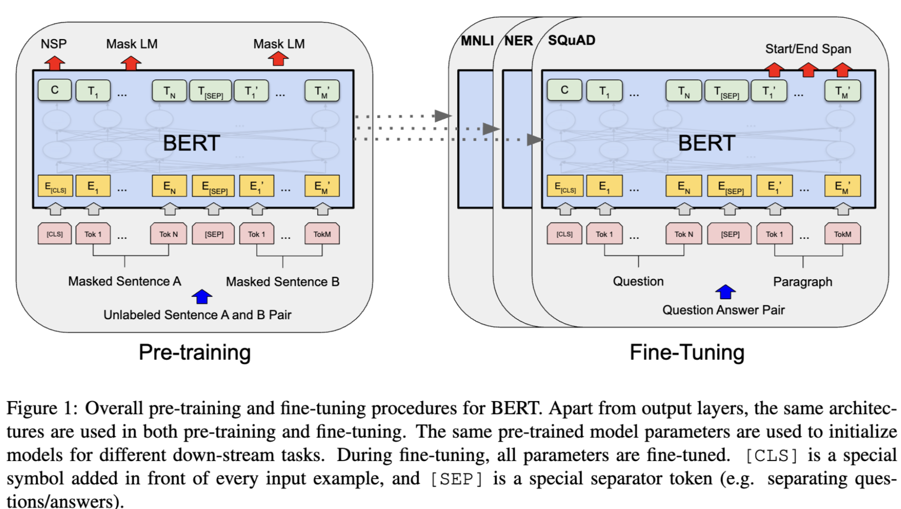
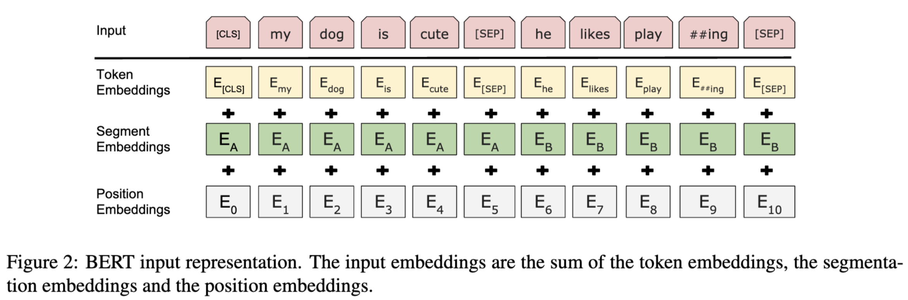

# BERT

BERT利用Transformer的Encoder结构，通过**双向掩码语言模型**与**句子预测**进行大规模预训练，在 11 项 NLP 任务上刷新了当时的最优结果，使得 “预训练 + 微调（fine-tuning）” 的范式在 NLP 领域广为流行



BERT 在设计上：

​1.仅使用 Transformer 的 Encoder，实现真正的双向建模； 

​2.利用 MLM（Masked LM） + NSP（Next Sentence Prediction） 的多任务预训练目标； 

​3.在超大规模数据（BookCorpus、Wikipedia）上训练，模型参数量庞大，性能十分优异； 

​4.预训练完成后，BERT 可作为“通用语义表征”提供给各类下游任务，只需添加少量层即可在分类、问答、序列标注等任务中取得绝佳效果。

## BERT优势

1. 相对 RNN / LSTM  ​:

- 采用Transformer，可并行处理序列，且多头注意力机制更有效捕捉长距离依赖

- 双向学习上下文，比单向语言模型更充分理解词义与句义

2. 相对Word2Vec:

- BERT 生成的词向量是上下文相关的，解决了一词多义问题

- 训练规模更大、网络更深，下游任务性能更佳

3. 相对 ELMo

- ELMo 虽然采用双向 LSTM，但实际是左右两条单向 LM 特征的拼接

- BERT 直接基于双向 Transformer，能更深入地融合全局语义

4. 相对 GPT

- GPT 是单向的（Decoder 结构），BERT 则是双向的（Encoder 结构）能充分利用上下文

- BERT 适合理解类任务（理解上下文），GPT 更偏向生成类任务

## 模型结构与输入表示



BERT 在结构上只保留了 Transformer Encoder。它的输入格式设计成 [CLS] + Sentence A + [SEP] + Sentence B + [SEP]，以便处理单句或句子对相关任务。

同时，BERT会引入三种Embedding相加来获得最终的输入向量：

1. **Token Embedding**:通过 WordPiece 进行切分，每个子词（Token）都有一个可学习的向量表示

2. **Position Embedding**：明确序列中各 Token 的位置。与原始 Transformer 不同，BERT 选择可学习位置向量而非三角函数

3. **Segment Embedding**： 用于区分不同句子（A、B），若只有单句则所有 Token 都可视为 Segment A=0

最终输入向量：

$$Embedding(t)=TokenEmb(t)+PositionEmb(t)+SegmentEmb(t)$$

> 序列长度默认512；若文本超过512，一般会进行截断或切分

**BERT前馈层用GeLU激活函数**

### [CLS]与[SEP]

- [CLS]：放在句首，用于下游分类等任务时，可以把它对应的输出向量视为整句全局表示

- [SEP]：分隔标记，若是句对 (A, B)，则 A 与 B 之间以及 B 的末尾都需要 [SEP]

### 模型超参

Google 官方提供 BERT-base（12 层 Encoder，768 隐层维度，12 头注意力，110M 参数）和 BERT-large（24 层，1024 隐层，16 头注意力，340M 参数）

- BERT-base可在普通GPU上(12GB)微调

- BERT-large 通常需要更多显存（>= 24GB）

## BERT预训练任务

在[Encoder-only 预训练任务](预训练任务.md)这篇博客讲过

## 模型训练与微调

### 预训练

1. 数据：BERT 使用 BookCorpus (800M 词) + 英文 Wikipedia (2,500M 词)，总计约 3.3B 字符

2. 训练：大规模分布式加速（8~64 TPU 节点）

3. 时间：BERT-base 官方训练约用 4 天 (16/64 TPU)

### 微调

BERT作为预训练语言模型，其本身就如同一个强大的 "特征提取器"，能够捕捉文本里丰富的语义和句法信息。
在处理下游具体任务时，不用对 BERT 的整体架构进行改动，仅需在其输出层的上方添加一个适配特定任务的小型神经网络层，也就是 "头部"，这样就能让模型适应不同类型的任务。

**文本分类任务**

像情感分析、主题分类这类文本分类任务，要求模型对输入文本给出一个类别标签。在这种情况下，只需在 BERT 的顶层添加一个简单的线性分类器就行。

具体操作：

把输入文本经过 BERT 编码后得到的 [CLS] 标记向量（这个向量可看作是整个句子的表示），输入到一个全连接层。

全连接层的输出维度和分类类别数量一致，接着通过 softmax 函数将输出转换为概率分布。

模型结构：

输入文本 → BERT 模型 → [CLS] 向量 → 全连接层（带 softmax 激活） → 分类标签

> 微调往往只需较小学习率与少量 epoch，就能取得很好的下游任务表现


### 微调代码

```python
 安装依赖
# pip install transformers torch

# ===== 新增：补充缺少的导入 =====
from transformers import TrainingArguments, Trainer
import torch

# 1. 加载预训练BERT模型和分词器
model_name = "bert-base-uncased"
tokenizer = BertTokenizer.from_pretrained(model_name)
model = BertForSequenceClassification.from_pretrained(model_name, num_labels=2)

# 2. 准备训练数据
texts = ["I love this product!", "This is really bad..."]
labels = [1, 0]  # 1表示积极情感，0表示消极情感

# 3. 数据编码
encodings = tokenizer(texts, truncation=True, padding=True, max_length=64)

# 4. 创建PyTorch数据集
class SimpleDataset(torch.utils.data.Dataset):
    def __init__(self, encodings, labels):
        self.encodings = encodings
        self.labels = labels
        
    def __len__(self):
        return len(self.labels)
    
    def __getitem__(self, idx):
        item = {key: torch.tensor(val[idx]) for key, val in self.encodings.items()}
        item['labels'] = torch.tensor(self.labels[idx])
        return item

dataset = SimpleDataset(encodings, labels)

# 5. 配置训练参数
# ===== 修改：添加no_cuda=True以支持CPU训练 =====
# ===== 修改：调整logging_steps为1，每步都记录日志 =====
training_args = TrainingArguments(
    output_dir='./results',          # 输出目录
    num_train_epochs=3,              # 训练轮数
    per_device_train_batch_size=2,   # 每设备训练批次大小
    logging_dir='./logs',            # 日志目录
    logging_steps=1,                 # 日志记录步数
    no_cuda=True                     # 禁用CUDA，在CPU上运行
)

# 6. 创建Trainer实例并训练
trainer = Trainer(
    model=model,                         # 模型
    args=training_args,                  # 训练参数
    train_dataset=dataset,               # 训练数据集
)

# 7. 执行训练
trainer.train()

# ===== 新增：保存模型 =====
trainer.save_model("./saved_model")

# ===== 新增：推理函数 =====
def predict_sentiment(text):
    # 加载保存的模型和分词器
    saved_model = BertForSequenceClassification.from_pretrained("./saved_model")
    tokenizer = BertTokenizer.from_pretrained(model_name)
    
    # 编码输入文本
    inputs = tokenizer(text, return_tensors="pt")
    
    # 模型推理
    with torch.no_grad():
        outputs = saved_model(**inputs)
    
    # 获取预测结果
    logits = outputs.logits
    predicted_class_id = logits.argmax().item()
    labels = ["消极", "积极"]
    return labels[predicted_class_id]

# ===== 新增：测试推理 =====
test_text = "This product is amazing!"
print(f"文本: {test_text}")
print(f"情感预测: {predict_sentiment(test_text)}")    

```

