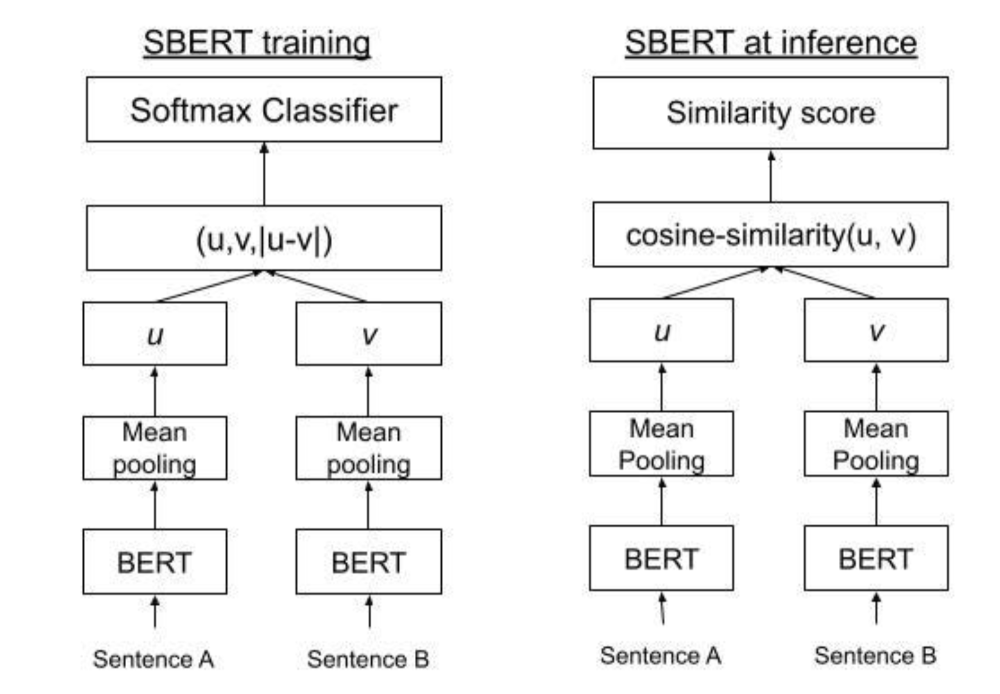
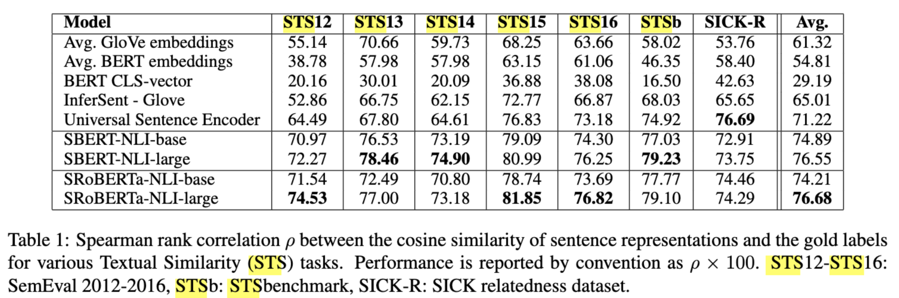

# Sentence-BERT

[Sentence-BERT](https://arxiv.org/pdf/1908.10084)

## BERT问题

1. 直接拿BERT产出的[CLS]向量作句子相似度，不理想：

    - BERT侧重于MLM和NSP任务，并没有度量句意相似度的功能

    - 在判断句子相似度的时候，时间复杂度为$o(N^2)$($\frac{N(N-1)}{2}$)，复杂度太高，训练成本高

```text
假如有N个句子，第一个句子与后面N-1个句子作相似度计算，第二个句子由于已经和第一个句子做过计算，只与后面N-2个句子计算，以此类推。
那么总共计算次数为:(N-1)+(N-2)+...+1，根据等差数列求和可得上述时间复杂度
```

## Sentence-BERT

为了句子相似度计算与语义检索任务获得高质量的嵌入表示，Sentence-BERT引入**Siamese/Triplet网络结构**，在进行
句子相似度计算时，只需要一次前向传播，就可以获得句子向量，使用**余弦相似度或向量点积**度量句子相似度

优势：

1. 一次性对多个句子进行编码

2. 通过**对比损失或者多任务监督**，使得相似句子向量距离更近，不相似的句子距离更远


### 核心方法 

#### 模型结构

SBERT 采用双塔结构，将两个句子分别输入同一个 BERT 编码器，得到各自的句子嵌入​，再计算相似度或距离并做监督学习



```text
句子1 → BERT → 池化层 → 句子嵌入1  
句子2 → BERT → 池化层 → 句子嵌入2  
```

- 共享权重：两个塔共享 BERT 参数，保证语义一致性。

- 池化策略:对 BERT 输出的 token 表示进行聚合，常用方式有

    - [CLS] 池化：直接使用 [CLS] token 的输出向量

    - 平均池化：对所有 token 的隐藏状态求平均（更常用）

    - 加权平均池化：根据注意力权重对 token 表示加权求和

2. 输出层设计

SBERT 在 BERT 输出后添加了池化层和可选的全连接层：

池化层：将 BERT 的 token 表示（通常是 [batch_size, seq_len, hidden_dim]）转换为固定维度的句子嵌入（[batch_size, hidden_dim]）。

全连接层：对池化后的嵌入进行非线性变换（如 ReLU），增强表达能力。

3. 训练目标：基于对比学习的损失函数

SBERT 通过对比学习优化句子嵌入，使相似句子的嵌入距离更近，不相似的更远。常用损失函数包括：

（1）MSE loss:$MSE = \frac{1}{n}\sum_{i=1}^n(y_i-\hat {y_i})^2$

（2）余弦回归：

- 余弦相似度：cos_sim(a,b) = $\frac{a\cdot b}{||a||\cdot ||b||}$,结果范围为 [-1, 1]，值越大表示向量方向越接近（语义越相似）

- 余弦回归:$L_{MSE}=\frac{1}{n}\sum_{i=1}^n(cossim(a,b)-y_i)^2$

（3）Classification Loss公式

对于自然语言推理（NLI）任务，涉及判断句对之间的关系（蕴含、矛盾、中立 ） 。这里先对句对中的两个句子分别得到其向量表示 $\mathbf{u}$ 和 $\mathbf{v}$ ，然后构造一个新的向量 $[\mathbf{u}; \mathbf{v}; |\mathbf{u} - \mathbf{v}|]$ ，它包含了两个句子各自的向量信息以及它们的差值信息 。

公式 $o = \text{softmax}(W_t(\mathbf{u}, \mathbf{v}, |\mathbf{u} - \mathbf{v}|))$ 中：

- $W_t$ 是一个权重矩阵，作用是对输入向量 $(\mathbf{u}, \mathbf{v}, |\mathbf{u} - \mathbf{v}|)$ 进行线性变换 ，将其映射到合适的维度以便进行分类。

- $\text{softmax}$ 函数是一种激活函数，它的作用是将线性变换后的结果转换为概率分布。对于一个长度为 $n$ 的向量 $\mathbf{z}$ ，$\text{softmax}$ 函数计算第 $i$ 个元素的公式为 $\text{softmax}(\mathbf{z})_i = \frac{e^{z_i}}{\sum_{j = 1}^{n} e^{z_j}}$ 。通过 $\text{softmax}$ 函数，得到的 $o$ 是一个概率向量，向量中的每个元素表示句对属于不同关系（如蕴含、矛盾、中立 ） 的概率 ，从而可以根据概率最大的类别确定句对的关系。

（4）Triplet Loss公式
在使用 Siamese 结构（孪生网络结构，两个网络结构相同且共享参数 ）处理句子时：

- 对于句对 $(A, P)$ （表示相似句 ） ，经过网络得到向量 $\mathbf{a}$ 和 $\mathbf{p}$ ；$(A, N)$ （表示不相似句 ） 经过网络得到向量 $\mathbf{a}$ 和 $\mathbf{n}$ 。这里 $\mathbf{a}$ 是同一个句子 $A$ 经过网络得到的向量 。

- $\|s_a - s_p\|$ 表示相似句对应的向量 $\mathbf{a}$ 和 $\mathbf{p}$ 之间的距离（这里可以是欧氏距离等，也可以是余弦距离形式 ） ，$\|s_a - s_n\|$ 表示不相似句对应的向量 $\mathbf{a}$ 和 $\mathbf{n}$ 之间的距离 。

- $\epsilon$ 是一个超参数，称为安全边界（margin ） ，它的作用是确保相似句向量间的距离与不相似句向量间的距离拉开一定差距。

- 公式 $\max(\|s_a - s_p\| - \|s_a - s_n\| + \epsilon, 0)$ 表示：希望相似句向量间的距离 $\|s_a - s_p\|$ 尽可能小，不相似句向量间的距离 $\|s_a - s_n\|$ 尽可能大，当 $\|s_a - s_p\| - \|s_a - s_n\| + \epsilon \leq 0$ 时，说明已经满足相似句距离小于不相似句距离且差距至少为 $\epsilon$ ，此时损失为 0 ；否则，损失就是 $\|s_a - s_p\| - \|s_a - s_n\| + \epsilon$ 。通过不断优化这个损失函数，使得模型能够更好地区分相似句和不相似句 。 

###计算复杂性优势

​在下游任务中，需要比较多个句子的相似度，如果使用原BERT，需要$o(N^2)$​前向过程；

而 SBERT 在预先将每个句子独立编码为向量后，比较只需需要$o(N)$次前向过程， $o(N^2)$的向量相似度计算。​

- SBERT：先一次性编码各句子 ​$\to$向量$\to$​ pair余弦相似度。

- 速度：对大规模语句库做相似度或检索时，可显著提升效率。

### 实验



句子嵌入与相似度计算

```python
from sentence_transformers import SentenceTransformer, util

# 1. 加载预训练好的SBERT模型
model = SentenceTransformer('sentence - transformers/all - MiniLM - L6 - v2')

# 2. 准备句子
sentences = [
    "I love machine learning!",
    "Machine learning is my passion.",
    "The sky is clear today."
]

# 3. 编码成向量
embeddings = model.encode(sentences)

# 4. 计算相似度
cos_sim = util.cos_sim(embeddings[0], embeddings[1])
print("Similarity between 0 and 1:", cos_sim.item())

cos_sim_01_2 = util.cos_sim(embeddings[0], embeddings[2])
print("Similarity between 0 and 2:", cos_sim_01_2.item())
```

SBERT 模型微调


```python
from sentence_transformers import InputExample, losses
from torch.utils.data import DataLoader

# 假设有STS数据: (sentence1, sentence2, similarity_score)
train_examples = [
    InputExample(texts=["I like apples", "Apples are my favorite fruit"], label=0.9),
    InputExample(texts=["She loves cats", "She hates cats"], label=0.2),
    # 可添加更多训练样本
]

train_dataloader = DataLoader(train_examples, shuffle=True, batch_size=16)

# 选用CosineSimilarityLoss
train_loss = losses.CosineSimilarityLoss(model)

# 训练
model.fit(
    train_objectives=[(train_dataloader, train_loss)],
    epochs=1,
    warmup_steps=100,
    output_path="./fine_tuned_sbert"
)
```

### Sentence-T5（ST5）

#### **核心思路**  
- 基于 **T5（Encoder-Decoder 架构）**，将句子作为输入，通过在解码器输出端引导至**固定 token 形式**（如特定标签或占位符），迫使模型生成能表征句子语义的向量。  
- 本质是将句子嵌入任务转化为 **文本生成任务**，利用 T5 的编解码能力捕捉语义。

#### **优缺点**  
- **优点**：  
  - T5 的 Encoder-Decoder 结构支持更灵活的生成任务，适用于需要结合生成和表示的场景（如摘要生成+语义检索）。  
- **缺点**：  
  - 结构复杂度高于 SBERT，在**单纯的句子相似度任务**中效率可能不如双塔结构（如 SBERT 的 Siamese Network）。  

#### **应用场景**  
- 多模态任务或需要生成与表示结合的场景，而非纯语义相似度计算。


### **SimCSE**
#### **核心方法**  
- **无监督 SimCSE**：  
  - 对同一输入句子应用 **不同的随机 dropout**（仅在编码器层），生成两个不同的向量表示，通过对比学习（Contrastive Learning）**拉近同句向量距离**，**拉远不同句子向量距离**。  
  - 利用 dropout 的随机性创造“伪正样本”，无需人工标注数据。  
- **有监督 SimCSE**：  
  - 在无监督基础上，引入 **STS（Semantic Textual Similarity）标注数据** 进行微调，进一步优化向量空间的语义对齐。  

#### **与 SBERT 的异同**  
- **相同点**：均用于生成句子嵌入，解决语义相似度问题。  
- **不同点**：  
  - **技术路径**：SBERT 依赖有标注数据（如句子对分类/回归），而 SimCSE 以无监督对比学习为主，轻量级且数据成本低。  
  - **模型结构**：SBERT 采用双塔+池化，SimCSE 可直接基于单塔（如 BERT）通过 dropout 实现对比。  

#### **优势**  
- 无监督性能显著，接近有监督 SBERT 的效果，适合数据稀缺场景。  
- 结构简单，易于实现，可作为 SBERT 的轻量化替代方案。


*### ** E5 / Contriever**
#### **E5**  
- **定位**：聚焦 **语义检索（Text Retrieval）**，通过大规模对比学习训练句子嵌入。  
- **方法**：  
  - 使用 **query-passage 对** 构建正负样本，优化目标为拉近查询与相关文档的向量距离，推远与无关文档的距离。  
  - 基于 encoder-only 架构（如 BERT），强调在检索任务中的高效性和准确性。  

#### **Contriever**  
- **核心思路**：类似对比学习，但采用不同的预训练策略（如改进的负样本采样、损失函数设计）。  
- **应用场景**：文本-文本检索（如问答系统中的文档匹配），在长文本场景中表现优异。  

#### **共同特点**  
- 均以 **检索任务为导向**，通过对比学习优化嵌入空间，适用于信息检索、问答系统等需要快速匹配语义的场景。  
- 性能优于传统 SBERT，尤其在大规模数据下效果显著。


### **Sentence-BERT v2 / 增强策略**
#### **改进方向**  
- 在 SBERT 原有框架（如多负样本对比损失 MNR）基础上，引入：  
  1. **数据增广**：如回译、同义词替换等，增强模型泛化能力。  
  2. **对抗训练**：通过添加对抗扰动（如 FGSM）提升模型鲁棒性。  
  3. **知识蒸馏**：将大模型的嵌入能力迁移到小模型，降低推理成本。  

#### **目标**  
- 解决 SBERT 在低资源场景下的过拟合问题，或提升其在复杂语义场景（如多语言、领域自适应）中的表现。  

#### *优势**  
- 延续 SBERT 的双塔结构，兼容原有训练流程，通过增量改进提升性能，适合工业级落地优化。


**总结对比**

| 方法         | 核心架构              | 训练方式                  | 数据依赖       | 优势场景                 | 轻量化程度 |
|--------------|-----------------------|---------------------------|----------------|--------------------------|------------|
| **SBERT**    | 双塔+池化             | 有监督（分类/回归）        | 标注句子对     | 通用语义相似度           | 中         |
| **SimCSE**   | 单塔（BERT）+dropout  | 无监督对比+有监督微调      | 无（或少量）   | 低资源语义匹配           | 高         |
| **E5/Contriever** | Encoder+对比学习      | 大规模对比学习（检索导向） | query-passage对 | 语义检索、长文本匹配     | 中         |
| **Sentence-T5** | T5 Encoder-Decoder     | 生成任务引导              | 标注数据       | 生成+表示联合任务         | 低         |
| **SBERT v2** | 双塔+增强策略         | 有监督+数据增广/蒸馏       | 标注句子对     | 工业级优化、领域自适应   | 中         |

对比学习的核心是**拉近正样本对距离，推远负样本对距离**
