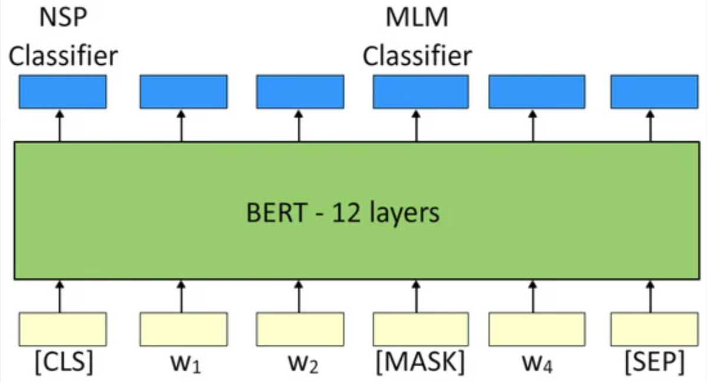

# Encoder-only 预训练任务

BERT引入了**深度双向注意力机制**和**Masking**思想，我们主要围绕BERT两大核心训练任务：

**Masked Language Modeling(MLM)与Next Sentence Prediction(NSP)**

### BERT预训练

传统的语言模型中，网络只能从左到右或从右到左进行单向建模，导致无法充分利用上下文信息。BERT 提出了一种 “遮蔽（Masking）” 的策略，通过将部分词隐藏，让模型在训练时同时关注被遮住单词左右两侧的上下文，从而获得真双向的上下文表示。此外，BERT 还引入了句子级别的 NSP 任务，使模型在理解单句语义的同时也能学习到句子之间的衔接与语义关系。

BERT的两个主要预训练任务：

1. MLM:通过遮蔽部分Token，打上[MASK]，让模型必须根据上下文推理出被遮蔽的token.

2. NSP:随机抽取句子对，判断第二句是否是第一句的后续（从同一文档中顺序提取），提升句子层次的理解能力

传统的语言模型中，网络只能从左到右或从右到左进行单向建模，导致无法充分利用上下文信息。BERT 提出了一种 “遮蔽（Masking）” 的策略，通过将部分词隐藏，让模型在训练时同时关注被遮住单词左右两侧的上下文，从而获得真双向的上下文表示。此外，BERT 还引入了句子级别的 NSP 任务，使模型在理解单句语义的同时也能学习到句子之间的衔接与语义关系。

BERT进行下游任务（如文本分类、问答等）时，只需在base模型上加一个或少量额外层的微调

#### 传统BERT预训练任务



##### MLM

BERT 会随机选择句子中 15% 的单词进行处理，其中 

1. 80%概率tokens会被替换为[MASK]

2. 10%概率，tokens会称替换为随机的token，这正是解决一词多义的最重要特性

3. 10%概率，tokens会保持不变但需要被预测

```text
模型如何 “忽略原词”，仅通过上下文预测？

1. 输入层：隐藏原词的真实身份
虽然原词未被替换为[MASK]或随机词，但在模型的输入表示中，它与其他词一样被编码为词向量、位置向量和段向量的叠加。
关键：模型在输入阶段无法 “知道” 哪个词是 “被强制预测的原词”，只能通过后续的编码层从上下文中提取信息。
2. 编码层：通过自注意力机制剥离原词依赖
Transformer 编码器的自注意力机制会让每个词的表示融合整个句子的上下文信息。
即使某个位置是原词，其最终的上下文表示（即编码器输出）也会被周围词的语义 “稀释”，不再单纯依赖自身的原始词义。
例如：句子 “苹果 [原词] 是红色的” 中，“苹果” 未被 mask，但模型需要通过 “是红色的” 来预测 “苹果”，而不是直接利用 “苹果” 本身的词义。
此时，模型的任务等价于：“根据‘[X] 是红色的’，预测 [X] 是什么？”，其中 [X] 的输入是 “苹果” 的词向量，但模型必须忽略这一信息，仅通过 “是红色的” 推断。
3. 预测层：强制基于上下文生成概率分布
编码器输出的向量会输入到一个全连接层（分类器），该层通过与词表的嵌入矩阵相乘，生成每个词的预测概率（不依赖输入词本身）。
即使输入的是原词，模型也会计算 “在上下文中，该位置最可能的词是什么”，而不是直接返回原词。
例如：输入 “苹果” 未被 mask，但模型需要根据 “是红色的” 预测该位置为 “苹果” 的概率，这要求模型必须证明 “苹果” 是上下文中最合理的词，而非直接记忆。

```
##### MLM训练目标

- 给定sequence $X$, 令$\tilde{X}$表示经过Mask后的序列。网络经过输出词向量$h_i$,并经过全连接层+softmax，预测每个被Mask位置所对应的真实词
- 损失函数：$L_{MLM}=-\sum_{i\in Maskset}\log P(x_i|\tilde{X})$

其中，“Maskset”表示被遮蔽的token索引集合

#### NSP

让模型在看到“句子对（A,B）”时，判断“B是否真的是A的后续句子”。这样可以帮助模型学习到**跨句子**的衔接关系

1. 从训练语料，随机抽取成对的句子（A,B）
    - 50% 的情况，B 是 A 在文档中的下一个句子
    - 50% 的情况，B 来自语料库中随机的其他文档或不相关位置

2. 模型输入：
    - 拼接[CLS]+A+[SEP]+B+[SEP],中间用[SEP]分割句子
    - [CLS]放在开头，起到**分类标志的作用**，其对应的向量$h_{[CLS]}$会用于NSP的二分类

3. 模型通过自注意力机制后，在[CLS]位置上输出一个向量，通过全连接+softmax，预测是否为后续句子

##### NSP训练目标

- 二分类NSP任务中，用交叉熵损失表示为：

$$L_{NSP}=-\sum_{(A,B)\in D}[y_{(A,B)}\log P(IsNext|A,B)+(1-y_{(A,B)})\log P(NotNext|A,B)]$$

其中,$y_{(A,B)}=1$表示B是A的后续，否则为0

### Sentence-Bert的额外训练任务

怎么提取sentence-level的特征用于下游任务，一种直观的想法是使用bert提取句子级别的embedding，那么我们有几种选择：

- CLS Token embedding

Sentence-BERT 说CLS不好，CLS 更关注 句子间的逻辑关系，而非单句的语义表征，原因就是bert原生的CLS是用于NSP分类任务的，对句子表征效果不好

- Pooling Context embedding（平均池化+归一化）

Sentence-BERT 认为这个特征比CLS好，并且在此基础上可以做fine-tune达到更好的表征效果

但是存在各向异性（Anisotropic）的问题，导致词余弦相似与pretrain词频相关

在 BERT 的原生向量空间中，高频词（如 “的”“是”“在”）的向量范数通常较小，分布在空间中心附近；

低频词（如专业术语、罕见词）的向量范数较大，分布在空间边缘。

因此，两个高频词的向量可能因靠近中心而 “虚假相似”，而低频词可能因范数差异大而 “虚假不相似”，与实际语义无关。

**如何缓解各向异性**：

向量归一化：对池化后的句向量进行 L2 归一化，强制向量范数为 1，消除范数差异对余弦相似度的影响。公式：\(\hat{v} = \frac{v}{\|v\|}\)，此时余弦相似度仅取决于向量方向，与范数无关。层归一化（Layer Normalization）：在预训练或微调阶段对 Transformer 层的输出进行归一化，稳定向量分布。

- EOS Token embedding

这是CLIP方法中文本编码器的特征提取方式，其实类似于Pooling Context Embedding，但是注意clip的文本编码器是从随机初始化开始训练的


## MLM+NSP模型变体

下表简要列出各个变体与 BERT 的主要特征对比，按提出时间顺序排列。

| 模型 | 时间 | 主要改进点 | 是否保留NSP | Mask策略 | 结构 | 典型应用 |
| ---- | ---- | ---- | ---- | ---- | ---- | ---- |
| BERT | 2018 | MLM (15%) + NSP<br>双向Transformer Encoder | Yes | 静态Mask，15% 单词被随机选中 | Encoder-only (12/24层) | 各类NLP理解任务 |
| RoBERTa | 2019 | 1)更大数据/更长训练<br>2)移除NSP<br>3)动态Mask<br>4)GPT-2 BPE | No | 动态Mask (同MLM) | Encoder-only | 同BERT，效果更佳 |
| ALBERT | 2019 | 1)Embedding因式分解<br>2)跨层权重共享<br>3)NSP → SOP | SOP | 同MLM (静态Mask) | Encoder-only | 减少参数，大模型部署 |
| SpanBERT | 2019 | 1)Span-level Masking<br>2)SBO目标<br>3)移除NSP | No | Span Mask (块状) | Encoder-only (改进BERT实现) | 核心指代、抽取式QA等 |
| XLNet | 2019 | 1)Permutation LM融合AR/AE<br>2)Two-stream Attention<br>3)融合Transformer-XL长依赖 | - | 无[Mask]标记，用Permutation+AttentionMask来双向建模 | 类Transformer Encoder | 问答、语言建模，多项SOTA |
| DeBERTa | 2020 | 1)Disentangled Attention (内容/位置分离)<br>2)Enhanced Mask Decoder<br>3)更优性能 | - | 同MLM (类似RoBERTa) | Encoder-only | GLUE/SQuAD SOTA，微软大规模应用 |

