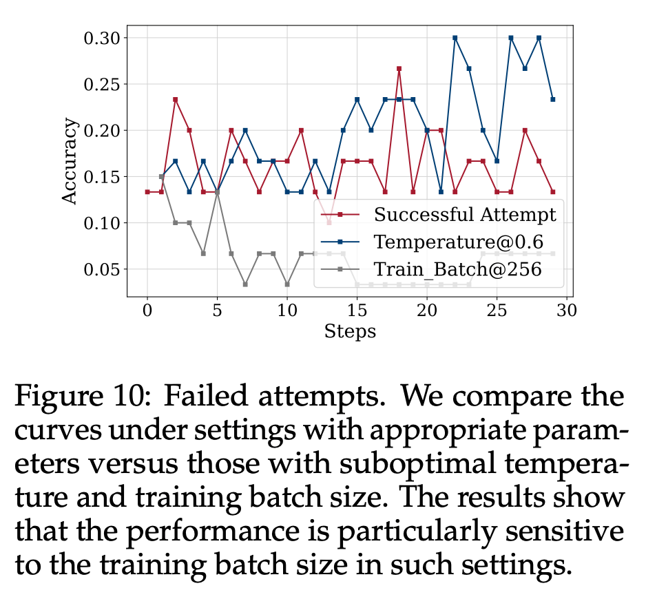

# TTRL: Test-Time Reinforcement Learning

论文地址：https://arxiv.org/abs/2504.16084

GitHub：https://github.com/PRIME-RL/TTRL

HuggingFace：https://huggingface.co/papers/2504.16084

测试时缩放（TTS，Test-Time Scaling）是一种提升大语言模型推理能力的新兴策略，通过在测试阶段优化推理过程（如多数投票、蒙特卡洛树搜索等）提升大型语言模型（LLMs）的性能，而无需修改模型参数。

研究表明，TTS 在计算效率上优于预训练阶段扩大模型规模，能以更低资源成本实现更好表现。然而，TTS 依赖预训练知识，在面对未标注新数据或输入分布变化时，泛化能力受限。如 OpenAI o3 在某基准任务上达到 75.7% 的成功率，对更复杂的新任务却仅能解决 4% 的问题。

为克服 TTS 的局限，测试时训练（TTT，Test-Time Training）一度受到广泛关注。TTT 通过在测试阶段利用 RL 等技术动态更新模型参数，使模型适应新数据或任务，弥补了 TTS 在泛化能力上的不足。但 TTT 同样面临自身的挑战：测试阶段缺乏奖励函数或验证信号，而人工标注数据的高成本使得无监督环境下的 RL 应用受限。

在最新的一篇论文中，清华大学和上海人工智能实验室提出了一种新方法 —— 测试时强化学习（Test-Time Reinforcement Learning，TTRL），该方法能够在无标注数据上对 LLM 进行强化学习训练。

TTRL 通过利用预训练模型中的先验知识，使 LLM 具备自我演化的能力。实验证明，TTRL 在多种任务和模型上都能持续提升性能：在仅使用未标注测试数据的情况下，TTRL 将 Qwen-2.5-Math-7B 在 AIME 2024 任务中的 pass@1 指标提升了约 159%。

值得注意的是，虽然 TTRL 仅依靠 Maj@N 指标进行监督，但其表现不仅能持续超越初始模型的性能上限，更能接近于那些直接在有标注测试数据上进行监督训练的模型性能。实验结果验证了 TTRL 在多种任务中的广泛有效性，充分展示了该方法在更广阔领域中的应用潜力。

方法

图 2 展示了研究者提出的 TTRL 方法如何应对此类挑战。给定状态表示为输入提示 x（prompt x），模型依据参数化策略 π_θ(y | x) 生成输出 y。为了在无真实标签的条件下构造奖励信号，研究者通过重复采样的方法，从模型中生成多个候选输出 {y₁, y₂, ..., y_N}。接着，使用多数投票（majority voting）或其他聚合方法从这些候选中推导出共识输出 y*，作为近似的最优动作（optimal action）的替代。

环境反馈的奖励 r (y, y*) 则根据当前动作 y 与共识输出 y* 之间的一致性进行设定。模型的 RL 目标是最大化期望奖励：

通过梯度上升（gradient ascent）更新参数 θ：

该方法能够在推理阶段实现模型的动态适应，无需标注数据即可提升模型应对分布变化输入时的性能。

多数投票奖励函数（Majority Voting Reward Function）

多数投票奖励机制的核心在于：首先借助多数投票策略估算一个伪标签（pseudo-label），再基于该估计标签计算规则驱动的奖励（rule-based rewards），并作为最终用于 RL 训练的奖励信号。

在具体操作上，给定一个输入问题 x，研究者对其输入到大型语言模型中，并生成一组输出结果。随后，答案抽取器（answer extractor）对这些输出进行处理，提取对应的预测答案，记为 P = {ŷᵢ}ⁿ_{i=1}。接着，研究者在集合 P 上应用第 4 节定义的多数投票策略函数 s (y, x)，选出出现频次最高的预测 y，作为估计标签。

随后，该多数投票结果 y 被用作标签估计，用于计算基于规则的奖励信号：

实验

TTRL 在大多数任务和模型上都表现出色。尽管 TTRL 完全依赖于使用无标注测试数据的自我进化，但其性能却可媲美基于大规模标注数据集训练的现有 RL 模型。如表 1 所示，在 AIME 2024 上，TTRL 实现了 159.3% 的大幅提升，超过了所有在大规模数据集上训练的模型。此外，当应用于 Qwen2.5-Math-7B 时，TTRL 在三个基准测试中平均提高了 84.1%。

TTRL 自然扩展。另一个值得注意的现象是，随着模型大小的增加（从 1.5B 到 7B），其在 AIME 2024 和 AMC 上的性能提升也在增加，这凸显了 TTRL 的自然扩展行为：更大的模型可以在自我改进过程中产生更准确的多数投票奖励，从而更有效地学习新数据。不过，LLaMA-3.1-8B-Instruct 和 Qwen2.5-Math-1.5B 可能由于容量有限，未能通过 TTRL 在 AIME 2024 上取得有意义的进展。相比之下，Qwen2.5-Math-7B 的模型容量更大，知识更充分，因此可以从自我改进中获益，从而取得明显的性能提升（第 4.3 节会详细讨论这一点）。

TTRL 在目标任务之外也有很好的通用性。研究者以 Qwen2.5-Math-7B 为骨干，在每个基准上执行了 TTRL，并在其他基准上进行了进一步评估。图 3 展示了结果。尽管这种设置具有分布外的性质，但 TTRL 在所有基准上都取得了实质性的改进。这表明 TTRL 并没有依赖过拟合（过拟合会导致在其他任务上的取舍），而是在自我改进过程中获得了可推广的收益。

TTRL 与不同的 RL 算法兼容。图 4 展示了结果。研究者在 MATH-500 上使用 PPO 应用 TTRL，以评估其与不同强化学习算法的兼容性。PPO 和 GRPO 的性能轨迹非常接近。与 GRPO 相比，PPO 能产生更稳定的结果，同时实现相似的整体性能。

讨论

Q1：TTRL 的性能能有多好？

研究者使用了两个上限来分析 TTRL 的潜在性能。第一个上限是 Maj@N，用于计算 TTRL 训练过程中的奖励。第二个上限是在基准数据集上的直接训练，它假定可以访问 ground-truth 标签，因此会向策略模型泄露标签信息。

关键发现如下：

1. TTRL 不仅超越了其训练信号和初始模型的直观上界 Maj@N，还接近了用标注测试数据训练的直接 RL 的性能。这一进步可能要归功于 TTRL 使用 RL 进行测试时间训练：通过将基于投票的伪标签转换为奖励，它提高了有效监督的质量，同时使学习摆脱了 Maj@N 的限制。

2. TTRL 的经验上限是在测试数据上进行训练（即在测试数据上进行训练），这凸显了它与标准训练评估协议相比在功效上的潜在优势。

3. 对于具有挑战性的任务，TTRL 只需使用 1.5B 模型即可达到经验上限。这表明，现在 LLM 可以通过 TTRL 有效地自我进化，从而在大规模数据集上实现无限制的终身学习。

TTRL 受 Maj@N 监督，却超越了 Maj@N。图 6 展示了 TTRL 在 Qwen2.5-Math-7B 上的测试结果。可以看出，在所有基准测试中，TTRL Avg@64 均优于 Qwen2.5-Math-7B Maj@64，大大超出预期。此外，在应用多数表决时，TTRL 的性能也有大幅提升。

TTRL 的「性能增益法」基准训练，图 7 展示了结果。令人惊讶的是，TTRL 的性能曲线非常接近 RL（泄漏）的性能曲线。

Q2：TTRL 为何有效？

这一节主要分析了 TTRL 在无监督条件下实现稳定有效的 RL 的因素，包括两个关键方面：标签估计和奖励计算。

标签估计。TTRL 与标准 RL 算法的一个直接区别是，TTRL 涉及标签估计，而标签估计会带来奖励误差。研究者认为，尽管存在这些误差，TTRL 仍能正常工作，原因有以下两点：

(i) 现有研究表明，RL 可以容忍一定程度的奖励不准确性。此外，与通常依赖于记忆训练数据的监督微调（SFT）相比，RL 的泛化效果往往更好。在 RL 中，奖励通常是模糊的，主要是作为探索的方向信号，这导致了 RL 对奖励噪声的鲁棒性。

(ii) 之前的研究还从优化的角度研究了什么是好的奖励模型，发现更准确的奖励模型不一定是更好的教师。因此，由政策模型本身估计的奖励信号可能会为学习提供更合适的指导。

奖励计算。当模型能够通过多数投票估算出准确的标签时，随后估算出的奖励一般都是可靠的。然而，一个自然而然的问题出现了：为什么在 AIME 2024 等具有挑战性的基准上，即使模型无法估算出准确的标签，TTRL 仍然有效？

研究者表示，最根本的原因在于 RL 中奖励的定义。基于规则的奖励是根据预测答案是否与「标签」匹配来分配的。因此，即使估计的标签不是 ground-truth，只要它与错误预测的答案不同，系统仍可分配正确的「负」奖励。

为了提供更详细的案例研究，研究者在 Qwen2.5-Math-7B 上检验了 TTRL 在 AIME 2024 上的性能。图 8 显示了三个指标的变化曲线。

研究者发现了 TTRL 在 AIME 2024 上依然有效的两个主要原因：

首先，奖励比标签更密集，即使估计的标签不准确，也有更多机会恢复有用的学习信号。

其次，当模型能力较弱时，TTRL 给出的奖励可能更准确。

Q3：TTRL 何时失效？

在算法层面，TTRL 与现有的 RL 算法并无本质区别，因此继承了它们的一些特点，如对数据难度的敏感性、对先验的强烈依赖性以及在某些条件下崩溃的风险。

在实现层面上，这些问题因 TTRL 的限制而进一步扩大，TTRL 通过多数投票来估计标签，并且只在稀疏和以前未见过的测试数据上运行，在某些情况下可能会导致失败。

在初步实验中，研究者发现了两个潜在问题：

缺乏对目标任务的先验知识。如表 2 所示，研究者发现，随着问题难度的增加，性能提高率和长度缩减率都呈下降趋势。这表明主干系统的可用先验知识不足以支持对更具挑战性问题的学习。

不恰当的 RL 超参数。图 10 比较了在 AIME 2024 上的几次失败尝试。

